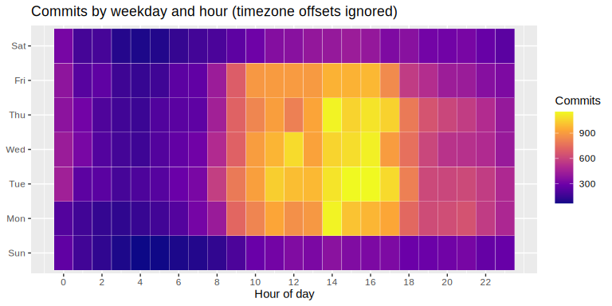
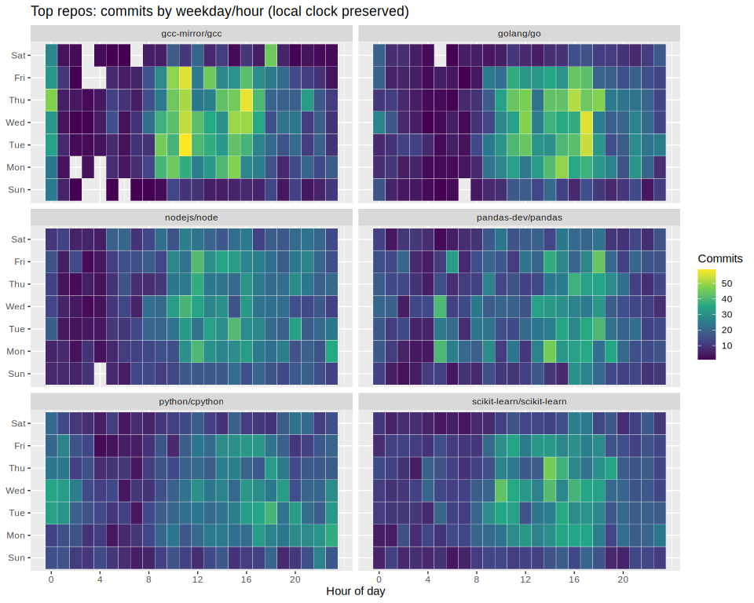
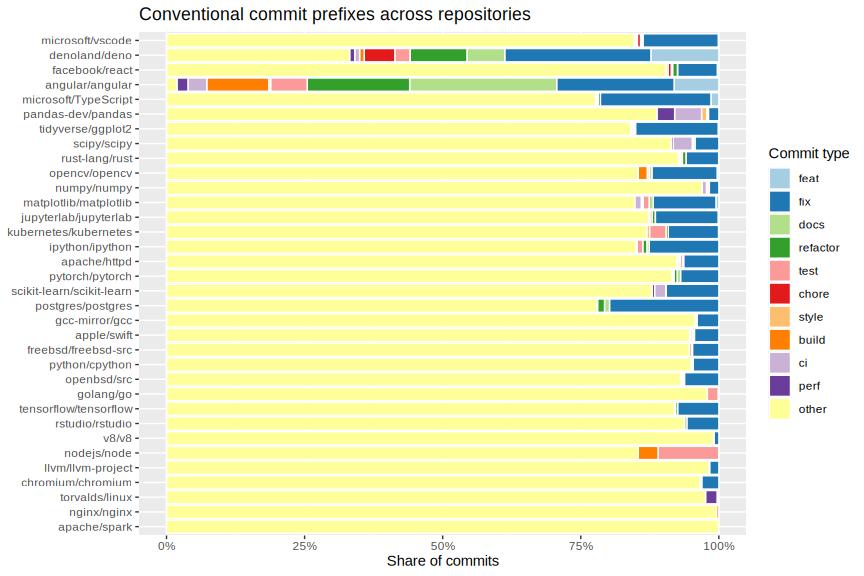
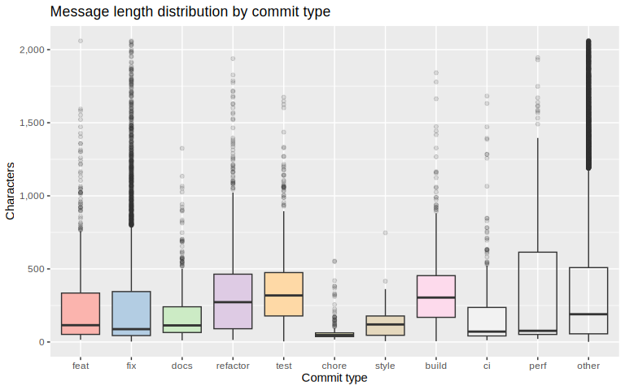
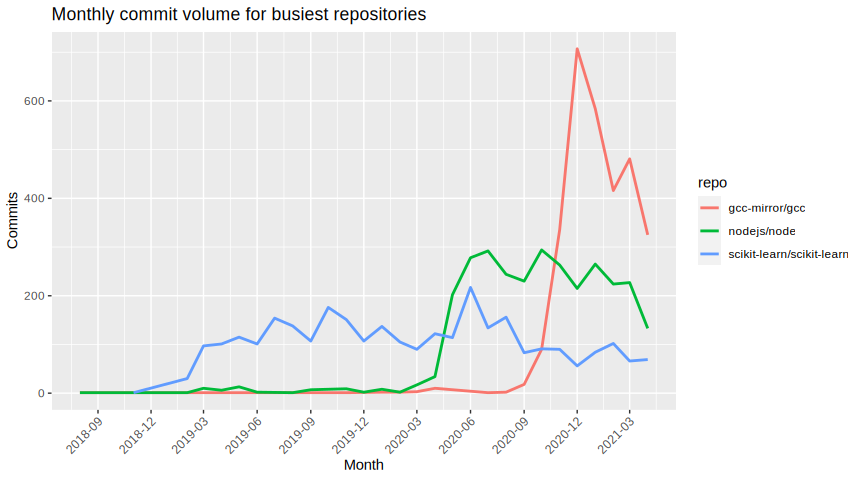

This notebook solves the commit-message exploration proposed in the
project description.  
Key choices:

-   Use the balanced sample
    (`datasets/commits_balanced_3k_per_repo.csv`) to compare
    repositories fairly.
-   **Ignore timezone offsets** when deriving hours/weekday patterns to
    reflect the local commit times authors recorded in Git.
-   Remove obviously auto-generated commits and normalize messages
    before classifying them.

## Load data

Balanced sample with 102000 commits across 34 repositories.

## Clean and enrich

Steps:

1.  Strip timezone offsets from the `date` string to keep the **recorded
    local time** (hour-of-day analyses ignore offset shifts).
2.  Parse datetimes; drop missing/invalid and pre-2018 timestamps.
3.  Drop duplicate commit hashes.
4.  Normalize messages (trim, flatten newlines); remove auto-generated
    commits that start with *merge*, *bump*, or *revert*.
5.  Derive features: `year`, `month`, `weekday`, `hour`,
    `message_length`, and conventional commit `commit_type` (others →
    `other`).

### Cleanup summary

Most rows survive once timestamps are parsed without timezone offsets;
dropping auto-generated messages keeps the focus on human-written
commits.

<table>
<caption>Row counts after each cleaning step</caption>
<thead>
<tr class="header">
<th style="text-align: left;">Step</th>
<th style="text-align: right;">Rows</th>
<th style="text-align: left;">Retained</th>
</tr>
</thead>
<tbody>
<tr class="odd">
<td style="text-align: left;">Raw rows</td>
<td style="text-align: right;">102000</td>
<td style="text-align: left;">100.0%</td>
</tr>
<tr class="even">
<td style="text-align: left;">Valid dates (&gt;=2018, tz offset
ignored)</td>
<td style="text-align: right;">95484</td>
<td style="text-align: left;">93.6%</td>
</tr>
<tr class="odd">
<td style="text-align: left;">Distinct commit hashes</td>
<td style="text-align: right;">95484</td>
<td style="text-align: left;">93.6%</td>
</tr>
<tr class="even">
<td style="text-align: left;">After removing auto-generated</td>
<td style="text-align: right;">83710</td>
<td style="text-align: left;">82.1%</td>
</tr>
<tr class="odd">
<td style="text-align: left;">Ready for analysis</td>
<td style="text-align: right;">83710</td>
<td style="text-align: left;">82.1%</td>
</tr>
</tbody>
</table>

Row counts after each cleaning step

### Repository coverage

Top repositories after cleaning (all within 2018–2021 coverage):

<table>
<caption>Top repositories (coverage and span)</caption>
<thead>
<tr class="header">
<th style="text-align: left;">repo</th>
<th style="text-align: right;">commits</th>
<th style="text-align: left;">first_date</th>
<th style="text-align: left;">last_date</th>
</tr>
</thead>
<tbody>
<tr class="odd">
<td style="text-align: left;">scikit-learn/scikit-learn</td>
<td style="text-align: right;">2994</td>
<td style="text-align: left;">2018-11-03</td>
<td style="text-align: left;">2021-04-20</td>
</tr>
<tr class="even">
<td style="text-align: left;">gcc-mirror/gcc</td>
<td style="text-align: right;">2985</td>
<td style="text-align: left;">2018-08-25</td>
<td style="text-align: left;">2021-04-21</td>
</tr>
<tr class="odd">
<td style="text-align: left;">nodejs/node</td>
<td style="text-align: right;">2980</td>
<td style="text-align: left;">2018-08-20</td>
<td style="text-align: left;">2021-04-19</td>
</tr>
<tr class="even">
<td style="text-align: left;">pandas-dev/pandas</td>
<td style="text-align: right;">2973</td>
<td style="text-align: left;">2020-07-06</td>
<td style="text-align: left;">2021-04-21</td>
</tr>
<tr class="odd">
<td style="text-align: left;">python/cpython</td>
<td style="text-align: right;">2973</td>
<td style="text-align: left;">2018-06-12</td>
<td style="text-align: left;">2021-04-20</td>
</tr>
<tr class="even">
<td style="text-align: left;">golang/go</td>
<td style="text-align: right;">2972</td>
<td style="text-align: left;">2019-03-24</td>
<td style="text-align: left;">2021-04-20</td>
</tr>
<tr class="odd">
<td style="text-align: left;">angular/angular</td>
<td style="text-align: right;">2960</td>
<td style="text-align: left;">2018-02-18</td>
<td style="text-align: left;">2021-04-20</td>
</tr>
<tr class="even">
<td style="text-align: left;">openbsd/src</td>
<td style="text-align: right;">2958</td>
<td style="text-align: left;">2020-11-09</td>
<td style="text-align: left;">2021-04-21</td>
</tr>
<tr class="odd">
<td style="text-align: left;">apache/spark</td>
<td style="text-align: right;">2953</td>
<td style="text-align: left;">2020-03-31</td>
<td style="text-align: left;">2021-04-21</td>
</tr>
<tr class="even">
<td style="text-align: left;">postgres/postgres</td>
<td style="text-align: right;">2951</td>
<td style="text-align: left;">2019-12-29</td>
<td style="text-align: left;">2021-04-21</td>
</tr>
</tbody>
</table>

Top repositories (coverage and span)

## Visualizations

### Overall weekday/hour heatmap

Daily rhythm using recorded local times shows peaks in daytime and a
secondary evening wave. 

### Weekday/hour heatmap by repository (top 6)

Top repositories reveal different rhythms—some concentrated around
business hours, others stretching into nights.

### Commit types per repository

Shares of conventional commit prefixes highlight whether a repo is
feature-driven (`feat`) or maintenance-heavy (`fix`, `chore`, `docs`).

### Message length by commit type

Feature and fix commits tend to carry longer descriptions than
chores/CI, suggesting richer context for impactful changes.

### Monthly activity trend (top 3 repos)

Monthly totals for the busiest repositories show sustained activity with
late-2020/early-2021 spikes.

## Takeaways

-   Ignoring timezone offsets (using the recorded local clock) surfaces
    clear daytime and late-evening peaks; activity spans the full week
    with softer dips on weekends.
-   A handful of repositories dominate volume; their hourly rhythms
    differ—some cluster around EU work hours, others show broader
    spread.
-   Conventional commit prefixes are widely used; `fix`/`chore` heavy
    repos contrast with more `feat`-oriented ones.
-   Message lengths vary by type: fixes and features are longer than
    chores/CI, hinting at richer descriptions for impactful changes.
