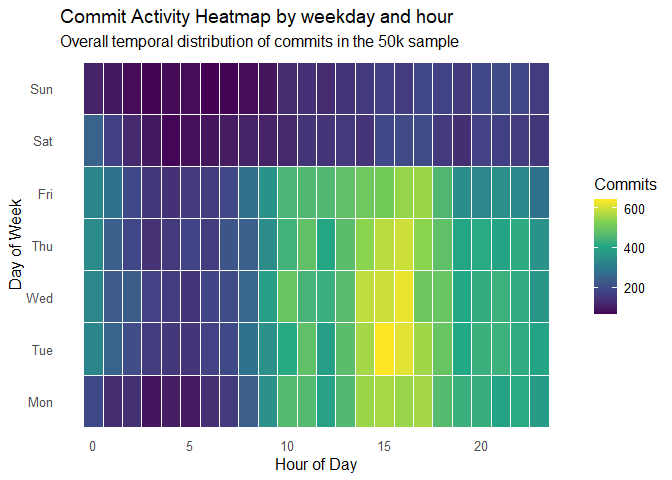
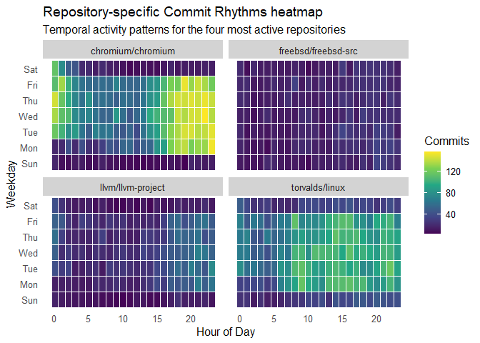
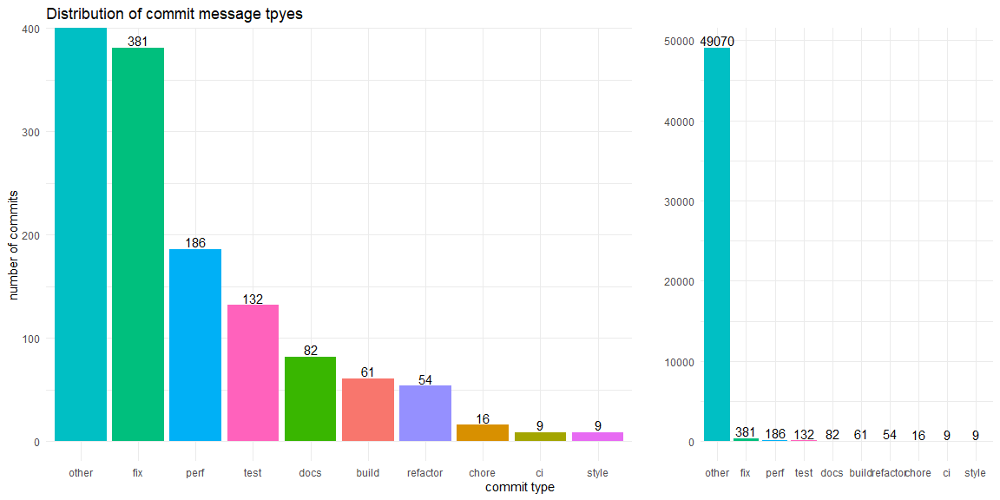
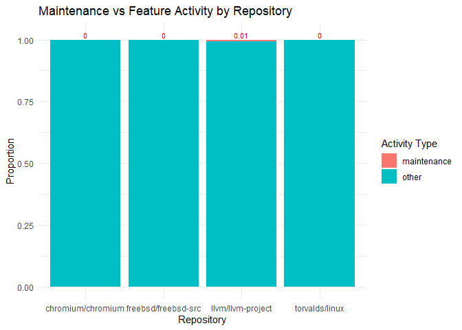

# Task description

Open-source projects use commit messages to communicate intent, fixes,
and changes. These short texts can reveal how teams work, how often they
fix bugs, and how practices differ across repositories and time. Your
task is to explore commit message styles and activity patterns across
popular GitHub projects.

## Questions / ideas

-   How do commit volumes vary by weekday and hour, and do different
    repositories show distinct rhythms?
-   How common are conventional commit prefixes (`feat`, `fix`, `docs`,
    `refactor`, `test`, etc.), and how do these proportions change over
    time?
-   Are message lengths and formats different across repositories or
    commit types?
-   Which repositories show more maintenance activity (fix/docs/chore)
    versus feature activity (feat)?

## Data

The original dataset contains commit messages and metadata from 34
popular GitHub repositories (e.g., `tensorflow/tensorflow`,
`pytorch/pytorch`, `pandas-dev/pandas`) as of April 21, 2021. Source:
<https://www.kaggle.com/datasets/dhruvildave/github-commit-messages-dataset/data>.
The repository list is saved in `datasets/source_README.md`.

The commit time range varies by repository (the latest commits are as of
April 21, 2021). Report the per-repo min/max dates after loading the
data.

Use one of the smaller subsets provided in `datasets/`:

-   `datasets/commits_sample_50k.csv` (random 50,000 rows, ~28 MB) —
    quick prototyping.
-   `datasets/commits_sample_150k.csv.zip` (random 150,000 rows, ~31 MB,
    zipped) — larger sample that stays under GitHub’s file size limit.
-   `datasets/commits_balanced_3k_per_repo.csv` (~48 MB) — balanced
    sample with 3,000 commits per repo for fair repo comparison.
-   Raw commit-level files for three repos (large/medium/small) to build
    a GitHub-style “commit calendar” heatmap. The repos are
    `torvalds/linux` (large), `pytorch/pytorch` (medium), and
    `tidyverse/ggplot2` (small).
    -   `datasets/commits_2019_2020_torvalds_linux.csv.zip` (~42 MB,
        zipped)
    -   `datasets/commits_2019_2020_pytorch_pytorch.csv` (~13 MB)
    -   `datasets/commits_2019_2020_tidyverse_ggplot2.csv` (~0.1 MB)

### Column overview

The CSV has the following columns:

-   `commit`: commit hash
-   `author`: author name and email in one string (e.g., `Name <email>`)
-   `date`: commit date as a string with timezone
-   `message`: commit message text (may include commas or line breaks)
-   `repo`: repository in `owner/name` format

Example file: `datasets/commits_sample_50k.csv`

### First rows (from `commits_sample_50k.csv`)

<table>
<caption>
Sample of commit data
</caption>
<thead>
<tr>
<th style="text-align:left;">
commit
</th>
<th style="text-align:left;">
author
</th>
<th style="text-align:left;">
date
</th>
<th style="text-align:left;">
message
</th>
<th style="text-align:left;">
repo
</th>
</tr>
</thead>
<tbody>
<tr>
<td style="text-align:left;">
a4ca44fa578c7c7fd123b7fba3c2c98d4ba4e53d
</td>
<td style="text-align:left;">
Joe Perches &lt;<joe@perches.com>&gt;
</td>
<td style="text-align:left;">
Wed May 16 09:55:56 2012 +0000
</td>
<td style="text-align:left;">
net: l2tp: Standardize logging styles Use more current logging styles.
Add pr\_fmt to prefix output appropriately. Convert printks to
pr\_&lt;level&gt;. Convert PRINTK macros to new l2tp\_&lt;level&gt;
macros. Neaten some &lt;foo&gt;\_refcount debugging macros. Use
print\_hex\_dump\_bytes instead of hand-coded loops. Coalesce formats
and align arguments. Some KERN\_DEBUG output is not now emitted unless
dynamic\_debugging is enabled. Signed-off-by: Joe Perches
&lt;<joe@perches.com>&gt; Signed-off-by: James Chapman
&lt;<jchapman@katalix.com>&gt; Signed-off-by: David S. Miller
&lt;<davem@davemloft.net>&gt;
</td>
<td style="text-align:left;">
torvalds/linux
</td>
</tr>
<tr>
<td style="text-align:left;">
110d1943c84cdd581f152abece6d83ab0240da0f
</td>
<td style="text-align:left;">
sandromaggi &lt;<sandromaggi@google.com>&gt;
</td>
<td style="text-align:left;">
Thu Dec 5 10:40:48 2019 +0000
</td>
<td style="text-align:left;">
\[Autofill Assistant\] Change form style. This CL changes the colors and
text styles in the form action according to Clank UI guidelines. It also
addresses the line height of the items, and increases the button touch
targets to 48dp. Line heights are: 48dp, 64dp and 88dp for 1 line, 2
line and 3 line items respectively. Right align checkboxes. Before:
<https://screenshot.googleplex.com/0Ues05tZuWB> After:
<https://screenshot.googleplex.com/uxo8pK9AbPS> After (with checkbox):
<https://screenshot.googleplex.com/K6kSqdXqpcJ> After (with
radiobutton): <https://screenshot.googleplex.com/gin0KYcgaLy> 1 / 2 / 3
lines: <https://screenshot.googleplex.com/iK8wbyXNaRY> Note: This CL
does not include changing the “More” toggle. Bug: b/144419528 Change-Id:
Ifd60a76bbc4cb28bb78a7727f4416ce99a4a7812 Reviewed-on:
<https://chromium-review.googlesource.com/c/chromium/src/+/1932783>
Commit-Queue: Sandro Maggi &lt;<sandromaggi@google.com>&gt; Reviewed-by:
Clemens Arbesser &lt;<arbesser@google.com>&gt; Cr-Commit-Position:
refs/heads/master@{#721953}
</td>
<td style="text-align:left;">
chromium/chromium
</td>
</tr>
<tr>
<td style="text-align:left;">
355d8a2f910508c452beedd35d41cf0e246c1bd8
</td>
<td style="text-align:left;">
John Baldwin &lt;<jhb@FreeBSD.org>&gt;
</td>
<td style="text-align:left;">
Fri May 16 17:45:09 2014 +0000
</td>
<td style="text-align:left;">
Add definitions for more structured extended features as well as XSAVE
Extended Features for AVX512 and MPX (Memory Protection Extensions).
Obtained from: Intel’s Instruction Set Extensions Programming Reference
(March 2014)
</td>
<td style="text-align:left;">
freebsd/freebsd-src
</td>
</tr>
<tr>
<td style="text-align:left;">
f4084cf26ba956764cf96894b0a65b0d566d6a16
</td>
<td style="text-align:left;">
Eliot Courtney &lt;<edcourtney@google.com>&gt;
</td>
<td style="text-align:left;">
Wed May 22 00:22:30 2019 +0000
</td>
<td style="text-align:left;">
Use OnDragFinished instead of the presence of DragDetails for bounds
reason. Clean up of DragDetails happens at a later time, so any bounds
updates that occur between OnDragFinished and the deletion of the
DragDetails will be incorrectly marked as a drag move or resize. drag
move. Bug: b/132853334 Test: PIP window does not get stuck in the middle
of the screen after Change-Id: I2f7d5db0e033768190da69e178d082f8a8fe2407
Reviewed-on:
<https://chromium-review.googlesource.com/c/chromium/src/+/1614764>
Reviewed-by: Mitsuru Oshima &lt;<oshima@chromium.org>&gt; Commit-Queue:
Eliot Courtney &lt;<edcourtney@chromium.org>&gt; Cr-Commit-Position:
refs/heads/master@{#661995}
</td>
<td style="text-align:left;">
chromium/chromium
</td>
</tr>
<tr>
<td style="text-align:left;">
64ac5f5977df5b276374fb2f051082129f5cdb22
</td>
<td style="text-align:left;">
Jon Maloy &lt;<jon.maloy@ericsson.com>&gt;
</td>
<td style="text-align:left;">
Fri Oct 13 11:04:20 2017 +0200
</td>
<td style="text-align:left;">
tipc: refactor function filter\_rcv() In the following commits we will
need to handle multiple incoming and rejected/returned buffers in the
function socket.c::filter\_rcv(). As a preparation for this, we
generalize the function by handling buffer queues instead of individual
buffers. We also introduce a help function tipc\_skb\_reject(), and
rename filter\_rcv() to tipc\_sk\_filter\_rcv() in line with other
functions in socket.c. Signed-off-by: Jon Maloy
&lt;<jon.maloy@ericsson.com>&gt; Acked-by: Ying Xue
&lt;<ying.xue@windriver.com>&gt; Signed-off-by: David S. Miller
&lt;<davem@davemloft.net>&gt;
</td>
<td style="text-align:left;">
torvalds/linux
</td>
</tr>
</tbody>
</table>

## Solution

### Q1: How do commit volumes vary by weekday and hour, and do different repositories show distinct rhythms?

#### Overall temporal patterns

-   To examine temporal commit patterns, the commit timestamps will be
    parsed and aggregated by weekday and hour. The results will be
    visualized using a heatmap.
-   The visualization will show:
    -   x-axis: hour of the day
    -   y-axis: day of the week
    -   fill color: number of commits.

<!-- -->

    ## ── Attaching core tidyverse packages ──────────────────────── tidyverse 2.0.0 ──
    ## ✔ dplyr     1.1.4     ✔ readr     2.1.5
    ## ✔ forcats   1.0.0     ✔ stringr   1.5.2
    ## ✔ ggplot2   4.0.0     ✔ tibble    3.3.0
    ## ✔ lubridate 1.9.4     ✔ tidyr     1.3.1
    ## ✔ purrr     1.1.0     
    ## ── Conflicts ────────────────────────────────────────── tidyverse_conflicts() ──
    ## ✖ dplyr::filter() masks stats::filter()
    ## ✖ dplyr::lag()    masks stats::lag()
    ## ℹ Use the conflicted package (<http://conflicted.r-lib.org/>) to force all conflicts to become errors

-   So, the answer for this part is that, commits are concentrated
    during typical working hours, especially between approximately 14:00
    and 00:00, where the highest activity levels are observed. In
    contrast, early morning hours (around 01:00–12:00) consistently show
    low activity.

-   Across weekdays, Tuesday to Friday exhibit relatively high and
    consistent activity levels, while Monday shows a slower start, with
    lower activity in the morning and increasing toward the afternoon.
    Weekend activity differs noticeably: Saturday shows reduced activity
    compared to weekdays, and Sunday has the lowest overall activity.

#### Differences across repositories

-   To investigate whether different repositories show distinct temporal
    rhythms, commit activity will be compared across selected
    repositories.

-   The visualization will show:

    -   x-axis: hour of the day
    -   y-axis: day of the week
    -   fill color: number of commits
    -   panels: different repositories

-   It is obvious that, differences in commit activity patterns across
    repositories.
    -   The repository *chromium/chromium* shows strong and concentrated
        activity during afternoon and evening hours, especially on
        weekdays, indicating a structured and synchronized development
        schedule.
    -   However, *freebsd/freebsd-src* exhibits consistently low and
        relatively uniform activity across all hours and days,
        suggesting a smaller or less time-concentrated contributor base.
    -   The repository *llvm/llvm-project* displays a more moderate and
        evenly distributed pattern.
    -   Meanwhile, *torvalds/linux* shows high overall activity with a
        broad distribution across daytime hours, indicating continuous
        development and might contributed from multiple time zones.

### Q2: How common are conventional commit prefixes (`feat`, `fix`, `docs`, `refactor`, `test`, etc.), and how do these proportions change over time?

#### Distribution of commit message prefixes

-   To analyze commit style, it is important to sort conventional
    prefixes and the others.
    -   Conventional prefixes: `feat`, `fix`, `docs`, `refactor`, etc.
-   The visualization will show:
    -   x-axis: commit type
    -   y-axis: number of commits
    -   fill: commit type

-   The distribution shows that, a large majority of commit messages
    fall into the “other” category, and the conventional commit prefixes
    are relatively uncommon in the dataset. Or we can say, the prefixes’
    styles are very diverse.

#### proportions changes

-   To examine how commit message types evolve over time, the commit
    counts would be aggregated by month and type.

-   The visualization will show:

    -   x-axis: time (month)
    -   y-axis: number of commits
    -   color: commit type

-   It’s hard to work out how the different conventional types of commit
    have changed over time., due to the dominance of the “other”
    category, the trends of conventional commit types (such as `fix`,
    `docs`, or `refactor`) are not clearly visible in this
    visualization. Their frequencies remain relatively low throughout
    the time period and are overshadowed by the much larger volume of
    non-standardized commit messages.

### Q3: Are message lengths and formats different across repositories or commit types?

#### message length across commit types

-   To analyze differences in message length, it is needed to compute
    the number of characters in each commit and compare distributions
    across commit types.

-   The visualization will show:

    -   x-axis: commit type
    -   y-axis: message length
    -   distribution: boxplot

-   Commit message format and length are closely related: messages
    following conventional prefixes are typically shorter and more
    uniform, while non-standard messages vary widely in length and
    structure.

#### message length across repositories

-   To examine whether repositories differ in their communication style,
    the message lengths across the repositories would be compared.

-   The visualization will show:

    -   x-axis: repository
    -   y-axis: message length

-   The boxplot reveals clear differences in message length across
    repositories.
-   The `chromium/chromium` repository exhibits the highest variability,
    with numerous very long commit messages and extreme outliers.
-   `torvalds/linux` and `lvm/lvm-project` also show some long messages,
    but to a lesser extent.
-   `freebsd/freebsd-src` displays a much more compact distribution with
    fewer extreme values.

### Q4: Which repositories show more maintenance activity (fix/docs/chore) versus feature activity (feat)?

-   To compare development activities across repositories, commits
    should firstly be classified by activities’ type:
    -   maintenance: fix, docs, chore
    -   feature: feat
    -   other: all remaining messages

-   The visualization shows that most repositories are dominated by
    commits categorized as “other”, while maintenance activity (fix,
    docs, chore) represents only a small proportion. While,
    feature-related commits (`feat`) are almost entirely absent from the
    dataset. And there is slightly more maintenance activity in the
    `llvm/llvm-project` repository than in the other repositories.
