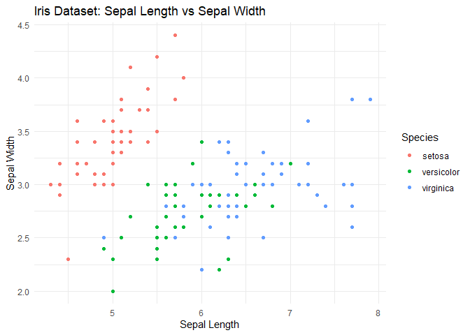

example image

    library(tidyverse)

    ## Warning: Paket 'ggplot2' wurde unter R Version 4.5.2 erstellt

    ## Warning: Paket 'tibble' wurde unter R Version 4.5.2 erstellt

    ## Warning: Paket 'tidyr' wurde unter R Version 4.5.2 erstellt

    ## Warning: Paket 'readr' wurde unter R Version 4.5.2 erstellt

    ## Warning: Paket 'purrr' wurde unter R Version 4.5.2 erstellt

    ## Warning: Paket 'dplyr' wurde unter R Version 4.5.2 erstellt

    ## Warning: Paket 'stringr' wurde unter R Version 4.5.2 erstellt

    ## Warning: Paket 'forcats' wurde unter R Version 4.5.2 erstellt

    ## Warning: Paket 'lubridate' wurde unter R Version 4.5.2 erstellt

    ## ── Attaching core tidyverse packages ──────────────────────── tidyverse 2.0.0 ──
    ## ✔ dplyr     1.2.0     ✔ readr     2.1.6
    ## ✔ forcats   1.0.1     ✔ stringr   1.6.0
    ## ✔ ggplot2   4.0.2     ✔ tibble    3.3.1
    ## ✔ lubridate 1.9.5     ✔ tidyr     1.3.2
    ## ✔ purrr     1.2.1     
    ## ── Conflicts ────────────────────────────────────────── tidyverse_conflicts() ──
    ## ✖ dplyr::filter() masks stats::filter()
    ## ✖ dplyr::lag()    masks stats::lag()
    ## ℹ Use the conflicted package (<http://conflicted.r-lib.org/>) to force all conflicts to become errors

    iris |> 
      ggplot(aes(x = Sepal.Length, y = Sepal.Width, color = Species)) +
      geom_point() +
      theme_minimal() +
      labs(title = "Iris Dataset: Sepal Length vs Sepal Width",
           x = "Sepal Length",
           y = "Sepal Width")

