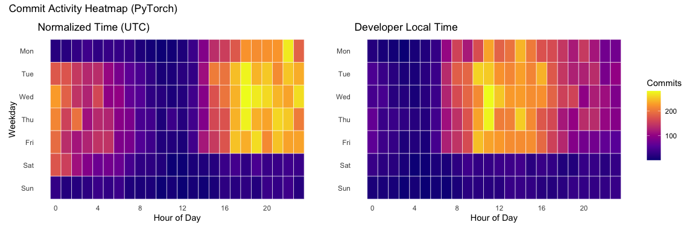
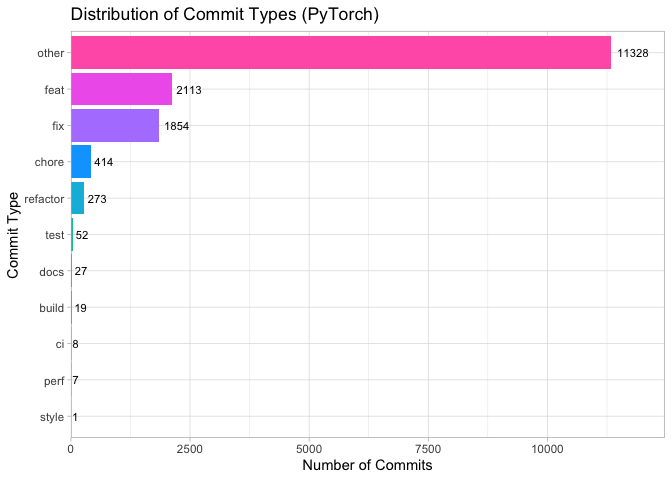
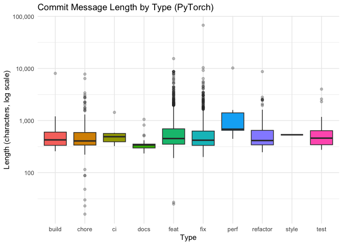
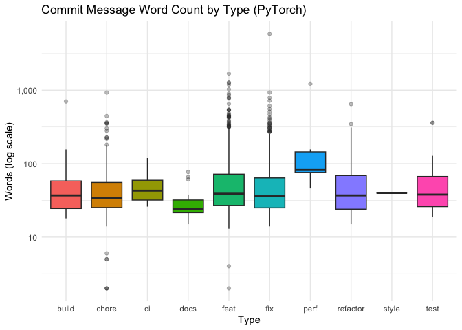
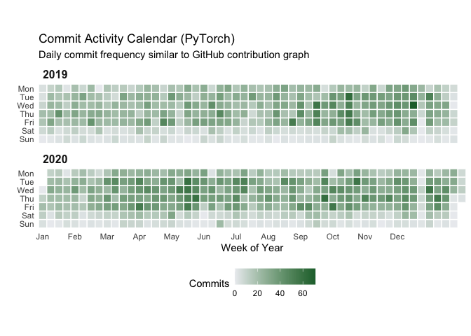

# Git Commit Analysis PyTorch

## Questions / ideas

-   How do commit volumes vary by weekday and hour, and do different
    repositories show distinct rhythms?
-   How common are conventional commit prefixes (`feat`, `fix`, `docs`,
    `refactor`, `test`, etc.), and how do these proportions change over
    time?
-   Are message lengths and formats different across repositories or
    commit types?
-   Which repositories show more maintenance activity (fix/docs/chore)
    versus feature activity (feat)?

## Data

## Data cleaning / manipulation goals

1.  **Parse and standardize time**
    -   Parse `date` into a proper datetime column and derive `year`,
        `month`, `weekday`, and `hour`.
    -   Drop rows with outlyer times, for example Unix time 0 (1970) or
        dates pre 2018 etc.
    -   Drop rows with missing or invalid `date` (needed for time-based
        plots and annotations).
    -   Verify that `commit` is unique; drop duplicates if necessary.
2.  **Message parsing**
    -   Normalize message text (trim whitespace, handle casing where
        needed).
    -   Detect conventional commit prefixes (`feat`, `fix`, `docs`,
        `refactor`, `test`, `chore`, `style`, `build`, `ci`, `perf`) by
        checking the start of the first line only; label everything else
        as `other`.
3.  **Filtering**
    -   Remove auto-generated messages (e.g., “Merge”, “Bump”, “Revert”)
        so the statistics reflect human-written commits.

## Visualization goals

### **Temporal heatmap for PyTorch**: 7x24 commits by weekday (rows) and hour (columns)

*How do commit volumes vary by weekday and hour?*

> The temporal heatmap shows a clear “work week” rhythm. Activity is
> mostly concentrated between Monday and Friday, with a significant
> drop-off on the weekends. Regarding the time of day, there is a
> consistent block of high activity between 4:00 PM and 00:00 PM.
> Interestingly, the activity between 1:00 AM and 5:00 AM is still
> higher than in the morning or early afternoon. This suggests that a
> large portion of the work happens outside of traditional 9-to-5 hours,
> with many developers being active late at night or very early in the
> morning, which is quite surprising. However, if we look at the
> developers’ actual local time (the right plot), this apparent “night
> shift” largely disappears. The late-night activity seen in the
> normalized UTC plot is actually just an artifact of time zone
> differences across a globally distributed team. When adjusting for
> local timezones, it becomes clear that most developers are indeed
> working during traditional daytime hours in their respective regions.

### **Message-type comparison**: stacked bar chart of commit types by repo (normalized to 100%).

*How common are conventional commit prefixes (`feat`, `fix`, `docs`,
`refactor`, `test`, etc.), and how do these proportions change over
time?*

> While the “other” category remains the largest with over 11,300
> commits, a significant portion of the data can be classified by
> looking for common action verbs. Among the categorized commits, “feat”
> is the most frequent type (2,113), followed closely by “fix” (1,854).
> This indicates that while the PyTorch repository does not strictly
> enforce standardized “Conventional Commit” tags, the developers
> frequently use descriptive language like “add”, “new”, or “fix” to
> label their work. Other categories such as “chore” (414) and
> “refactor” (273) are also present, showing a diverse range of
> development activities beyond simple feature additions.

### Message length comparison: boxplots of message length by repo or by commit type

*Are message lengths and formats different across repositories or commit
types?*

> Yes, the message lengths vary quite a bit depending on the commit
> type. The boxplot shows that “chore” “feat” and “fix” commits tend to
> have very different lengths, with many outliers indicating very long
> and detailed explanations for complex changes. In contrast, “style”
> messages (as an example) are in comparison very short and consistent,
> likely because they often contain standardized or automated text.

*Which repositories show more maintenance versus feature activity?
(based on Vis-2 & Vis-3)*

> The distribution of commit types reveals a balanced development
> strategy. Feature-related activity is very strong, with over 2,100
> commits dedicated to adding or implementing new functionality.
> However, when combining all maintenance-oriented categories—including
> fixes, chores, documentation, and refactoring—this “housekeeping” work
> actually represents the majority of the classified activity. This
> confirms that PyTorch is a mature and stable framework. The developers
> invest heavily in fixing bugs and maintaining the codebase to ensure
> reliability, which is just as important as the introduction of new
> features.

### Optional “commit calendar”: 7x53 daily heatmap (like GitHub’s contribution graph) for 2019 and 2020

