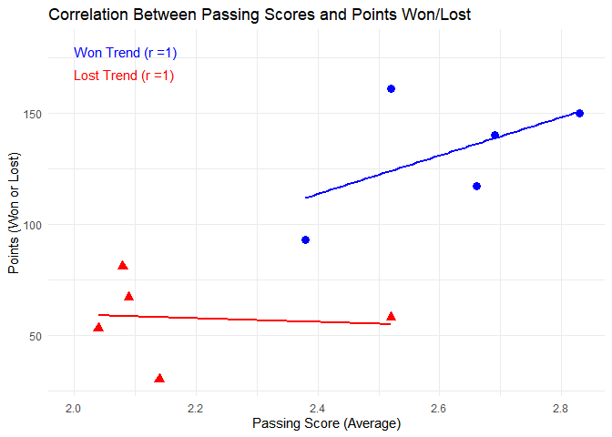

    ## ── Attaching core tidyverse packages ──────────────────────── tidyverse 2.0.0 ──
    ## ✔ dplyr     1.1.4     ✔ readr     2.1.5
    ## ✔ forcats   1.0.0     ✔ stringr   1.5.1
    ## ✔ lubridate 1.9.3     ✔ tibble    3.2.1
    ## ✔ purrr     1.0.2     ✔ tidyr     1.3.1
    ## ── Conflicts ────────────────────────────────────────── tidyverse_conflicts() ──
    ## ✖ dplyr::filter() masks stats::filter()
    ## ✖ dplyr::lag()    masks stats::lag()
    ## ℹ Use the conflicted package (<http://conflicted.r-lib.org/>) to force all conflicts to become errors
    ## New names:

    ## New names:
    ## New names:
    ## New names:
    ## New names:
    ## New names:
    ## • `` -> `...5`
    ## • `` -> `...6`
    ## • `` -> `...7`

    ## # A tibble: 10 × 3
    ##    `side-outs` points average
    ##    <chr>       <chr>    <dbl>
    ##  1 won         150       2.83
    ##  2 lost        53        2.04
    ##  3 won         117       2.66
    ##  4 lost        30        2.14
    ##  5 won         140       2.69
    ##  6 lost        81        2.08
    ##  7 won         161       2.52
    ##  8 lost        58        2.52
    ##  9 won         93        2.38
    ## 10 lost        67        2.09

    ## `geom_smooth()` using formula = 'y ~ x'

