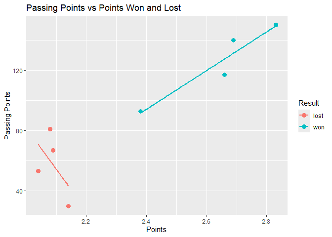

# This is the initial solution

    library(tidyverse)
    library(readxl)
    file <- "C:/Users/Yugua/Desktop/R2/Volleyball Passing- USA and TU.xlsx"
    #I don't know why the url didn't work
    #'file <- "https://dataverse.harvard.edu/api/access/datafile/:persistentId?persistentId=doi:10.7910/DVN/27560/SS9PFS"

# Visualization of chart one

    ggplot(data_for1, aes(x = pass_score, y = count, fill = result))+
      geom_bar(stat = "identity", position = "stack")+
      labs(
        title = "Attempts by Pass Score", 
        x = "pass score", 
        y = "attempts", 
        fill = "result"
      ) +
      scale_fill_manual(values = c("won" = "blue", "lost" = "red"),
                        labels = c("won", "lost"))

# Visualization for chart two

    ggplot(data_for2, aes(x = points, y = passing_points, color = type)) +
      geom_point(size = 3) +
      geom_smooth(method = "lm", se = FALSE, aes(group = type)) + 
      labs(
        title = "Passing Points vs Points Won and Lost",
        x = "Points",
        y = "Passing Points",
        color = "Result"
      )

    ## `geom_smooth()` using formula = 'y ~ x'

