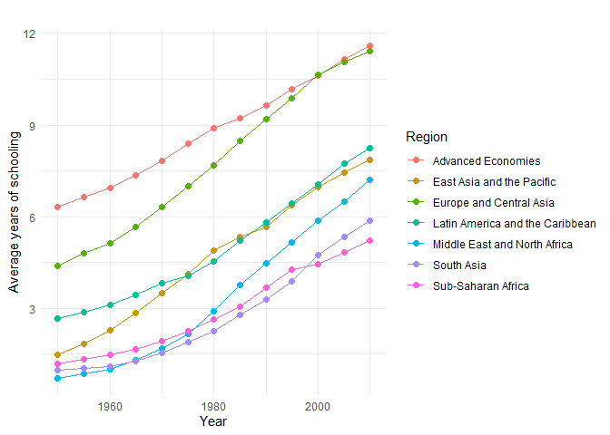
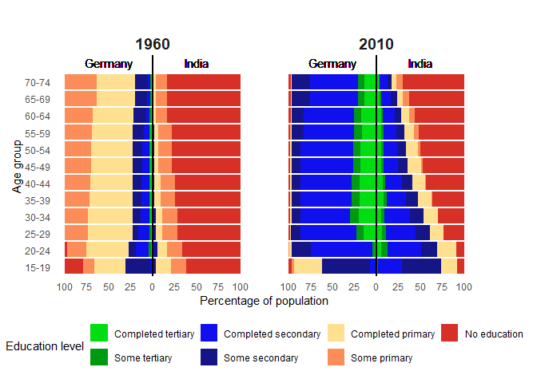

## Data cleaning & manipulation

The validation check shows that the percentage sums far exceed 100%.
More precisely, the range of the percentage sums are as follows:

<table>
<thead>
<tr>
<th style="text-align: right;">Minimum sum</th>
<th style="text-align: right;">Maximum sum</th>
</tr>
</thead>
<tbody>
<tr>
<td style="text-align: right;">99.84</td>
<td style="text-align: right;">199.74</td>
</tr>
</tbody>
</table>

This is especially interesting, because education levels are mutually
exclusive, so the percentage sums should always add up to 100%. However
if one was to consider that people with `completed` education are also
counted in the more generalized education level (`some`), the following
ranges are calculated:

<table>
<thead>
<tr>
<th style="text-align: right;">Minimum sum</th>
<th style="text-align: right;">Maximum sum</th>
</tr>
</thead>
<tbody>
<tr>
<td style="text-align: right;">99.5</td>
<td style="text-align: right;">100.5</td>
</tr>
</tbody>
</table>

This makes much more sense than the previous results, thus the adjusted
data will be used from now on.

Testing for implausible values and missing values:

    min(data)

    ## [1] 0

    max(data)

    ## [1] 100

    sum(is.na(data))

    ## [1] 0

There are no values below 0 or above 100, and there are no missing
values.

Are all expected country × year combinations present?

    ## [1] TRUE

All expected combinations are present, so there are no missing country ×
year combinations.

**Renaming cryptic names**

    DFData_adjusted <- DFData_adjusted %>%
      rename(
        `No education` = lu,
        `Some primary` = lp,
        `Completed primary` = lpc,
        `Some secondary` = ls,
        `Completed secondary` = lsc,
        `Some tertiary` = lh,
        `Completed tertiary` = lhc,
        `Years of schooling` = yr_sch,
        Region = region_code
      )

## Visualization 1: Regional Trends in Average Years of Schooling

## Vizualization 2: Education Level Distribution by Age Group and Country Comparison

## Questions and Interpretation

The graphs above show the trends in average years of schooling across
different regions over time (Visualization 1), as well as the
distribution of education levels by age group for Germany and India in
1960 and 2010 (Visualization 2). These graphs help answer the questions
proposed in the project description:

-   Q1: Has the global education gap between regions narrowed over time?

    > Visualization 1 shows that, although the average years of
    > schooling has increased for regions ranking lower in the graph,
    > the gap between the regions has not narrowed significantly, as all
    > other regions have kept up. A possible interpretation of this
    > could be that while less developed regions have made significant
    > progress in improving access to education, people in developed
    > regions spend more time in education, pursuing higher levels of
    > education. This explanation is backed by Visualization 2, which
    > shows that the percentage of people with completed tertiary
    > education has increased significantly in developed regions, while
    > for less developed regions there has just been a shift from no
    > education to some primary and some secondary education. This could
    > explain the steady increase across all countries.

-   Q2: Are there countries where average years of schooling have
    stagnated or even declined?

    > Visualization 1 shows that this was not the case for any region.
    > All regions show a steady increase in average years of schooling
    > over time, with no decline or stagnation.

-   Q4: Which age group benefits most from education expansion?

    > Generally, the younger the group, the more they benefit from
    > education expansion, as can be interpreted from Visualization 2.
    > Looking at Germany in 2010 for instance, the group with the
    > highest percentage of completed tertiary education is the 30-34
    > age group, which is to be expected, as younger people are still in
    > the persuit of this education level.
    >
    > Looking at the trends in Visualization 2 with the context of the
    > increase in schooling years in Visualization 1, it is safe to say
    > that the percentage of people completing tertiary education will
    > be higher in the group 15-19 fifteen years down the line (eg. in
    > 2025), than the group 30-34 in 2010. Thus, the youngest groups
    > will likely end up with the highest education level on average, as
    > has been the trend so far, benefiting the most from education
    > expansion.
