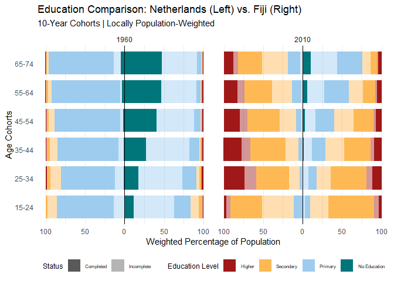

Setup

## Validation Checks

#### Sum of education level percentages

    # Sum up to 100?
    edu_lvl <- subset(data, select = c("lu", "lp", "lpc", "ls", "lsc", "lh", "lhc"))
    min_val<-which.min(rowSums(edu_lvl))
    max_val<-which.max(rowSums(edu_lvl)) # Max Value almost at 200, something must be wrong here with the data
    # What to do? Should from a threshold on entries be removed?
    sum(edu_lvl[min_val,])

    ## [1] 99.84

    sum(edu_lvl[max_val,])

    ## [1] 199.74

The sum of education levels should be at ~100, the max. value however,
is at almost 200. This is because the completed education level (e.g.,
lpc) is a subset of that education level in general (e.g., lp).
Therefore, for the general education levels the completed subset needs
to be subtracted:

#### Missing values?

    sum(is.na(data)) # No

    ## [1] 0

There are NO missing values

#### Implausible values?

    # Are there any implausible values (negative percentage)
    min(edu_lvl) # no values below 0

    ## [1] 0

    max(edu_lvl) # no values above 100

    ## [1] 100

The max value at any single education level is 100, the min value 0

#### Check if for every country there are all year entries

    # 1. Create a grid of all possible combinations
    all_combinations <- data %>%
      expand(country, year)
    # 2. Find which combinations are NOT in your original data
    missing_entries <- all_combinations %>%
      anti_join(data, by = c("country", "year"))
    print(missing_entries)

    ## # A tibble: 0 × 2
    ## # ℹ 2 variables: country <chr>, year <dbl>

There are NO missing combinations of country and year

BUT: for age groups from 15, 25 & 75 entries are always double (the
second time with ageto == 999). This needs to be removed!

## Renaming columns for improved readability

<table>
<colgroup>
<col style="width: 8%" />
<col style="width: 11%" />
<col style="width: 18%" />
<col style="width: 13%" />
<col style="width: 19%" />
<col style="width: 11%" />
<col style="width: 17%" />
</colgroup>
<thead>
<tr>
<th style="text-align: right;">No_education</th>
<th style="text-align: right;">Primary_education</th>
<th style="text-align: right;">Primary_education_completed</th>
<th style="text-align: right;">Secondary_education</th>
<th style="text-align: right;">Secondary_education_completed</th>
<th style="text-align: right;">Higher_education</th>
<th style="text-align: right;">Higher_education_completed</th>
</tr>
</thead>
<tbody>
<tr>
<td style="text-align: right;">86.12</td>
<td style="text-align: right;">9.68</td>
<td style="text-align: right;">3.64</td>
<td style="text-align: right;">0.42</td>
<td style="text-align: right;">0.12</td>
<td style="text-align: right;">0.02</td>
<td style="text-align: right;">0</td>
</tr>
</tbody>
</table>

# Data Visualizations

## Visualization 1

#### Takeaways from the first visualization:

\*\* Q1: Has the global education gap between regions narrowed over
time?\*\*

-   The plot shows that there has been a general increase in average
    years of schooling across all regions from 1950 to 2010, but the gap
    between regions has not as much narrowed as we might have expected.
    However, this question should be further investigated by looking at
    different variables indicating access to education. The increase in
    total years of schooling in developed countries might not be due to
    an increase in access to education but rather the development of
    tertiary education having received a higher social value in these
    countries over the past decades.

\*\* Q2: Are there countries where average years of schooling have
stagnated or even declined?\*\*

-   Mainly in Sub-Saharan Africa the increase in average years of
    schooling has become less steep since the mid 1990s. However, it is
    difficult to link specific regional events to the increase (or its
    stagnation), for this single countries instead of regions might need
    to be investigated.

## Visualization 2

## Visualization 2.1 (Age groups in 10-year cohorts)

## Takeaways from the second visualization:

**Q4: Which age group benefits most from education expansion?**

In both countries all age groups have benefited from education expansion
across the past decades. Just from the visualization (without
statistical tests) it is difficult to pinpoint one group that has
benefited the most, however, in the Netherlands the increased education
level is very prominent in the 25-34 year old, while in Fiji the
increase seems to be most noticeable in the age group of 15-24 year
olds.
