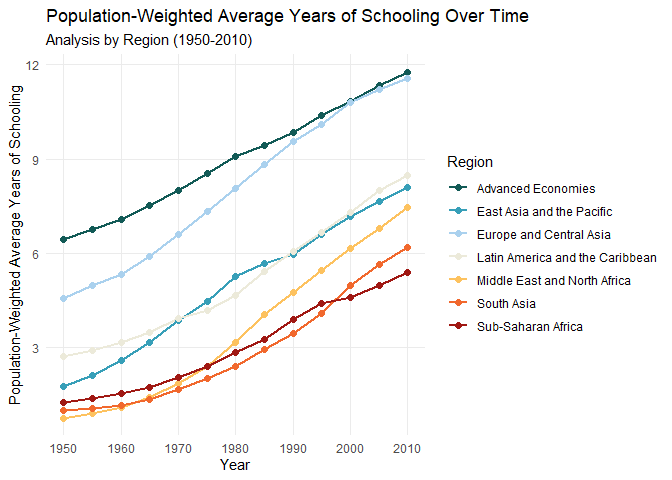
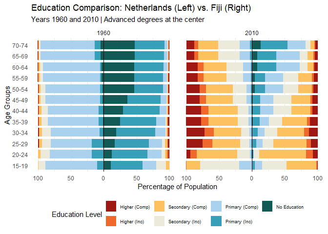

Setup

    ## Warning: Paket 'khroma' wurde unter R Version 4.5.3 erstellt

## Validation Checks

#### Sum of education level percentages

    ## [1] 99.84

    ## [1] 199.74

The sum of education levels should be at ~100, the max. value however,
is at almost 200. This is because the completed education level (e.g.,
lpc) is a subset of that education level in general (e.g., lp).
Therefore, for the general education levels the completed subset needs
to be subtracted:

#### Missing values?

    ## [1] 0

There are NO missing values

#### Implausible values?

    ## [1] 0

    ## [1] 100

The max value at any single education level is 100, the min value 0

#### Check if for every country there are all year entries

    ## # A tibble: 0 × 2
    ## # ℹ 2 variables: country <chr>, year <dbl>

There are NO missing combinations of country and year

BUT: for age groups from 15, 25 & 75 entries are always double (the
second time with ageto == 999). This needs to be removed!

## Renaming columns for improved readability

<table>
<colgroup>
<col style="width: 8%" />
<col style="width: 11%" />
<col style="width: 18%" />
<col style="width: 13%" />
<col style="width: 19%" />
<col style="width: 11%" />
<col style="width: 17%" />
</colgroup>
<thead>
<tr>
<th style="text-align: right;">No_education</th>
<th style="text-align: right;">Primary_education</th>
<th style="text-align: right;">Primary_education_completed</th>
<th style="text-align: right;">Secondary_education</th>
<th style="text-align: right;">Secondary_education_completed</th>
<th style="text-align: right;">Higher_education</th>
<th style="text-align: right;">Higher_education_completed</th>
</tr>
</thead>
<tbody>
<tr>
<td style="text-align: right;">86.12</td>
<td style="text-align: right;">9.68</td>
<td style="text-align: right;">3.64</td>
<td style="text-align: right;">0.42</td>
<td style="text-align: right;">0.12</td>
<td style="text-align: right;">0.02</td>
<td style="text-align: right;">0</td>
</tr>
</tbody>
</table>

# Data Visualizations

## Visualization 1

\##Visualization 2

