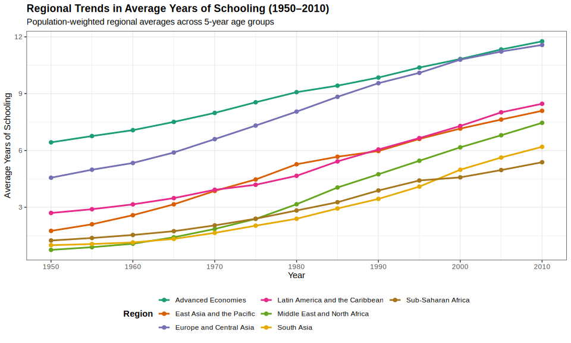
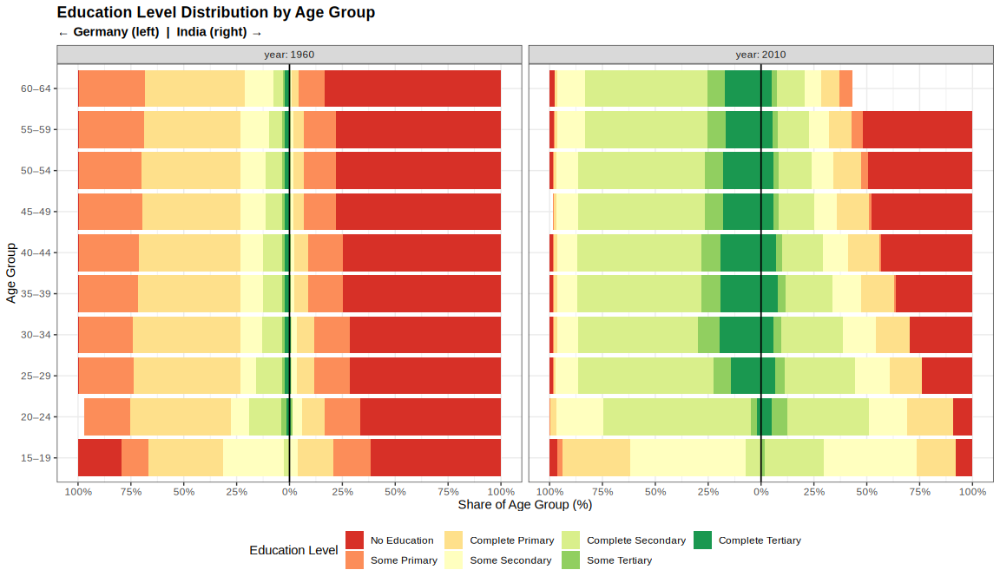
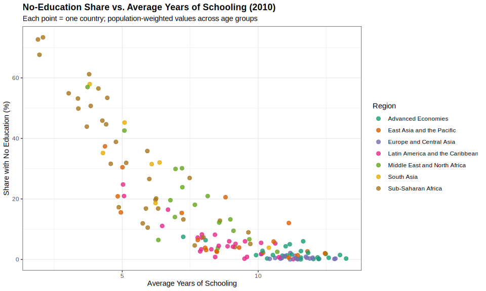
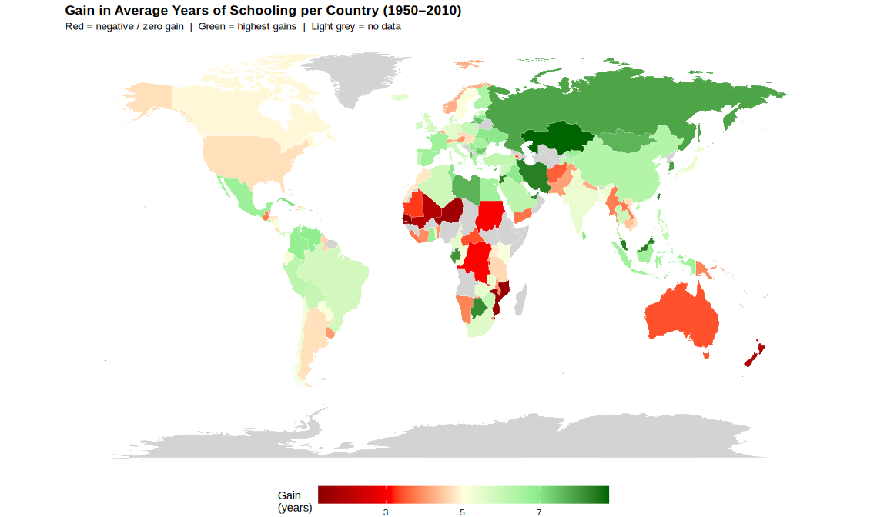

## Data

The analysis uses the **Barro-Lee Educational Attainment Dataset (v2.2,
2013)**.  
Data source: <http://barrolee.com> or directly via  
<https://raw.githubusercontent.com/barrolee/BarroLeeDataSet/refs/heads/master/BLData/BL2013_MF_v2.2.csv>

### First rows of the dataset

<table style="width:100%;">
<caption>First 5 rows of the Barro-Lee dataset</caption>
<colgroup>
<col style="width: 4%" />
<col style="width: 5%" />
<col style="width: 3%" />
<col style="width: 2%" />
<col style="width: 5%" />
<col style="width: 3%" />
<col style="width: 3%" />
<col style="width: 3%" />
<col style="width: 3%" />
<col style="width: 3%" />
<col style="width: 3%" />
<col style="width: 3%" />
<col style="width: 3%" />
<col style="width: 4%" />
<col style="width: 6%" />
<col style="width: 6%" />
<col style="width: 6%" />
<col style="width: 2%" />
<col style="width: 4%" />
<col style="width: 17%" />
</colgroup>
<thead>
<tr class="header">
<th style="text-align: center;">BLcode</th>
<th style="text-align: center;">country</th>
<th style="text-align: center;">year</th>
<th style="text-align: center;">sex</th>
<th style="text-align: center;">agefrom</th>
<th style="text-align: center;">ageto</th>
<th style="text-align: center;">lu</th>
<th style="text-align: center;">lp</th>
<th style="text-align: center;">lpc</th>
<th style="text-align: center;">ls</th>
<th style="text-align: center;">lsc</th>
<th style="text-align: center;">lh</th>
<th style="text-align: center;">lhc</th>
<th style="text-align: center;">yr_sch</th>
<th style="text-align: center;">yr_sch_pri</th>
<th style="text-align: center;">yr_sch_sec</th>
<th style="text-align: center;">yr_sch_ter</th>
<th style="text-align: center;">pop</th>
<th style="text-align: center;">WBcode</th>
<th style="text-align: center;">region_code</th>
</tr>
</thead>
<tbody>
<tr class="odd">
<td style="text-align: center;">1</td>
<td style="text-align: center;">Algeria</td>
<td style="text-align: center;">1950</td>
<td style="text-align: center;">MF</td>
<td style="text-align: center;">15</td>
<td style="text-align: center;">19</td>
<td style="text-align: center;">86.12</td>
<td style="text-align: center;">13.32</td>
<td style="text-align: center;">3.64</td>
<td style="text-align: center;">0.54</td>
<td style="text-align: center;">0.12</td>
<td style="text-align: center;">0.02</td>
<td style="text-align: center;">0.00</td>
<td style="text-align: center;">0.57</td>
<td style="text-align: center;">0.54</td>
<td style="text-align: center;">0.03</td>
<td style="text-align: center;">0.00</td>
<td style="text-align: center;">876</td>
<td style="text-align: center;">DZA</td>
<td style="text-align: center;">Middle East and North Africa</td>
</tr>
<tr class="even">
<td style="text-align: center;">1</td>
<td style="text-align: center;">Algeria</td>
<td style="text-align: center;">1950</td>
<td style="text-align: center;">MF</td>
<td style="text-align: center;">20</td>
<td style="text-align: center;">24</td>
<td style="text-align: center;">81.48</td>
<td style="text-align: center;">16.22</td>
<td style="text-align: center;">4.30</td>
<td style="text-align: center;">1.90</td>
<td style="text-align: center;">0.75</td>
<td style="text-align: center;">0.40</td>
<td style="text-align: center;">0.16</td>
<td style="text-align: center;">0.89</td>
<td style="text-align: center;">0.75</td>
<td style="text-align: center;">0.13</td>
<td style="text-align: center;">0.01</td>
<td style="text-align: center;">756</td>
<td style="text-align: center;">DZA</td>
<td style="text-align: center;">Middle East and North Africa</td>
</tr>
<tr class="odd">
<td style="text-align: center;">1</td>
<td style="text-align: center;">Algeria</td>
<td style="text-align: center;">1950</td>
<td style="text-align: center;">MF</td>
<td style="text-align: center;">25</td>
<td style="text-align: center;">29</td>
<td style="text-align: center;">81.48</td>
<td style="text-align: center;">16.22</td>
<td style="text-align: center;">4.30</td>
<td style="text-align: center;">1.90</td>
<td style="text-align: center;">0.75</td>
<td style="text-align: center;">0.40</td>
<td style="text-align: center;">0.25</td>
<td style="text-align: center;">0.89</td>
<td style="text-align: center;">0.75</td>
<td style="text-align: center;">0.13</td>
<td style="text-align: center;">0.01</td>
<td style="text-align: center;">649</td>
<td style="text-align: center;">DZA</td>
<td style="text-align: center;">Middle East and North Africa</td>
</tr>
<tr class="even">
<td style="text-align: center;">1</td>
<td style="text-align: center;">Algeria</td>
<td style="text-align: center;">1950</td>
<td style="text-align: center;">MF</td>
<td style="text-align: center;">30</td>
<td style="text-align: center;">34</td>
<td style="text-align: center;">81.20</td>
<td style="text-align: center;">16.80</td>
<td style="text-align: center;">3.50</td>
<td style="text-align: center;">1.60</td>
<td style="text-align: center;">0.52</td>
<td style="text-align: center;">0.40</td>
<td style="text-align: center;">0.25</td>
<td style="text-align: center;">0.85</td>
<td style="text-align: center;">0.73</td>
<td style="text-align: center;">0.11</td>
<td style="text-align: center;">0.01</td>
<td style="text-align: center;">555</td>
<td style="text-align: center;">DZA</td>
<td style="text-align: center;">Middle East and North Africa</td>
</tr>
<tr class="odd">
<td style="text-align: center;">1</td>
<td style="text-align: center;">Algeria</td>
<td style="text-align: center;">1950</td>
<td style="text-align: center;">MF</td>
<td style="text-align: center;">35</td>
<td style="text-align: center;">39</td>
<td style="text-align: center;">81.20</td>
<td style="text-align: center;">16.80</td>
<td style="text-align: center;">3.50</td>
<td style="text-align: center;">1.60</td>
<td style="text-align: center;">0.51</td>
<td style="text-align: center;">0.40</td>
<td style="text-align: center;">0.28</td>
<td style="text-align: center;">0.85</td>
<td style="text-align: center;">0.73</td>
<td style="text-align: center;">0.11</td>
<td style="text-align: center;">0.01</td>
<td style="text-align: center;">479</td>
<td style="text-align: center;">DZA</td>
<td style="text-align: center;">Middle East and North Africa</td>
</tr>
</tbody>
</table>

First 5 rows of the Barro-Lee dataset

**Key columns**

<table>
<thead>
<tr class="header">
<th>Column</th>
<th>Description</th>
</tr>
</thead>
<tbody>
<tr class="odd">
<td><code>lu</code></td>
<td>% with no education</td>
</tr>
<tr class="even">
<td><code>lp</code></td>
<td>% with some primary education</td>
</tr>
<tr class="odd">
<td><code>lpc</code></td>
<td>% with completed primary education</td>
</tr>
<tr class="even">
<td><code>ls</code></td>
<td>% with some secondary education</td>
</tr>
<tr class="odd">
<td><code>lsc</code></td>
<td>% with completed secondary education</td>
</tr>
<tr class="even">
<td><code>lh</code></td>
<td>% with some higher/tertiary education</td>
</tr>
<tr class="odd">
<td><code>lhc</code></td>
<td>% with completed higher/tertiary education</td>
</tr>
<tr class="even">
<td><code>yr_sch</code></td>
<td>Average years of schooling</td>
</tr>
<tr class="odd">
<td><code>WBcode</code></td>
<td>World Bank country code</td>
</tr>
<tr class="even">
<td><code>region_code</code></td>
<td>World region</td>
</tr>
</tbody>
</table>

The education-level variables are mutually exclusive: each person is
counted only under their **highest** attained education level.

------------------------------------------------------------------------

## Data Cleaning & Validation

### Check 1 — Education level groups sum to 100

The dataset uses three mutually exclusive **level groups**: primary
(`lp`), secondary (`ls`), and higher (`lh`). Within each group, the `*c`
variant (`lpc`, `lsc`, `lhc`) counts those who **completed** that level.
Accordingly, `lu + lp + ls + lh ≈ 100` for each row, while
`lu + lp + lpc + ls + lsc + lh + lhc` will naturally exceed 100 (as
`lpc`, `lsc`, `lhc` are nested subsets of their parent level).

<table>
<caption>Share sum validation: lu + lp + ls + lh should be
~100</caption>
<thead>
<tr class="header">
<th style="text-align: right;">n_rows</th>
<th style="text-align: right;">mean_total</th>
<th style="text-align: right;">min_total</th>
<th style="text-align: right;">max_total</th>
<th style="text-align: right;">n_off_by_gt0.5pct</th>
</tr>
</thead>
<tbody>
<tr class="odd">
<td style="text-align: right;">22776</td>
<td style="text-align: right;">100</td>
<td style="text-align: right;">99.5</td>
<td style="text-align: right;">100.5</td>
<td style="text-align: right;">0</td>
</tr>
</tbody>
</table>

Share sum validation: lu + lp + ls + lh should be ~100

### Check 2 — Missing and negative values

<table>
<caption>Missing and negative value counts per column</caption>
<thead>
<tr class="header">
<th style="text-align: left;">column</th>
<th style="text-align: right;">n_missing</th>
<th style="text-align: right;">n_negative</th>
</tr>
</thead>
<tbody>
<tr class="odd">
<td style="text-align: left;">lu</td>
<td style="text-align: right;">0</td>
<td style="text-align: right;">0</td>
</tr>
<tr class="even">
<td style="text-align: left;">lp</td>
<td style="text-align: right;">0</td>
<td style="text-align: right;">0</td>
</tr>
<tr class="odd">
<td style="text-align: left;">lpc</td>
<td style="text-align: right;">0</td>
<td style="text-align: right;">0</td>
</tr>
<tr class="even">
<td style="text-align: left;">ls</td>
<td style="text-align: right;">0</td>
<td style="text-align: right;">0</td>
</tr>
<tr class="odd">
<td style="text-align: left;">lsc</td>
<td style="text-align: right;">0</td>
<td style="text-align: right;">0</td>
</tr>
<tr class="even">
<td style="text-align: left;">lh</td>
<td style="text-align: right;">0</td>
<td style="text-align: right;">0</td>
</tr>
<tr class="odd">
<td style="text-align: left;">lhc</td>
<td style="text-align: right;">0</td>
<td style="text-align: right;">0</td>
</tr>
<tr class="even">
<td style="text-align: left;">yr_sch</td>
<td style="text-align: right;">0</td>
<td style="text-align: right;">0</td>
</tr>
<tr class="odd">
<td style="text-align: left;">pop</td>
<td style="text-align: right;">0</td>
<td style="text-align: right;">0</td>
</tr>
</tbody>
</table>

Missing and negative value counts per column

### Check 3 — Country × year coverage

    ## All countries have data for all 13 expected years.

------------------------------------------------------------------------

## Visualization 1 — Regional Trends in Average Years of Schooling

*Addresses Q1 (Has the education gap between regions narrowed?) and Q2
(Are there countries where schooling stagnated?)*

Population-weighted average years of schooling per region per year:

------------------------------------------------------------------------

## Visualization 2 — Education Distribution by Age Group (Population Pyramid Style)

*Addresses Q4 (Which age group benefits most?) and Q1*

Germany (left) vs. India (right) for the years 1960 and 2010, with
stacked bars showing the share in each education level per 5-year age
group.

------------------------------------------------------------------------

## Visualization 3 — No-Education Share vs. Average Years of Schooling

*Addresses Q3 (Do countries with more uneducated population have lower
average schooling?) — shown here for the year 2010*

Each point is one country; colour encodes world region. Values are
population-weighted averages across all 5-year age groups.

------------------------------------------------------------------------

## Visualization 4 — Choropleth Map: Gain in Average Years of Schooling (1950–2010)

*Addresses Q1 and Q2*

Countries coloured by the absolute increase in average years of
schooling between 1950 and 2010. **Red** = negative or zero gain;
**Green** = highest gains; **Light grey** = no data.

