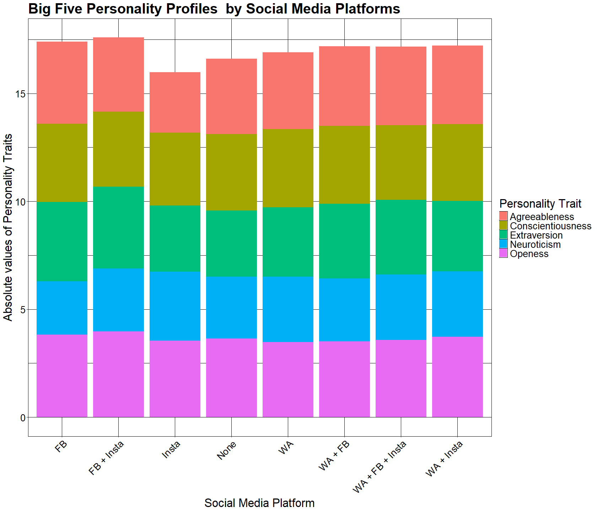

## General project topic

In this project, you are tasked with generating a spider-web diagram on
the relation between social-media applications use and the personality
profiles of more than 3000 users. We want to focus on the data regarding
“young adults” (18 to 34) in particular. The social media platforms
included are Whatsapp, Facebook and Instagram, and the personality
profiles are based on the “Big-5” trait-model of personality, which
measures Openness, Conscientiousness, Extraversion, Agreeableness and
Neuroticism by means of a standardized questionnaire.

## The Data Set (processed)

Find the filtered data frame below:

    ## # A tibble: 6 × 15
    ##     Age has_whatsapp has_facebook has_instagram BFI_Extra BFI_Agree BFI_Consc
    ##   <dbl>        <dbl>        <dbl>         <dbl>     <dbl>     <dbl>     <dbl>
    ## 1    34            1            1             1      3.25       4.3      4.67
    ## 2    34            1            1             1      3.25       3.1      3.56
    ## 3    34            1            1             1      4.25       3.6      3.78
    ## 4    34            1            1             1      4.5        3.2      4.56
    ## 5    34            1            1             1      4.25       4.5      3.44
    ## 6    34            1            1             1      2.12       4.5      3.33
    ## # ℹ 8 more variables: BFI_Neuro <dbl>, BFI_Open <dbl>, has_WF <lgl>,
    ## #   has_FI <lgl>, has_WI <lgl>, has_WFI <lgl>, has_none <lgl>, case_num <dbl>

<table style="width:100%;">
<caption>Here you can find the processed data used for
plotting:</caption>
<colgroup>
<col style="width: 12%" />
<col style="width: 17%" />
<col style="width: 18%" />
<col style="width: 23%" />
<col style="width: 16%" />
<col style="width: 12%" />
</colgroup>
<thead>
<tr class="header">
<th style="text-align: center;">case_num</th>
<th style="text-align: center;">Extraversion</th>
<th style="text-align: center;">Agreeableness</th>
<th style="text-align: center;">Conscientiousness</th>
<th style="text-align: center;">Neuroticism</th>
<th style="text-align: center;">Openess</th>
</tr>
</thead>
<tbody>
<tr class="odd">
<td style="text-align: center;">min</td>
<td style="text-align: center;">1.125000</td>
<td style="text-align: center;">1.600000</td>
<td style="text-align: center;">1.222222</td>
<td style="text-align: center;">1.000000</td>
<td style="text-align: center;">1.600000</td>
</tr>
<tr class="even">
<td style="text-align: center;">max</td>
<td style="text-align: center;">5.000000</td>
<td style="text-align: center;">5.000000</td>
<td style="text-align: center;">5.000000</td>
<td style="text-align: center;">5.000000</td>
<td style="text-align: center;">5.000000</td>
</tr>
<tr class="odd">
<td style="text-align: center;">1</td>
<td style="text-align: center;">3.677083</td>
<td style="text-align: center;">3.791667</td>
<td style="text-align: center;">3.629630</td>
<td style="text-align: center;">2.468750</td>
<td style="text-align: center;">3.825000</td>
</tr>
<tr class="even">
<td style="text-align: center;">2</td>
<td style="text-align: center;">3.062500</td>
<td style="text-align: center;">2.800000</td>
<td style="text-align: center;">3.388889</td>
<td style="text-align: center;">3.187500</td>
<td style="text-align: center;">3.550000</td>
</tr>
<tr class="odd">
<td style="text-align: center;">3</td>
<td style="text-align: center;">3.221726</td>
<td style="text-align: center;">3.555357</td>
<td style="text-align: center;">3.623016</td>
<td style="text-align: center;">3.025298</td>
<td style="text-align: center;">3.479762</td>
</tr>
<tr class="even">
<td style="text-align: center;">4</td>
<td style="text-align: center;">3.265748</td>
<td style="text-align: center;">3.647244</td>
<td style="text-align: center;">3.551181</td>
<td style="text-align: center;">3.026575</td>
<td style="text-align: center;">3.727559</td>
</tr>
<tr class="odd">
<td style="text-align: center;">5</td>
<td style="text-align: center;">3.787500</td>
<td style="text-align: center;">3.440000</td>
<td style="text-align: center;">3.466667</td>
<td style="text-align: center;">2.925000</td>
<td style="text-align: center;">3.970000</td>
</tr>
<tr class="even">
<td style="text-align: center;">6</td>
<td style="text-align: center;">3.451531</td>
<td style="text-align: center;">3.686395</td>
<td style="text-align: center;">3.622071</td>
<td style="text-align: center;">2.920068</td>
<td style="text-align: center;">3.509864</td>
</tr>
<tr class="odd">
<td style="text-align: center;">7</td>
<td style="text-align: center;">3.465340</td>
<td style="text-align: center;">3.629875</td>
<td style="text-align: center;">3.464917</td>
<td style="text-align: center;">3.024821</td>
<td style="text-align: center;">3.580322</td>
</tr>
<tr class="even">
<td style="text-align: center;">8</td>
<td style="text-align: center;">3.064103</td>
<td style="text-align: center;">3.494872</td>
<td style="text-align: center;">3.532764</td>
<td style="text-align: center;">2.878205</td>
<td style="text-align: center;">3.638462</td>
</tr>
</tbody>
</table>

Here you can find the processed data used for plotting:

## Visualisation

