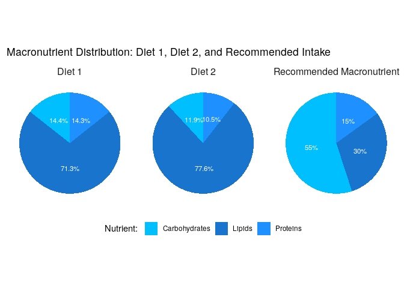
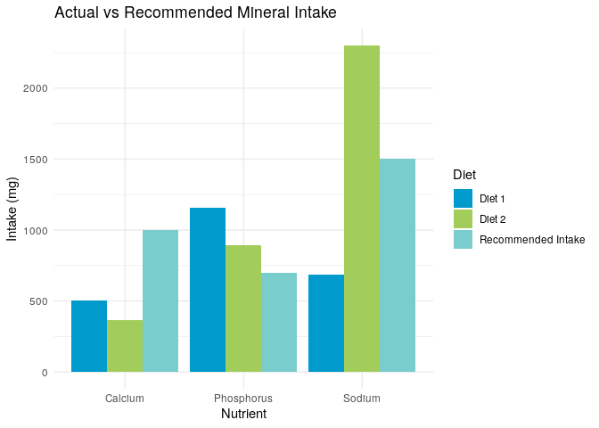

Diet plans

Day 1: -Wholegrain Bread: 100g - “Wholewheat bread” in data -Apple:
150g - “Apple, fresh” -Chicken Breast, cooked: 120g - “Chicken, breast,
with skin, raw” -Broccoli, steamed: 100g - “Broccoli, steamed (without
addition of salt)” -Olive oil: 10g -Almonds: 30g - “Almond”  
-Low-fat Yogurt: 150g - “Yogurt, low fat”

Day 2: -Rice, cooked: 150g - “Rice parboiled, cooked in salted water
(uniodised)”  
-Banana: 120g -Salmon, smoked: 150g -Spinach, steamed: 100g -Sunflower
Oil: 10g -Walnuts: 20g -Soya drink, plain, with calcium and vitamin
fortified: 200ml

    # Subset relevant columns
    dat <- data %>%
      select(
        "ID", "Name", "Category",
        "Fat, total (g)", "Carbohydrates, available (g)", "Protein (g)",
        "Vitamin B1 (thiamine) (mg)", "Vitamin B2 (riboflavin) (mg)", "Vitamin B6 (pyridoxine) (mg)",
        "Calcium (Ca) (mg)", "Sodium (Na) (mg)", "Phosphorus (P) (mg)"
      ) %>%
      
      # Filter for specific foods
      filter(str_detect(Name, regex("Apple|Bread|Chicken|Broccoli|Oil|Almond|Yogurt|Rice|Banana|Salmon|Sunflower Oil|Spinach|Walnut|Soya drink",
        ignore_case = TRUE
        
      ))) %>%
      # Add diet column
      mutate(Diet = case_when(
        Name %in% c("Almond", "Wholewheat bread", "Apple, fresh", "Chicken, breast, with skin, raw", 
                    "Broccoli, steamed (without addition of salt)", "Olive oil", "Yogurt, low fat") ~ "Diet 1",
        Name %in% c("Banana, raw", "Rice parboiled, cooked in salted water (uniodised)", "Salmon, smoked", 
                    "Spinach, steamed (without addition of salt)", "Sunflower oil", "Walnut", 
                    "Soya drink, plain, with calcium and vitamin fortified") ~ "Diet 2",
        TRUE ~ NA_character_
      )) %>%
      # remove NAs
      filter(!is.na(Diet))

    # Convert character columns to numeric for calculations
    convert_numeric <- setdiff(names(dat), c("ID", "Name", "Category", "Diet"))
    dat[convert_numeric] <- lapply(dat[convert_numeric], as.numeric)

    ## Warning in lapply(dat[convert_numeric], as.numeric): NAs introduced by coercion

    # Energy density for macronutrients
    energy_density <- c(Carbs = 17, Lipids = 37, Proteins = 17)

    # Add energy columns and recommended percentages
    dat <- dat %>%
      mutate(
        energy_carbs = `Carbohydrates, available (g)` * energy_density["Carbs"],
        energy_proteins = `Protein (g)` * energy_density["Proteins"],
        energy_lipids = `Fat, total (g)` * energy_density["Lipids"],
        total_energy = energy_carbs + energy_proteins + energy_lipids,
        percent_carbs = (energy_carbs / total_energy) * 100,
        percent_proteins = (energy_proteins / total_energy) * 100,
        percent_lipids = (energy_lipids / total_energy) * 100
      )

    # group by diet
    dat_by_diet <- dat %>%
      
      group_by(Diet) %>%
      
      summarise(
        energy_carbs = sum(energy_carbs, na.rm = TRUE),
        energy_proteins = sum(energy_proteins, na.rm = TRUE),
        energy_lipids = sum(energy_lipids, na.rm = TRUE),
        total_energy = sum(total_energy, na.rm = TRUE)
      ) %>%
      
      mutate(
        Carbohydrates = (energy_carbs / total_energy) * 100,
        Proteins  = (energy_proteins / total_energy) * 100,
        Lipids  = (energy_lipids / total_energy) * 100
      ) %>%
      
      select(Diet, Carbohydrates, Proteins, Lipids)%>%
      pivot_longer(cols = -Diet, names_to = "Nutrient", values_to = "Percentage")

Pie chart for Macronutrient

    # recommended intake
    recommended_macronutrient <- tibble(
      Diet = "Recommended Macronutrient",
      Nutrient = c("Carbohydrates", "Proteins", "Lipids"),
      Percentage = c(55, 15, 30)
    )

    # combine data for plot
    dat_macronutrient <- bind_rows(dat_by_diet, recommended_macronutrient)

    dat_macronutrient_labels <- dat_macronutrient %>%
      group_by(Diet) %>%
      arrange(Diet, desc(Nutrient)) %>%
      mutate(
        pos = cumsum(Percentage) - (Percentage / 2),  # position in the middle
        label = paste0(round(Percentage, 1), "%")    # format label as percentage
      )

    # ggplot
    ggplot(dat_macronutrient_labels, aes(x = "", y = Percentage, fill = Nutrient)) +
      geom_bar(stat = "identity", width = 1) +
      geom_text(aes(y = pos, label = label), color = "white", size = 3) +  # Add labels
      coord_polar("y", start = 0) +
      facet_wrap(~Diet, scales = "free") +
      labs(
        title = "Macronutrient Distribution: Diet 1, Diet 2, and Recommended Intake",
        fill = "Nutrient: "
      ) +
      scale_fill_manual(values = c("Carbohydrates" = "#00BFFF", "Proteins" = "#1E90FF", "Lipids" = "#1874CD")) +
      theme_minimal() +
      theme(
        axis.title = element_blank(),
        axis.text = element_blank(),
        panel.grid = element_blank(),
        legend.position = "bottom",
        strip.text = element_text(size = 12)
      )

Bar chart for Minerals

    dat_minerals <- dat %>%
      group_by(Diet) %>%
      summarise(
        Calcium = sum(`Calcium (Ca) (mg)`, na.rm = TRUE),
        Phosphorus = sum(`Phosphorus (P) (mg)`, na.rm = TRUE),
        Sodium = sum(`Sodium (Na) (mg)`, na.rm = TRUE)
      ) %>%
      pivot_longer(cols = -Diet, names_to = "Nutrient", values_to = "Percentage") %>%
      # add recommended intake
      bind_rows(
        tibble(
      Diet = "Recommended Intake",
      Nutrient = c("Calcium", "Phosphorus", "Sodium"),
      Percentage = c(1000, 700, 1500))
      )

    # plot

    ggplot(dat_minerals, aes(x = Nutrient, y = Percentage, fill = Diet)) +
      geom_bar(stat = "identity", position = "dodge") +
      labs(
        title = "Actual vs Recommended Mineral Intake",
        x = "Nutrient",
        y = "Intake (mg)",
        fill = "Diet"
      ) +
      theme_minimal() +
      scale_fill_manual(values = c("Diet 1" = "#009ACD", "Diet 2" = "#A2CD5A", "Recommended Intake" = "#79CDCD"))

