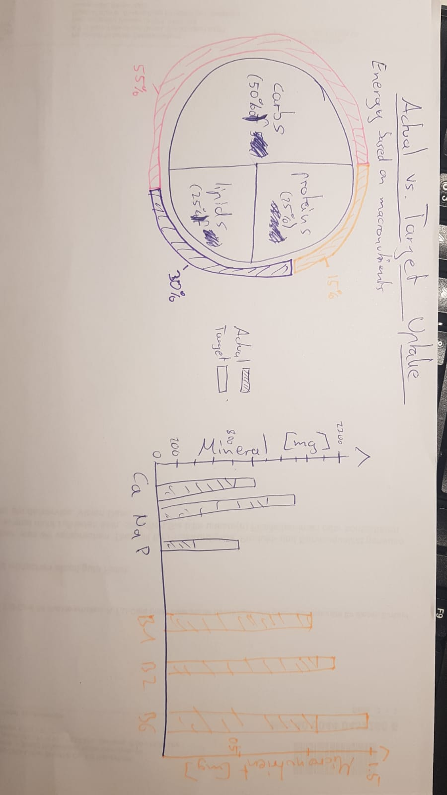

# Phase 1 - Drafting a project

The idea of the data project is to extract and process some nutrient
data from a provided table. Based on some predefined foods that were
(hypothetically) consumed within a day, the project aims to answer i) to
which extent ones energy demand is saturated, ii) how much each
macronutrient (i.e., carbs, lipids, proteins) contributes to ones daily
energy uptake, and iii) to which extent ones mineral (i.e., Calcium,
Phosphorus, Sodium) and vitamin (i.e., B1, B2, B6) demand is saturated.
i) and ii) could be visualised somehow in the same pie plot. iii) could
be represented well by a histogram. The drawing of one possible outcome
is shown elsewhere.

To this end, you are supposed to filter the dataset for some predefined
foods (perhaps your favourite foods you wish to eat within a day? Any
food plan could offer some alternative daily food “recommendations”. But
be careful, your food might be found under another name in the dataset.
You could also use the two plans provided below.). Then, you should
calculate the total uptake (in g or mg) from the foods, i.e., the uptake
of the aforementioned macronutrients, minerals, and micronutrients.
Therefore, you need to approximate the amount of all foods that were
consumed. Finally, you can calculate a (fictive) persons Daily Energy
Demand and the relative contribution of each macronutrient. The total
mineral and micronutrient uptake only needs to be summed up.

Potential additions to the project:  
-The dataset could be imported directly from the webpage.  
-In the end, you could create an output file with all the information
necessary to recreate the plots and a add a respective date to create
some kind of dietary history.

## Data Set

The Swiss Food Composition Database provided by the state of Swizzerland
is used for the project. It is a database consisting of over 1000
different food and drinks and the nutrient composition of these.

### Data Preview

<table>
<colgroup>
<col style="width: 37%" />
<col style="width: 3%" />
<col style="width: 4%" />
<col style="width: 4%" />
<col style="width: 3%" />
<col style="width: 14%" />
<col style="width: 3%" />
<col style="width: 9%" />
<col style="width: 9%" />
<col style="width: 8%" />
</colgroup>
<thead>
<tr class="header">
<th style="text-align: left;">X1</th>
<th style="text-align: left;">X2</th>
<th style="text-align: left;">X3</th>
<th style="text-align: left;">X4</th>
<th style="text-align: left;">X5</th>
<th style="text-align: left;">X6</th>
<th style="text-align: left;">X7</th>
<th style="text-align: left;">X8</th>
<th style="text-align: left;">X9</th>
<th style="text-align: left;">X10</th>
</tr>
</thead>
<tbody>
<tr class="odd">
<td style="text-align: left;">Swiss food composition database – Generic
foods V6.5 (27.06.2023)</td>
<td style="text-align: left;">NA</td>
<td style="text-align: left;">NA</td>
<td style="text-align: left;">NA</td>
<td style="text-align: left;">NA</td>
<td style="text-align: left;">NA</td>
<td style="text-align: left;">NA</td>
<td style="text-align: left;">NA</td>
<td style="text-align: left;">NA</td>
<td style="text-align: left;">NA</td>
</tr>
<tr class="even">
<td style="text-align: left;">Corrected version 17.08.2023 (Correction:
nutrient “Zinc”, food 13420 “Beer, non-alcoholic”)</td>
<td style="text-align: left;">NA</td>
<td style="text-align: left;">NA</td>
<td style="text-align: left;">NA</td>
<td style="text-align: left;">NA</td>
<td style="text-align: left;">NA</td>
<td style="text-align: left;">NA</td>
<td style="text-align: left;">NA</td>
<td style="text-align: left;">NA</td>
<td style="text-align: left;">NA</td>
</tr>
<tr class="odd">
<td style="text-align: left;">ID</td>
<td style="text-align: left;">ID V 4.0</td>
<td style="text-align: left;">ID SwissFIR</td>
<td style="text-align: left;">Name</td>
<td style="text-align: left;">Synonyms</td>
<td style="text-align: left;">Category</td>
<td style="text-align: left;">Density</td>
<td style="text-align: left;">Matrix unit</td>
<td style="text-align: left;">Energy, kilojoules (kJ)</td>
<td style="text-align: left;">Derivation of value</td>
</tr>
<tr class="even">
<td style="text-align: left;">10533</td>
<td style="text-align: left;">NA</td>
<td style="text-align: left;">NA</td>
<td style="text-align: left;">Agar Agar</td>
<td style="text-align: left;">NA</td>
<td style="text-align: left;">Various/Gelling and binding agents</td>
<td style="text-align: left;">NA</td>
<td style="text-align: left;">per 100g edible portion</td>
<td style="text-align: left;">641</td>
<td style="text-align: left;">Automated calculation</td>
</tr>
<tr class="odd">
<td style="text-align: left;">10536</td>
<td style="text-align: left;">NA</td>
<td style="text-align: left;">NA</td>
<td style="text-align: left;">Agave syrup</td>
<td style="text-align: left;">NA</td>
<td style="text-align: left;">Sweets/Sugar and sweeteners</td>
<td style="text-align: left;">NA</td>
<td style="text-align: left;">per 100g edible portion</td>
<td style="text-align: left;">1240</td>
<td style="text-align: left;">Automated calculation</td>
</tr>
</tbody>
</table>

Entries of the data table are shown for the first ten out of 129
columns.

The complete data set is provided by and available at [The Swiss Food
Composition Database](https://naehrwertdaten.ch/en/downloads/).

## Visualisation goals:

The data could be represented as a pie chart and one or more histograms.
A visualisation-example-drawing is shown below (Note: The legened is
only valid for the histogram.). The pie chart can show the relative
energy uptake per macronutrient and directly compare it to some general
recommendation given below. You could add some bar showing the actual
energy uptake vs the energy demand (not shown in plot, but actually the
answer to i) ). The one or more histograms could represent the uptake of
minerals and micronutrients as bars that show the “progress” in
achieving ones demand (given below).

The figures could also be simplified and the data presented in several
charts.

<figure>

<figcaption aria-hidden="true">Lokales Bild</figcaption>
</figure>

## Required information

### Calculation of Daily Energy Demand

  

*B**a**s**a**l* *M**e**t**a**b**o**l**i**c* *R**a**t**e* (*B**M**R*) = 4.2 kJ/(kg⋅hours) ⋅ *h* ⋅ *m*

*D**a**i**l**y* *E**n**e**r**g**y* *D**e**m**a**n**d* (*D**E**M*) = *B**M**R* ⋅ *P**A**L*

*E**n**e**r**g**y* *U**p**t**a**k**e**m**a**c**r**o**n**u**t**r**i**e**n**t* = *E**n**e**r**g**y* *D**e**n**s**i**t**y**m**a**c**r**o**n**u**t**r**i**e**n**t* ⋅ *T**o**t**a**l* *U**p**t**a**k**e**m**a**c**r**o**n**u**t**r**i**e**n**t*

with:  
-hours of a day h (= 24 hours),  
-body weight of the person of interest \[kg\],  
-and Physical Activity Level (PAL = 1.65).

Some general recommendation for the saturation of the Daily Energy
Demand \[kJ\] by the macronutrients carbo hydrates, lipids, and proteins
is 55%, 30%, and 15%, respectively.

### Nutrient demand and energy density

<!-- Erste Tabelle -->
<table>
<tr>
<th>
Mineral
</th>
<th>
Demand \[mg/day\]
</th>
</tr>
<tr>
<td>
Calcium
</td>
<td>
1000
</td>
</tr>
<tr>
<td>
Phosphorus
</td>
<td>
700
</td>
</tr>
<tr>
<td>
Sodium
</td>
<td>
1500
</td>
</tr>
</table>
<!-- Zweite Tabelle -->
<table>
<tr>
<th>
Micronutrient
</th>
<th>
Demand \[mg/day\]
</th>
</tr>
<tr>
<td>
Vitamin B1 (Thiamine)
</td>
<td>
1.1
</td>
</tr>
<tr>
<td>
Vitamin B2 (Riboflavin)
</td>
<td>
1.2
</td>
</tr>
<tr>
<td>
Vitamin B6 (Pyridoxine)
</td>
<td>
1.5
</td>
</tr>
</table>
<!-- Dritte Tabelle -->
<table>
<tr>
<th>
Macronutrient
</th>
<th>
Energy density \[kJ/g\]
</th>
</tr>
<tr>
<td>
Carbo hydrates
</td>
<td>
17
</td>
</tr>
<tr>
<td>
Lipids
</td>
<td>
37
</td>
</tr>
<tr>
<td>
Proteins
</td>
<td>
17
</td>
</tr>
</table>

  
  
  
Note: Some of the given demand values vary between people and thus, were
approximated/averaged where necessary.

### Example dietary plans

Day 1:  
-Wholegrain Bread: 100g  
-Apple: 150g  
-Chicken Breast, cooked: 120g  
-Broccoli, steamed: 100g  
-Olive Oil: 10g  
-Almonds: 30g  
-Low-fat Yogurt: 150g  

  
Day 2:  
-Rice, cooked: 150g  
-Banana: 120g  
-Salmon, grilled: 150g  
-Spinach, cooked: 100g  
-Sunflower Oil: 10g  
-Walnuts: 20g  
-Milk, semi-skimmed: 200ml  
