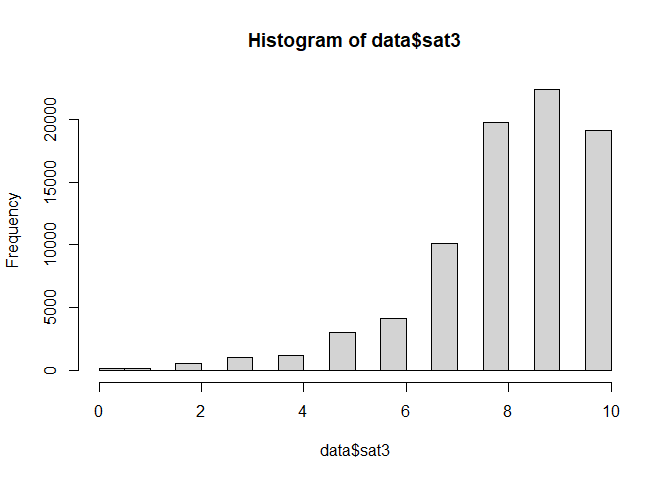
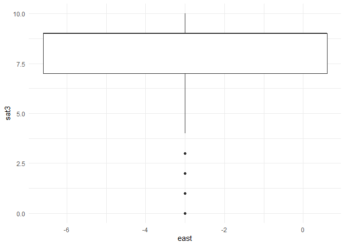

# Solution for Michael’s Project “Demographic Shift in Germany”

    library(tidyverse)

    ## ── Attaching core tidyverse packages ──────────────────────── tidyverse 2.0.0 ──
    ## ✔ dplyr     1.2.0     ✔ readr     2.2.0
    ## ✔ forcats   1.0.1     ✔ stringr   1.6.0
    ## ✔ ggplot2   4.0.3     ✔ tibble    3.3.1
    ## ✔ lubridate 1.9.5     ✔ tidyr     1.3.2
    ## ✔ purrr     1.2.1     
    ## ── Conflicts ────────────────────────────────────────── tidyverse_conflicts() ──
    ## ✖ dplyr::filter() masks stats::filter()
    ## ✖ dplyr::lag()    masks stats::lag()
    ## ℹ Use the conflicted package (<http://conflicted.r-lib.org/>) to force all conflicts to become errors

    library(dplyr)
    library(ggplot2)
    library(kableExtra)

    ## 
    ## Attache Paket: 'kableExtra'
    ## 
    ## Das folgende Objekt ist maskiert 'package:dplyr':
    ## 
    ##     group_rows

    library(ppcor)

    ## Lade nötiges Paket: MASS
    ## 
    ## Attache Paket: 'MASS'
    ## 
    ## Das folgende Objekt ist maskiert 'package:dplyr':
    ## 
    ##     select

    data <- read_csv("FReDA_panel_4waves_long_labeled.csv.zip")

    ## Multiple files in zip: reading 'FReDA_panel_4waves_long_labeled.csv'
    ## Rows: 107921 Columns: 203
    ## ── Column specification ────────────────────────────────────────────────────────
    ## Delimiter: ","
    ## dbl (203): id, welle, pid, sample, sat3, pa27, sd3, sd40, sd43, sd11, sd7e1,...
    ## 
    ## ℹ Use `spec()` to retrieve the full column specification for this data.
    ## ℹ Specify the column types or set `show_col_types = FALSE` to quiet this message.

    head(data)

    ## # A tibble: 6 × 203
    ##       id welle    pid sample  sat3  pa27   sd3  sd40  sd43  sd11 sd7e1 pstat
    ##    <dbl> <dbl>  <dbl>  <dbl> <dbl> <dbl> <dbl> <dbl> <dbl> <dbl> <dbl> <dbl>
    ## 1 111000     2     NA    101    -3    NA    NA    NA    NA    NA    NA     0
    ## 2 111000     3     NA    101    -3    NA    NA    NA    NA    NA    NA     0
    ## 3 111000     4     NA    101    -3    NA    NA    NA    NA    NA    NA     0
    ## 4 828000     3 828103    101     9     2    NA    NA    NA    NA    NA     1
    ## 5 828000     4 828104    101     9     2    NA    NA    NA    NA    NA     1
    ## 6 907000     2     NA    101    -3    NA    NA    NA    NA    NA    NA     0
    ## # ℹ 191 more variables: separation <dbl>, relstat <dbl>, reldur <dbl>,
    ## #   sd5ezby <dbl>, pa64 <dbl>, pa65 <dbl>, pa66 <dbl>, pa68i1 <dbl>,
    ## #   pa17i1 <dbl>, pa17i2 <dbl>, pa17i4 <dbl>, pa17i5 <dbl>, pa17i6 <dbl>,
    ## #   pa17i8 <dbl>, pa21i7 <dbl>, pa21i8 <dbl>, pa21i9 <dbl>, pa21i10 <dbl>,
    ## #   pa21i11 <dbl>, pa21i12 <dbl>, pa21i13 <dbl>, pa22ri1 <dbl>, pa22ri9 <dbl>,
    ## #   pa22ri10 <dbl>, pa22ri11 <dbl>, pa22ri12 <dbl>, pa22ri8 <dbl>,
    ## #   pa18i1 <dbl>, pa18i2 <dbl>, pa18i3 <dbl>, pa18i4 <dbl>, pa18i6 <dbl>, …

    #Where possible, use functions of the loaded packages

## Analysis of Reasons for the low Fertility Rate

    # mutating values with `-2` to `NA` for the variable `fertility_rate
    data <- data %>%
     mutate(
       across(c(sat3,frt68,frt69,age,nkids,reldur),~replace(.x, .x<0, NA)))
      

    #1.1
    cor(data$sat3, data$frt68, use = "complete.obs")

    ## [1] 0.1555075

    cor(data$sat3, data$frt69, use = "complete.obs")

    ## [1] 0.1458812

    #positive correllation between relationship satisfaction and intention to have children in the next 3 years.
    #1.2

    # heat map, sat3 on x axis, frt69 on y axis
    # I allready got. this runnning somehow but wanted to improve it and now nothing works ... :/ I really do not understand what I fucked up here... My Interpretation relys on the previous results

    data%>%
      ggplot(aes(x = data$sat3, y = data$frt69)) +
      geom_tile() + 
      theme_minimal()

    ## Warning: Use of `data$sat3` is discouraged.
    ## ℹ Use `sat3` instead.

    ## Warning: Use of `data$frt69` is discouraged.
    ## ℹ Use `frt69` instead.

    ## Warning: Removed 102329 rows containing missing values or values outside the scale range
    ## (`geom_tile()`).

    #1.3
    #I think that is due to happy couples not wanting to change any of their current situation since they are allready fulfilled. Maybe the unhappier families simply are unhappy because they want ti have children but do not have any yet and will be happier as soon as they have children. 

    #1.4

    # Histpgram to get an overview of data
    hist(data$sat3)

    #We have the statistical problem that most people see themselves as very happy or do not want to answer the question. This leads to a very skewed distribution of the data and makes it hard to find a correlation between the two variables.

    #1.5
    #corellation between sat3 and frt69 with controll of age
    vars <- c("sat3", "frt69", "age")

    data_for_cor <- 
      data %>%
      mutate(
        age = 2026 - data$age
      ) %>%
      mutate(
        across(c(sat3, frt69, age), ~replace(.x, .x<0, NA))
      ) |> 
      drop_na( any_of(vars))

    pcor.test(data_for_cor$sat3, data_for_cor$frt69, (2026 - data_for_cor$age), method = "pearson")

    ##    estimate      p.value statistic    n gp  Method
    ## 1 0.1104294 1.232921e-16  8.305721 5591  1 pearson

    #1.6

\##Task 2

     data <- data %>%
     mutate(
       across(c(val1i3, val1i5),~replace(.x, .x<0, NA)))

    ggplot(data, aes(x = east, y = sat3)) +
      geom_boxplot() +
      theme_minimal()

    ## Warning: Orientation is not uniquely specified when both the x and y aesthetics are
    ## continuous. Picking default orientation 'x'.

    ## Warning: Continuous x aesthetic
    ## ℹ did you forget `aes(group = ...)`?

    ## Warning: Removed 26261 rows containing non-finite outside the scale range
    ## (`stat_boxplot()`).

