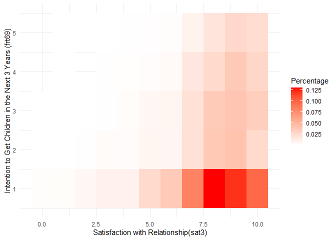
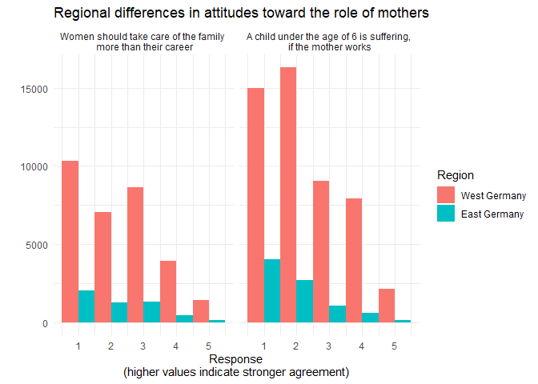

    library(ppcor)

    ## Warning: package 'ppcor' was built under R version 4.5.3

    ## Loading required package: MASS

    library(tidyverse)

    ## ── Attaching core tidyverse packages ──────────────────────── tidyverse 2.0.0 ──
    ## ✔ dplyr     1.1.4     ✔ readr     2.1.5
    ## ✔ forcats   1.0.1     ✔ stringr   1.5.2
    ## ✔ ggplot2   4.0.0     ✔ tibble    3.3.0
    ## ✔ lubridate 1.9.4     ✔ tidyr     1.3.1
    ## ✔ purrr     1.1.0

    ## ── Conflicts ────────────────────────────────────────── tidyverse_conflicts() ──
    ## ✖ dplyr::filter() masks stats::filter()
    ## ✖ dplyr::lag()    masks stats::lag()
    ## ✖ dplyr::select() masks MASS::select()
    ## ℹ Use the conflicted package (<http://conflicted.r-lib.org/>) to force all conflicts to become errors

    library(knitr)

# Demographic shift in Germany

## Relationship Quality, Fertility Intentions and more

------------------------------------------------------------------------

## Data manipulation of the FReDA Data-set

------------------------------------------------------------------------

    freda<-read_csv("FReDA_panel_4waves_long_labeled.csv")

    ## Rows: 107921 Columns: 203
    ## ── Column specification ────────────────────────────────────────────────────────
    ## Delimiter: ","
    ## dbl (203): id, welle, pid, sample, sat3, pa27, sd3, sd40, sd43, sd11, sd7e1,...
    ## 
    ## ℹ Use `spec()` to retrieve the full column specification for this data.
    ## ℹ Specify the column types or set `show_col_types = FALSE` to quiet this message.

    freda_2 <- freda%>%
      mutate(across
             (c
               (sat3,frt68,frt69,age,nkids,reldur,val1i3,val1i5,east),
                    ~replace(.x, .x<0, NA)),
             east=east==1)

## Data preview

------------------------------------------------------------------------

<table>
<caption>First five observations of the variables used in the
analysis</caption>
<colgroup>
<col style="width: 9%" />
<col style="width: 8%" />
<col style="width: 9%" />
<col style="width: 7%" />
<col style="width: 8%" />
<col style="width: 8%" />
<col style="width: 5%" />
<col style="width: 8%" />
<col style="width: 9%" />
<col style="width: 9%" />
<col style="width: 9%" />
<col style="width: 7%" />
</colgroup>
<thead>
<tr>
<th style="text-align: center;">id</th>
<th style="text-align: center;">welle</th>
<th style="text-align: center;">pid</th>
<th style="text-align: center;">sat3</th>
<th style="text-align: center;">frt68</th>
<th style="text-align: center;">frt69</th>
<th style="text-align: center;">age</th>
<th style="text-align: center;">nkids</th>
<th style="text-align: center;">reldur</th>
<th style="text-align: center;">val1i3</th>
<th style="text-align: center;">val1i5</th>
<th style="text-align: center;">east</th>
</tr>
</thead>
<tbody>
<tr>
<td style="text-align: center;">111000</td>
<td style="text-align: center;">2</td>
<td style="text-align: center;">NA</td>
<td style="text-align: center;">NA</td>
<td style="text-align: center;">NA</td>
<td style="text-align: center;">NA</td>
<td style="text-align: center;">51</td>
<td style="text-align: center;">3</td>
<td style="text-align: center;">NA</td>
<td style="text-align: center;">NA</td>
<td style="text-align: center;">2</td>
<td style="text-align: center;">TRUE</td>
</tr>
<tr>
<td style="text-align: center;">111000</td>
<td style="text-align: center;">3</td>
<td style="text-align: center;">NA</td>
<td style="text-align: center;">NA</td>
<td style="text-align: center;">NA</td>
<td style="text-align: center;">NA</td>
<td style="text-align: center;">52</td>
<td style="text-align: center;">3</td>
<td style="text-align: center;">NA</td>
<td style="text-align: center;">NA</td>
<td style="text-align: center;">NA</td>
<td style="text-align: center;">TRUE</td>
</tr>
<tr>
<td style="text-align: center;">111000</td>
<td style="text-align: center;">4</td>
<td style="text-align: center;">NA</td>
<td style="text-align: center;">NA</td>
<td style="text-align: center;">NA</td>
<td style="text-align: center;">NA</td>
<td style="text-align: center;">53</td>
<td style="text-align: center;">3</td>
<td style="text-align: center;">NA</td>
<td style="text-align: center;">NA</td>
<td style="text-align: center;">NA</td>
<td style="text-align: center;">TRUE</td>
</tr>
<tr>
<td style="text-align: center;">828000</td>
<td style="text-align: center;">3</td>
<td style="text-align: center;">828103</td>
<td style="text-align: center;">9</td>
<td style="text-align: center;">NA</td>
<td style="text-align: center;">3</td>
<td style="text-align: center;">30</td>
<td style="text-align: center;">0</td>
<td style="text-align: center;">NA</td>
<td style="text-align: center;">NA</td>
<td style="text-align: center;">NA</td>
<td style="text-align: center;">TRUE</td>
</tr>
<tr>
<td style="text-align: center;">828000</td>
<td style="text-align: center;">4</td>
<td style="text-align: center;">828104</td>
<td style="text-align: center;">9</td>
<td style="text-align: center;">5</td>
<td style="text-align: center;">3</td>
<td style="text-align: center;">31</td>
<td style="text-align: center;">0</td>
<td style="text-align: center;">36</td>
<td style="text-align: center;">NA</td>
<td style="text-align: center;">NA</td>
<td style="text-align: center;">TRUE</td>
</tr>
</tbody>
</table>

## Task

------------------------------------------------------------------------

### 1.1. What is the correlation between satisfaction with relationship with the general intention to get children and the correlation between satisfaction with relationship with the more specific intention to get children (in the next 3 years).

------------------------------------------------------------------------

<table>
<thead>
<tr>
<th style="text-align: left;">variable</th>
<th style="text-align: right;">correlation</th>
</tr>
</thead>
<tbody>
<tr>
<td style="text-align: left;">frt68</td>
<td style="text-align: right;">0.1555075</td>
</tr>
<tr>
<td style="text-align: left;">frt69</td>
<td style="text-align: right;">0.1458812</td>
</tr>
</tbody>
</table>

Answer: The correlations are both positive but also quite small. People
with higher satisfaction with relationship has slightly stronger general
intention to get children, and also people with higher satisfaction with
relationship has slightly stronger specific intention to get children
within the next 3 years. However, the correlations are weak.

### 1.2. Plot a heat map! On the x-axis: sat3. On the y-axis frt69. I want to see how much percent of people are in each box which displays the relative frequency of people with a specific combination of relationship satisfaction and intention to get children in the next 3 years.

------------------------------------------------------------------------

### 1.3. Why do you think that people who are satisfied with their relationship the most are seemingly less likely to get children in the near future?

------------------------------------------------------------------------

Answer: They are already happy with their relationship and do not feel
the need to have children to make it more fulfilling. Instead, they
would rather focus on their relationship with each other.

### 1.4. What statistical problems do we run into? (Hint: Look at the distribution in the variable sat3. How many percent are unsatisfied or very unsatisfied?)

------------------------------------------------------------------------

    ## [1] 3.966446

    ## [1] 50.6674

Answer: Only 3.9664462 of the respondents are unsatisfied or very
unsatisfied with their relationship, while 50.6674014 answered that they
are very satisfied with their relationship. Therefore, the distribution
of sat3 is strongly focused toward high satisfaction of the
relationship. This can cause a statistical problem because the
correlations for low satisfaction group may be unstable and less
reliable.

### 1.5. See if age is affecting the correlation between relationship satisfaction and fertility intentions (use it as a control variable)

------------------------------------------------------------------------

<table>
<thead>
<tr>
<th style="text-align: left;">variable</th>
<th style="text-align: right;">correlation</th>
</tr>
</thead>
<tbody>
<tr>
<td style="text-align: left;">frt68</td>
<td style="text-align: right;">0.1013064</td>
</tr>
<tr>
<td style="text-align: left;">frt69</td>
<td style="text-align: right;">0.1104294</td>
</tr>
</tbody>
</table>

Answer: After controlling for age, the correlation between relationship
satisfaction and general fertility intention went down to 0.101 from
0.156. Also for the correlation between relationship satisfaction and
fertility intention in the next 3 years went down to 0.110 from 0.146.
This means that age variable does effect the correlation between
relationship satisfaction and fertility intentions. However, correlation
still remain positive after controlling for age as well.

### 1.6. Now we can add number of children (nkids) and relationship duration (reldur) as control variables. What happens to the correlation between relationship satisfaction and fertility intentions when we introduce these variables into our model?

------------------------------------------------------------------------

<table>
<thead>
<tr>
<th style="text-align: left;">variable</th>
<th style="text-align: right;">correlation</th>
</tr>
</thead>
<tbody>
<tr>
<td style="text-align: left;">frt68</td>
<td style="text-align: right;">0.1050705</td>
</tr>
<tr>
<td style="text-align: left;">frt69</td>
<td style="text-align: right;">0.1123691</td>
</tr>
</tbody>
</table>

Answer: After controlling for the number of kids and the relationship
duration, the correlation between relationship satisfaction and general
fertility intention went down to 0.105 from 0.156. Also for the
correlation between relationship satisfaction and fertility intention in
the next 3 years went down to 0.112 from 0.146. This means that number
of kids and the relationship duration do effect the correlation between
relationship satisfaction and fertility intentions. However, correlation
still remain positive after the controlling as well.

### 1.7. significance: Are the correlations between relationship satisfaction and fertility intentions significant? (Hint: Look at the p-value of the correlation coefficient). What is the 95% confidence interval of the correlation coefficient? What does it mean?

------------------------------------------------------------------------

    ## 
    ##  Pearson's product-moment correlation
    ## 
    ## data:  freda_2$sat3 and freda_2$frt68
    ## t = 7.3383, df = 2173, p-value = 3.04e-13
    ## alternative hypothesis: true correlation is not equal to 0
    ## 95 percent confidence interval:
    ##  0.1142237 0.1962550
    ## sample estimates:
    ##       cor 
    ## 0.1555075

    ## 
    ##  Pearson's product-moment correlation
    ## 
    ## data:  freda_2$sat3 and freda_2$frt69
    ## t = 11.025, df = 5590, p-value < 2.2e-16
    ## alternative hypothesis: true correlation is not equal to 0
    ## 95 percent confidence interval:
    ##  0.1201297 0.1714366
    ## sample estimates:
    ##       cor 
    ## 0.1458812

<table>
<thead>
<tr>
<th style="text-align: left;">variable</th>
<th style="text-align: left;">p-value</th>
<th style="text-align: left;">95% CI</th>
</tr>
</thead>
<tbody>
<tr>
<td style="text-align: left;">frt68</td>
<td style="text-align: left;">3.04e-13</td>
<td style="text-align: left;">[0.114,0.196]</td>
</tr>
<tr>
<td style="text-align: left;">frt69</td>
<td style="text-align: left;">5.62e-28</td>
<td style="text-align: left;">[0.12,0.171]</td>
</tr>
</tbody>
</table>

Answer:

\[frt68\] p-value is &lt;.001, meaning the correlations are
statistically significant. However, there is a 95% probability that the
true correlation lies between 0.114 and 0.196. This means the
correlation is valid, but the assosiation is relatively weak.

\[frt69\] p-value is &lt;.001, meaning the correlations are
statistically significant. However, there is a 95% probability that the
true correlation lies between 0.120 and 0.171. This means the
correlation is valid, but the assosiation is relatively weak.

### 2.1. Which region has more conservative viewpoints regarding the role a mother should play in the family? Which region has more egalitarian viewpoints?

------------------------------------------------------------------------

<table>
<thead>
<tr>
<th style="text-align: left;">east</th>
<th style="text-align: right;">mean_val1i3</th>
<th style="text-align: right;">mean_val1i5</th>
</tr>
</thead>
<tbody>
<tr>
<td style="text-align: left;">FALSE</td>
<td style="text-align: right;">2.334725</td>
<td style="text-align: right;">2.323553</td>
</tr>
<tr>
<td style="text-align: left;">TRUE</td>
<td style="text-align: right;">2.135884</td>
<td style="text-align: right;">1.853245</td>
</tr>
</tbody>
</table>

Answer:The average score for the statement that “Women should take care
of the family more than their career.” was approximately 2.33 in West
Germany and 2.14 in East Germany. For the statement that “A child under
the age of 6 is suffering, if the mother works.”, the average score was
approximately 2.32 in West Germany and 1.85 in East Germany. As higher
values means stronger agreement with conservative viewpoints, West
Germany has more conservative viewpoints while East Germany appears to
be more egalitatrian.

### 2.2. Do a violine plot for visualization! It should visualize the regional differences between East and West Germany according to these different values on the role of woman in families. Think for yourself what kind of graph would suit best to visualize this. Also both plots should be visualized in one graph via faceting. So you can easily compare the regional differences between the two different viewpoints on the role of a mother in a family.

------------------------------------------------------------------------

