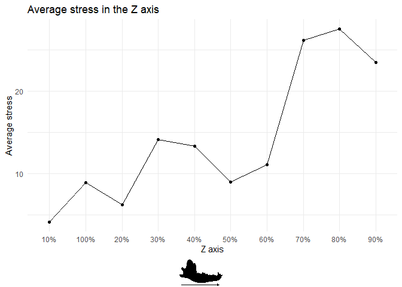
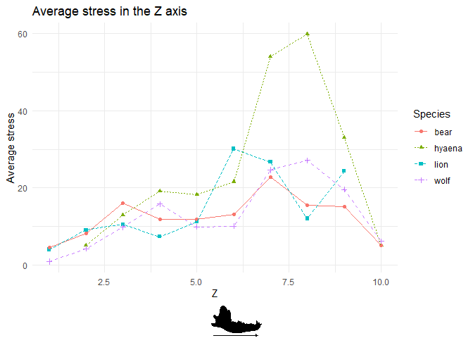
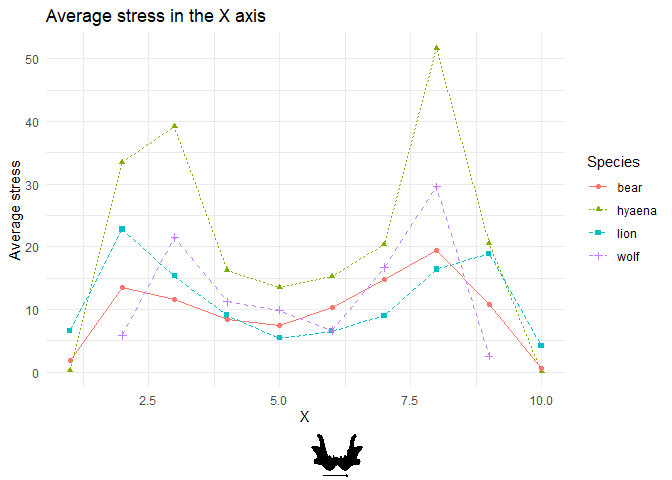
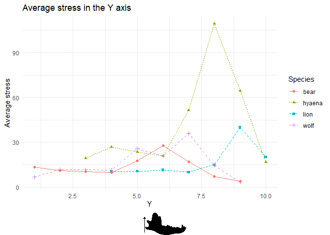
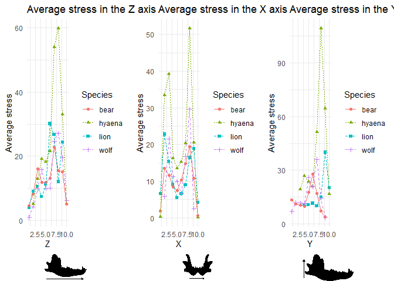

## Loading the data

First of all, we need to load the data. The following code chunk loads
the data from the `smooth_stress_tensor.csv` file:

    #load the library to read csv files hiding the messages and 
    #defining the path of the file
    library(here)

    ## here() starts at /home/miguel/Documents/R Course/Data-projects-with-R-and-GitHub

    library(readr)

    data <- suppressMessages(read_csv(here("Projects", "MiguelDLM", "smooth_stress_tensor.csv")))
    #count the number of rows and columns of the data
    dim(data)

    ## [1] 391431      5

    #show the first rows of the data
    head(data)

    ## # A tibble: 6 × 5
    ##   NodeTag     X     Y     Z `Von Misses Stress`
    ##     <dbl> <dbl> <dbl> <dbl>               <dbl>
    ## 1       1  22.6 -16.3 -89.8              0.0275
    ## 2       2  22.4 -16.6 -90.0              0.0247
    ## 3       3  22.4 -16.3 -90.0              0.0277
    ## 4       4  22.4 -15.9 -90.0              0.0253
    ## 5       5  22.6 -16.0 -89.8              0.0239
    ## 6       6  22.6 -15.6 -89.8              0.0213

## cleaning the data

Before analyzing the data, we need to clean it. It is necesary to remove
the 1 or 2% higher stress values of the dataset. The following code
chunk removes the 1% higher stress values of the dataset:

    #remove the 1% higher stress values of the dataset
    data <- data[order(data$`Von Misses Stress`),]
    data <- data[-(1:round(nrow(data)*0.01)),]
    #count the number of rows of the data after cleaning
    dim(data)

    ## [1] 387517      5

## Subdividing the data

The data will be subdivided into 10 groups, each one representing the
10% of the total length of the 3D model.

    #Get the minimum and maximum values for each coordinate
    min_x <- min(data$X)
    max_x <- max(data$X)
    min_y <- min(data$Y)
    max_y <- max(data$Y)
    min_z <- min(data$Z)
    max_z <- max(data$Z)

    #Divide the length of each coordinate into 10 equal sub-samples
    data$X_group <- cut(
        data$X, 
        breaks = seq(min_x, max_x, length.out = 11), 
        include.lowest = TRUE
    )

    data$Y_group <- cut(
        data$Y, 
        breaks = seq(min_y, max_y, length.out = 11), 
        include.lowest = TRUE
    )

    data$Z_group <- cut(
        data$Z, 
        breaks = seq(min_z, max_z, length.out = 11), 
        include.lowest = TRUE
    )
    #count the number of rows in each group
    table(data$X_group)

    ## 
    ##  [-60.4,-48.3]  (-48.3,-36.2]  (-36.2,-24.1]  (-24.1,-12.1] (-12.1,0.0293] 
    ##          10625          37024          47086          42593          36789 
    ##  (0.0293,12.1]    (12.1,24.2]    (24.2,36.3]    (36.3,48.4]    (48.4,60.4] 
    ##          52591          56349          56308          38754           9398

    table(data$Y_group)

    ## 
    ##  [-54.6,-43.7]  (-43.7,-32.8]  (-32.8,-21.9]    (-21.9,-11]  (-11,-0.0865] 
    ##          29374          59039          94970          97165          32800 
    ## (-0.0865,10.8]    (10.8,21.7]    (21.7,32.6]    (32.6,43.5]    (43.5,54.4] 
    ##          27473          25200           7794           6064           7638

    table(data$Z_group)

    ## 
    ##   [-102,-81.3]  (-81.3,-61.1]  (-61.1,-40.8]  (-40.8,-20.6] (-20.6,-0.335] 
    ##          47877          48641          31551          27497          33287 
    ##  (-0.335,19.9]    (19.9,40.2]    (40.2,60.4]    (60.4,80.7]     (80.7,101] 
    ##          33041          30753          48450          49038          37382

Each table shows the number of rows in each group. The groups are
equally distributed along the X, Y and Z axes. For example, the first
table shows that in the first group of the X axis there are 10625 rows.
This is the first 10% of the total length of the 3D model along the X
axis.

## Estimating the average stress in each group

The following code chunk calculates the average stress in each group:

    #load the library dplyr
    library(dplyr)

    ## 
    ## Attaching package: 'dplyr'

    ## The following objects are masked from 'package:stats':
    ## 
    ##     filter, lag

    ## The following objects are masked from 'package:base':
    ## 
    ##     intersect, setdiff, setequal, union

    #calculate the average stress in each X group
    average_stress_X <- data %>%
        group_by(X_group) %>%
        summarise(average_stress = mean(`Von Misses Stress`))
    #calculate the average stress in each Y group
    average_stress_Y <- data %>%
        group_by(Y_group) %>%
        summarise(average_stress = mean(`Von Misses Stress`))
    #calculate the average stress in each Z group
    average_stress_Z <- data %>%
        group_by(Z_group) %>%
        summarise(average_stress = mean(`Von Misses Stress`))

    #show the first rows of the average stress
    head(average_stress_X)

    ## # A tibble: 6 × 2
    ##   X_group        average_stress
    ##   <fct>                   <dbl>
    ## 1 [-60.4,-48.3]            3.58
    ## 2 (-48.3,-36.2]           21.1 
    ## 3 (-36.2,-24.1]           15.2 
    ## 4 (-24.1,-12.1]           11.2 
    ## 5 (-12.1,0.0293]          10.1 
    ## 6 (0.0293,12.1]            6.06

    head(average_stress_Y)

    ## # A tibble: 6 × 2
    ##   Y_group        average_stress
    ##   <fct>                   <dbl>
    ## 1 [-54.6,-43.7]            11.9
    ## 2 (-43.7,-32.8]            11.0
    ## 3 (-32.8,-21.9]            12.1
    ## 4 (-21.9,-11]              10.4
    ## 5 (-11,-0.0865]            23.7
    ## 6 (-0.0865,10.8]           21.6

    head(average_stress_Z)

    ## # A tibble: 6 × 2
    ##   Z_group        average_stress
    ##   <fct>                   <dbl>
    ## 1 [-102,-81.3]             4.18
    ## 2 (-81.3,-61.1]            6.28
    ## 3 (-61.1,-40.8]           14.2 
    ## 4 (-40.8,-20.6]           13.4 
    ## 5 (-20.6,-0.335]           9.03
    ## 6 (-0.335,19.9]           11.1

## Rename the groups

The groups in the X, Y and Z axes will be renamed to show the percentage
of the total length of the 3D model that each group represents.

    #load the library dplyr
    library(dplyr)
    #rename the groups in the X axis
    average_stress_X <- average_stress_X %>%
        mutate(X_group = paste0(row_number() * 10, "%"))
    #rename the groups in the Y axis
    average_stress_Y <- average_stress_Y %>%
        mutate(Y_group = paste0(row_number() * 10, "%"))
    #rename the groups in the Z axis
    average_stress_Z <- average_stress_Z %>%
        mutate(Z_group = paste0(row_number() * 10, "%"))
    #show the first rows of the average stress
    head(average_stress_X)

    ## # A tibble: 6 × 2
    ##   X_group average_stress
    ##   <chr>            <dbl>
    ## 1 10%               3.58
    ## 2 20%              21.1 
    ## 3 30%              15.2 
    ## 4 40%              11.2 
    ## 5 50%              10.1 
    ## 6 60%               6.06

    head(average_stress_Y)

    ## # A tibble: 6 × 2
    ##   Y_group average_stress
    ##   <chr>            <dbl>
    ## 1 10%               11.9
    ## 2 20%               11.0
    ## 3 30%               12.1
    ## 4 40%               10.4
    ## 5 50%               23.7
    ## 6 60%               21.6

    head(average_stress_Z)

    ## # A tibble: 6 × 2
    ##   Z_group average_stress
    ##   <chr>            <dbl>
    ## 1 10%               4.18
    ## 2 20%               6.28
    ## 3 30%              14.2 
    ## 4 40%              13.4 
    ## 5 50%               9.03
    ## 6 60%              11.1

## Plotting the results

Now it is possible to plot the results. First, we will plot the average
stress in the X axis and compare to the strees in the Y and Z axes.

    #load the libraries
    library(ggplot2)
    library(png)
    library(grid)
    library(gridExtra)

    ## 
    ## Attaching package: 'gridExtra'

    ## The following object is masked from 'package:dplyr':
    ## 
    ##     combine

    #read the image
    img <- readPNG("Z_axe.png")
    g <- rasterGrob(img, interpolate=TRUE)
    #plot the changes in the average stress in the Z axis accros the groups using geom_points and conecting them with geom_line
    p <- ggplot(average_stress_Z, aes(x = Z_group, y = average_stress, group = 1)) +
        geom_point() +
        geom_line() +
        labs(title = "Average stress in the Z axis", x = "Z axis", y = "Average stress") +
        theme_minimal()
    #combine the plot and the image
    grid.arrange(p, g, ncol = 1, heights = c(9, 1))

\#compare across different species

Now lets to replicate the same analysis using different species. The
following code chunk loads the data from the
`smooth_stress_tensor_species.csv` file:

    #load the csv files for each species
    # install.packages("here")

    library(here)
    library(readr)

    data_lion <- suppressMessages(read_csv(here("Projects", "MiguelDLM", "smooth_stress_tensor (lion).csv")))
    data_hyaena <- suppressMessages(read_csv(here("Projects", "MiguelDLM", "smooth_stress_tensor (hyaena).csv")))
    data_wolf <- suppressMessages(read_csv(here("Projects", "MiguelDLM", "smooth_stress_tensor (wolf).csv")))
    data_bear <- suppressMessages(read_csv(here("Projects", "MiguelDLM", "smooth_stress_tensor (bear).csv")))

## cleaning and preparing the data

The following code chunk removes the 1% higher stress values of the
dataset for each species, subdivides the data into 10 groups and
calculates the average stress in each group:

    library(dplyr)

    # Define the species names
    species_names <- c("lion", "hyaena", "wolf", "bear")

    # Initialize lists to store the data for each species
    average_stress_X_list <- list()
    average_stress_Y_list <- list()
    average_stress_Z_list <- list()

    # Combine all data to calculate global min and max
    all_data <- bind_rows(data_lion, data_hyaena, data_wolf, data_bear)

    # Calculate global min and max for X, Y, Z
    min_x <- min(all_data$X, na.rm = TRUE)
    max_x <- max(all_data$X, na.rm = TRUE)
    min_y <- min(all_data$Y, na.rm = TRUE)
    max_y <- max(all_data$Y, na.rm = TRUE)
    min_z <- min(all_data$Z, na.rm = TRUE)
    max_z <- max(all_data$Z, na.rm = TRUE)

    # Process the data for each species
    for (i in seq_along(list(data_lion, data_hyaena, data_wolf, data_bear))) {
        data <- list(data_lion, data_hyaena, data_wolf, data_bear)[[i]]
        species <- species_names[i]
        
        # Remove the 1% higher stress values of the dataset
        data <- data[order(data$`Von Misses Stress`),]
        data <- data[-(1:round(nrow(data)*0.01)),]
        
        # Divide the length of each coordinate into 10 equal sub-samples
        data$X_group <- cut(
            data$X, 
            breaks = seq(min_x, max_x, length.out = 11), 
            include.lowest = TRUE,
            labels = FALSE
        )
        data$Y_group <- cut(
            data$Y, 
            breaks = seq(min_y, max_y, length.out = 11), 
            include.lowest = TRUE,
            labels = FALSE
        )
        data$Z_group <- cut(
            data$Z, 
            breaks = seq(min_z, max_z, length.out = 11), 
            include.lowest = TRUE,
            labels = FALSE
        )
        
        # Calculate the average stress in each X, Y, and Z group
        average_stress_X <- data %>%
            group_by(X_group) %>%
            summarise(average_stress = mean(`Von Misses Stress`, na.rm = TRUE))
        
        average_stress_Y <- data %>%
            group_by(Y_group) %>%
            summarise(average_stress = mean(`Von Misses Stress`, na.rm = TRUE))
        
        average_stress_Z <- data %>%
            group_by(Z_group) %>%
            summarise(average_stress = mean(`Von Misses Stress`, na.rm = TRUE))
        
        # Store the data for this species in the lists
        average_stress_X_list[[species]] <- average_stress_X
        average_stress_Y_list[[species]] <- average_stress_Y
        average_stress_Z_list[[species]] <- average_stress_Z
    }

    # Combine the data for all species
    combined_data_X <- bind_rows(average_stress_X_list, .id = "Species")
    combined_data_Y <- bind_rows(average_stress_Y_list, .id = "Species")
    combined_data_Z <- bind_rows(average_stress_Z_list, .id = "Species")

## Plotting the results for all species in the Z axis

Now it is possible to plot the results for all species in the Z axis in
the same plot.

    library(ggplot2)
    library(png)
    library(grid)
    library(gridExtra)
    library(here)

    ## here() starts at /home/miguel/Documents/R Course/Data-projects-with-R-and-GitHub

    # Function to read an image and create a rasterGrob
    read_image_as_grob <- function(image_path) {
        img <- readPNG(here("Projects", "MiguelDLM", image_path))
        rasterGrob(img, interpolate=TRUE)
    }

    # Function to create a plot with given data and axis information
    create_plot <- function(data, axis_name, axis_label, image_grob) {
        p <- ggplot(data, aes_string(x = paste0(axis_name, "_group"), y = "average_stress", group = "Species", color = "Species", linetype = "Species", shape = "Species")) +
            geom_point() +
            geom_line() +
            labs(title = paste("Average stress in the", axis_label, "axis"), x = axis_label, y = "Average stress") +
            theme_minimal()
        grid.arrange(p, image_grob, ncol = 1, heights = c(9, 1))
    }

    # Load images once
    g_z <- read_image_as_grob("Z_axe.png")
    g_x <- read_image_as_grob("X_axe.png")
    g_y <- read_image_as_grob("Y_axe.png")

    # Create and display plots for Z, X, and Y axes
    p_z <- create_plot(combined_data_Z, "Z", "Z", g_z)

    ## Warning: `aes_string()` was deprecated in ggplot2 3.0.0.
    ## ℹ Please use tidy evaluation idioms with `aes()`.
    ## ℹ See also `vignette("ggplot2-in-packages")` for more information.
    ## This warning is displayed once every 8 hours.
    ## Call `lifecycle::last_lifecycle_warnings()` to see where this warning was
    ## generated.

    p_x <- create_plot(combined_data_X, "X", "X", g_x)

    p_y <- create_plot(combined_data_Y, "Y", "Y", g_y)

    plot <- grid.arrange(p_z, p_x, p_y, ncol = 3)

