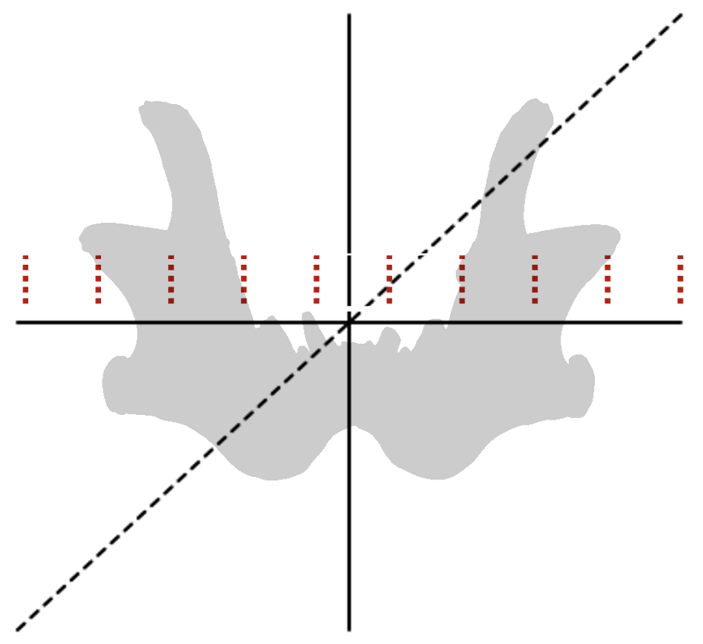

# Revised Solution to Miguel's Project by Meri
```{r setup, message=FALSE}
library(tidyverse)
library(gridExtra)
library(scales)
```
### Background

#Finite Element Analysis

- used to predict stresses/ deformations on structures under defined conditions
- reduction of 3D model to ##finite## number of ##elements##


### 1. Iterative import of datasets:

I import the data sets into a list by iteration of the respective url to use. As the data is imported into a list first, I transformed that list into a data frame, that is easier to work with, using `bind_rows`.

```{r ImportDataFromGitHub, warning=FALSE, message=FALSE}
animals <- c("bear", "hyaena", "lion", "wolf")

# Importing the four dataset as entries to the list `smoothstress`
smoothstress <- list()
for (i in animals) {
  url <- paste0("https://github.com/Dr-Eberle-Zentrum/Data-projects-with-R-and-GitHub/raw/main/Projects/MiguelDLM/smooth_stress_tensor%20(",i,").csv")
  smoothstress[[i]] <- read_csv(url)
}

# Combining listentries into a dataframe by animal
smoothstress_animals <- bind_rows(smoothstress, .id = "animal")
```

## 2. Resclaing the coordinates per dimension onto a scale from 0 to 1:



Here I am using the `across` function to perform the same actions (rescaling values to new scale from 0 to 10 with `scales::rescale` and assigning the intervalls in which the entries fall based on that with `cut`) for all three dimensions in one command to avoide copy and pasting.

```{r RescalingCoordinates}
# First attempt: using too much C&P but testing if the function work like I want them to.
# smoothstress_animals <- smoothstress_animals %>% 
#   group_by(animal) %>% 
#   mutate(xrange = scales::rescale(X, to = c(0,1))) %>% 
#   mutate(yrange = scales::rescale(Y, to = c(0,1))) %>% 
#   mutate(zrange = scales::rescale(Z, to = c(0,1))) %>% 
#   mutate(xbreaks = cut(xrange, (0:10)/10)) %>% 
#   mutate(ybreaks = cut(xrange, (0:10)/10)) %>% 
#   mutate(zbreaks = cut(xrange, (0:10)/10))

#Rescaling the coordinates and creating breaks
smoothstress_animals <- smoothstress_animals %>% 
  group_by(animal) %>% 
  mutate(across(
    .col = c("X","Y","Z"), # I tried running dimensions = c(X","Y","Z") ... .col = dimensions, but it did not work like that.
    {~ scales::rescale(.x,to = c(0,1))},
    .names = "{.col}_range"
  )) %>% 
  mutate(across(
    .col = c("X_range", "Y_range", "Z_range"),
    {~ cut(.x, (0:10)/10)},
      .names = "{.col}_breaks"
  )) %>% 
  ungroup()
  
```

## 3. Calculating Mean Von Misses Stress per interval

```{r CalculatingMeanStressPerDimension}
range_names <- c("X_range_breaks","Y_range_breaks","Z_range_breaks")

# First attempt: 
# for (i in range_names){
#   .data <- smoothstress_animals %>%
#     group_by(i, animal) %>%
#     summarise(Mean = mean(`Von Misses Stress`))
#   smoothstress_ranges <- cbind(smoothstress_ranges, .data)
# }
# Column i is not found. -> i is not read into group_by I guess

# Attempt using across(): did not return data in the format I wanted
# smoothstress_ranges <- smoothstress_animals %>% 
#   group_by(across(
#     .col = c(all_of(range_names), animal),
#   )) %>% 
#   summarise(MeanStress = mean(`Von Misses Stress`))

for (i in range_names){
  .data <- smoothstress_animals %>%
    group_by(across(all_of(i)), animal) %>%
    summarise(MeanStress = mean(`Von Misses Stress`)) %>% 
    ungroup() %>% 
    mutate(MockDimension = i)
  
  if (exists("smoothstress_ranges")){
    smoothstress_ranges <- bind_rows(smoothstress_ranges, .data)
  } else {
    smoothstress_ranges <- .data
  }
}

# Creating "easier" columns to work with for range and MockDimension
range_map <- c("(0,0.1]" = 0.1, 
               "(0.1,0.2]" = 0.2, 
               "(0.2,0.3]" = 0.3,
               "(0.3,0.4]" = 0.4, 
               "(0.4,0.5]" = 0.5, 
               "(0.5,0.6]" = 0.6,
               "(0.6,0.7]" = 0.7, 
               "(0.7,0.8]" = 0.8, 
               "(0.8,0.9]" = 0.9,
               "(0.9,1]" = 1.0)
dimension_map <- c("X_range_breaks" = "X", "Y_range_breaks" = "Y", "Z_range_breaks" = "Z")

smoothstress_ranges <- smoothstress_ranges %>% 
  mutate(range = coalesce(X_range_breaks, Y_range_breaks, Z_range_breaks)) %>%
  mutate(RelativeCoordinate = range_map[range]) %>% 
  mutate(Dimension = dimension_map[MockDimension]) %>% 
  select(animal, Dimension, RelativeCoordinate, MeanStress) %>% 
  drop_na()

```

## 4. Visualization of Data

```{r Visualization, warning=FALSE}
ggplot(smoothstress_ranges, aes(x=RelativeCoordinate, y = MeanStress, color = animal))+
  geom_point()+
  geom_line()+
  theme_classic()+
  xlab("Relative Coordinate")+
  ylab("Mean von Misses Stress")+
  scale_color_manual(values = c(
    "bear" = "brown",
    "hyaena" = "#E15634",
    "lion" ="#FFBF46",
    "wolf" = "grey"))+
  facet_grid(cols = vars(Dimension))
```

## Archived Old Solution:

Importing the datasets:
```{r DataImport}
# smoothstress_bear <- read_csv("https://github.com/Dr-Eberle-Zentrum/Data-projects-with-R-and-GitHub/raw/main/Projects/MiguelDLM/smooth_stress_tensor%20(bear).csv")
# smoothstress_lion <- read_csv("https://github.com/Dr-Eberle-Zentrum/Data-projects-with-R-and-GitHub/raw/main/Projects/MiguelDLM/smooth_stress_tensor%20(lion).csv")
# smoothstress_wolf <- read_csv("https://github.com/Dr-Eberle-Zentrum/Data-projects-with-R-and-GitHub/raw/main/Projects/MiguelDLM/smooth_stress_tensor%20(wolf).csv")
# smoothstress_hyaena <- read_csv("https://github.com/Dr-Eberle-Zentrum/Data-projects-with-R-and-GitHub/raw/main/Projects/MiguelDLM/smooth_stress_tensor%20(hyaena).csv")
```

Next I created the relative intervals across the length of the respective axises. (For the data wrangling steps I should probably write functions (which I am not super comfortable with) so for now, this also works).

```{r IntervalCreation}
# bear_xbreaks <- c(seq(min(smoothstress_bear$X), max(smoothstress_bear$X), length.out = 11))
# bear_ybreaks <- c(seq(min(smoothstress_bear$Y), max(smoothstress_bear$Y), length.out = 11))
# bear_zbreaks <- c(seq(min(smoothstress_bear$Z), max(smoothstress_bear$Z), length.out = 11))
# 
# lion_xbreaks <- c(seq(min(smoothstress_lion$X), max(smoothstress_lion$X), length.out = 11))
# lion_ybreaks <- c(seq(min(smoothstress_lion$Y), max(smoothstress_lion$Y), length.out = 11))
# lion_zbreaks <- c(seq(min(smoothstress_lion$Z), max(smoothstress_lion$Z), length.out = 11))
# 
# wolf_xbreaks <- c(seq(min(smoothstress_wolf$X), max(smoothstress_wolf$X), length.out = 11))
# wolf_ybreaks <- c(seq(min(smoothstress_wolf$Y), max(smoothstress_wolf$Y), length.out = 11))
# wolf_zbreaks <- c(seq(min(smoothstress_wolf$Z), max(smoothstress_wolf$Z), length.out = 11))
# 
# hyaena_xbreaks <- c(seq(min(smoothstress_hyaena$X), max(smoothstress_hyaena$X), length.out = 11))
# hyaena_ybreaks <- c(seq(min(smoothstress_hyaena$Y), max(smoothstress_hyaena$Y), length.out = 11))
# hyaena_zbreaks <- c(seq(min(smoothstress_hyaena$Z), max(smoothstress_hyaena$Z), length.out = 11))
```

Next I am calculating the mean Stress across the intervalls.
```{r MeanStress}
# bear_x <- smoothstress_bear %>% 
#   mutate(breaks = cut(X, bear_xbreaks)) %>% 
#   group_by(breaks) %>% 
#   summarise(MeanStress = mean(`Von Misses Stress`))
# bear_y <- smoothstress_bear %>% 
#   mutate(breaks = cut(Y, bear_ybreaks)) %>% 
#   group_by(breaks) %>% 
#   summarise(MeanStress = mean(`Von Misses Stress`))
# bear_z <- smoothstress_bear %>% 
#   mutate(breaks = cut(Z, bear_zbreaks)) %>% 
#   group_by(breaks) %>% 
#   summarise(MeanStress = mean(`Von Misses Stress`))
# 
# lion_x <- smoothstress_lion %>% 
#   mutate(breaks = cut(X, lion_xbreaks)) %>% 
#   group_by(breaks) %>% 
#   summarise(MeanStress = mean(`Von Misses Stress`))
# lion_y <- smoothstress_lion %>% 
#   mutate(breaks = cut(Y, lion_ybreaks)) %>% 
#   group_by(breaks) %>% 
#   summarise(MeanStress = mean(`Von Misses Stress`))
# lion_z <- smoothstress_lion %>% 
#   mutate(breaks = cut(Z, lion_zbreaks)) %>% 
#   group_by(breaks) %>% 
#   summarise(MeanStress = mean(`Von Misses Stress`))
# 
# wolf_x <- smoothstress_wolf %>% 
#   mutate(breaks = cut(X, wolf_xbreaks)) %>% 
#   group_by(breaks) %>% 
#   summarise(MeanStress = mean(`Von Misses Stress`))
# wolf_y <- smoothstress_wolf %>% 
#   mutate(breaks = cut(Y, wolf_ybreaks)) %>% 
#   group_by(breaks) %>% 
#   summarise(MeanStress = mean(`Von Misses Stress`))
# wolf_z <- smoothstress_wolf %>% 
#   mutate(breaks = cut(Z, wolf_zbreaks)) %>% 
#   group_by(breaks) %>% 
#   summarise(MeanStress = mean(`Von Misses Stress`))
# 
# hyaena_x <- smoothstress_hyaena %>% 
#   mutate(breaks = cut(X, hyaena_xbreaks)) %>% 
#   group_by(breaks) %>% 
#   summarise(MeanStress = mean(`Von Misses Stress`))
# hyaena_y <- smoothstress_hyaena %>% 
#   mutate(breaks = cut(Y, hyaena_ybreaks)) %>% 
#   group_by(breaks) %>% 
#   summarise(MeanStress = mean(`Von Misses Stress`))
# hyaena_z <- smoothstress_hyaena %>% 
#   mutate(breaks = cut(Z, hyaena_zbreaks)) %>% 
#   group_by(breaks) %>% 
#   summarise(MeanStress = mean(`Von Misses Stress`))
```

Here I am combining the data of the different animals per dimension into one dataframe.
```{r DimensionDataframes}
# x_stress <- data.frame(RelativeCoordinate = c(0,0.1,0.2,0.3,0.4,0.5,0.6,0.7,0.8,0.9,1),
#                        stress_bear = bear_x$MeanStress,
#                        stress_lion = lion_x$MeanStress,
#                        stress_wolf = wolf_x$MeanStress,
#                        stress_hyaena = hyaena_x$MeanStress)
# x_stress_long <- x_stress %>% 
#   pivot_longer(cols = starts_with("stress_"),
#                names_to = "animal",
#                values_to = "MeanStress") %>% 
#   mutate(animal = str_replace(animal, "stress_",""))
# 
# y_stress <- data.frame(RelativeCoordinate = c(0,0.1,0.2,0.3,0.4,0.5,0.6,0.7,0.8,0.9,1),
#                        stress_bear = bear_y$MeanStress,
#                        stress_lion = lion_y$MeanStress,
#                        stress_wolf = wolf_y$MeanStress,
#                        stress_hyaena = hyaena_y$MeanStress)
# y_stress_long <- y_stress %>% 
#   pivot_longer(cols = starts_with("stress_"),
#                names_to = "animal",
#                values_to = "MeanStress") %>% 
#   mutate(animal = str_replace(animal, "stress_",""))
# 
# z_stress <- data.frame(RelativeCoordinate = c(0,0.1,0.2,0.3,0.4,0.5,0.6,0.7,0.8,0.9,1),
#                        stress_bear = bear_z$MeanStress,
#                        stress_lion = lion_z$MeanStress,
#                        stress_wolf = wolf_z$MeanStress,
#                        stress_hyaena = hyaena_z$MeanStress)
# z_stress_long <- z_stress %>% 
#   pivot_longer(cols = starts_with("stress_"),
#                names_to = "animal",
#                values_to = "MeanStress") %>% 
#   mutate(animal = str_replace(animal, "stress_",""))
```

This was my first attempt at plotting, but the `facet_grid` works much better.

```{r GridPlotting}
# px <- ggplot(x_stress_long, aes(x=RelativeCoordinate, y = MeanStress, color = animal))+
#   geom_point()+
#   geom_line()+
#   theme_classic()+
#   xlab("Relative Coordinate")+
#   ylab("Mean van Misses Stress")+
#   scale_color_manual(values = c(
#     "bear" = "brown",
#     "hyaena" = "#E15634",
#     "lion" ="#FFBF46",
#     "wolf" = "grey"),
#   guide ="none")
# 
# py <- ggplot(y_stress_long, aes(x=RelativeCoordinate, y = MeanStress, color = animal))+
#   geom_point()+
#   geom_line()+
#   theme_classic()+
#   xlab("Relative Coordinate")+
#   ylab("Mean van Misses Stress")+
#   scale_color_manual(values = c(
#     "bear" = "brown",
#     "hyaena" = "#E15634",
#     "lion" ="#FFBF46",
#     "wolf" = "grey"),
#   guide ="none")
# 
# pz <- ggplot(z_stress_long, aes(x=RelativeCoordinate, y = MeanStress, color = animal))+
#   geom_point()+
#   geom_line()+
#   theme_classic()+
#   xlab("Relative Coordinate")+
#   ylab("Mean van Misses Stress")+
#   scale_color_manual(values = c(
#     "bear" = "brown",
#     "hyaena" = "#E15634",
#     "lion" ="#FFBF46",
#     "wolf" = "grey"))
# 
# grid.arrange(px, py, pz, nrow = 1)
#   
```

To plot using `facet_grid` I combine all dimensions into one dataframe.

```{r FacetPlotting}
# x_stress_long$Dimension <- "X"
# y_stress_long$Dimension <- "Y"
# z_stress_long$Dimension <- "Z"
# df_list <- list(x_stress_long, y_stress_long, z_stress_long)
# 
# stress_long <- Reduce(function(x,y) merge(x,y, all = TRUE), df_list, accumulate = FALSE)
# 
# p <- ggplot(stress_long, aes(x=RelativeCoordinate, y = MeanStress, color = animal))+
#   geom_point()+
#   geom_line()+
#   theme_classic()+
#   xlab("Relative Coordinate")+
#   ylab("Mean van Misses Stress")+
#   scale_color_manual(values = c(
#     "bear" = "brown",
#     "hyaena" = "#E15634",
#     "lion" ="#FFBF46",
#     "wolf" = "grey"))
# 
# p+facet_grid(cols = vars(Dimension))
```

