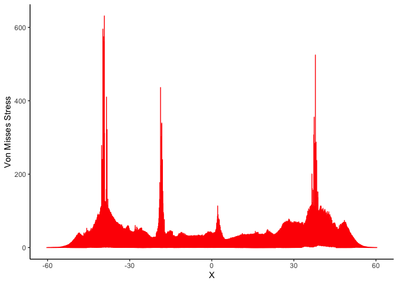
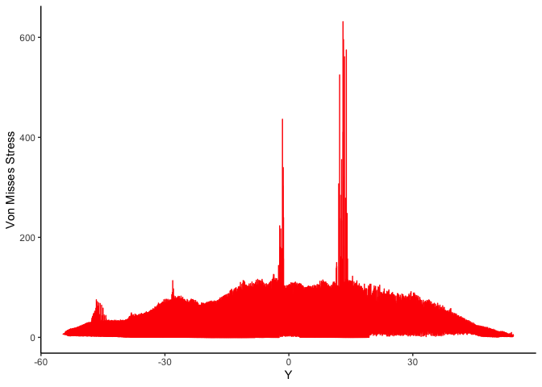
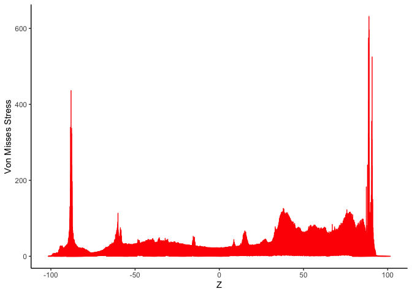

    library(tidyverse)

    ## ── Attaching core tidyverse packages ──────────────────────── tidyverse 2.0.0 ──
    ## ✔ dplyr     1.1.4     ✔ readr     2.1.5
    ## ✔ forcats   1.0.0     ✔ stringr   1.5.1
    ## ✔ ggplot2   3.5.1     ✔ tibble    3.2.1
    ## ✔ lubridate 1.9.3     ✔ tidyr     1.3.1
    ## ✔ purrr     1.0.2     
    ## ── Conflicts ────────────────────────────────────────── tidyverse_conflicts() ──
    ## ✖ dplyr::filter() masks stats::filter()
    ## ✖ dplyr::lag()    masks stats::lag()
    ## ℹ Use the conflicted package (<http://conflicted.r-lib.org/>) to force all conflicts to become errors

    library(ggplot2)

    smoothstress <- read_csv("https://github.com/Dr-Eberle-Zentrum/Data-projects-with-R-and-GitHub/raw/main/Projects/MiguelDLM/smooth_stress_tensor.csv")

    ## Rows: 391431 Columns: 5
    ## ── Column specification ────────────────────────────────────────────────────────
    ## Delimiter: ","
    ## dbl (5): NodeTag, X, Y, Z, Von Misses Stress
    ## 
    ## ℹ Use `spec()` to retrieve the full column specification for this data.
    ## ℹ Specify the column types or set `show_col_types = FALSE` to quiet this message.

So when I read this file, I cannot find different 3D models. Is this
something defined by the nodes?

## Visualizing data set for understanding

    smoothstress %>% 
      ggplot(aes(x = X, y =`Von Misses Stress`))+
      geom_line(color = "red")+
      theme_classic()

    smoothstress %>% 
      ggplot(aes(x = Y, y =`Von Misses Stress`))+
      geom_line(color = "red")+
      theme_classic()

    smoothstress %>% 
      ggplot(aes(x = Z, y =`Von Misses Stress`))+
      geom_line(color = "red")+
      theme_classic()

Since the force distribution of the von misses stresses along the axises
resembles a relief, I presume this is where the sampleing comes into
play?
