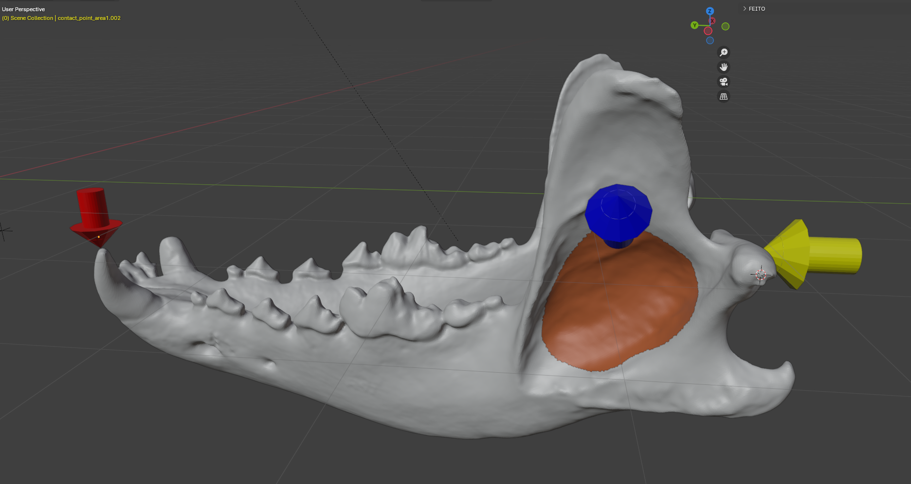
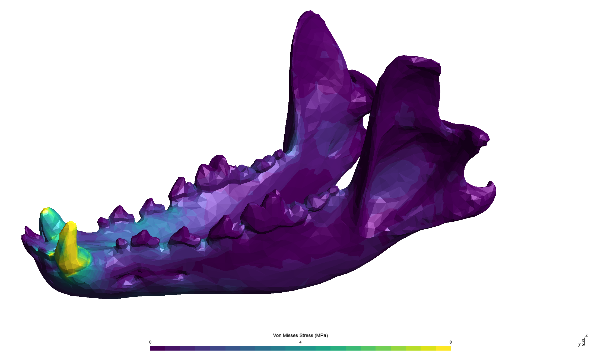
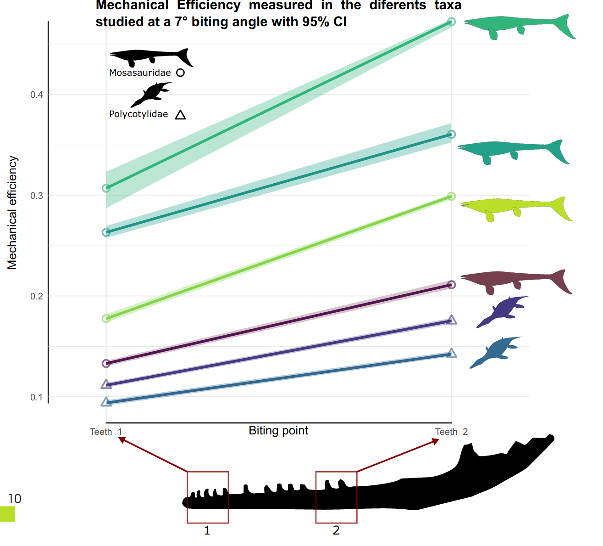

# Force distribution with Finite Element Analysis

Finite Element Analysis (FEA) is a computational technique used to predict stress, strain, and deformation in structures. This method involves breaking down a structure into discrete elements, making complex problems more manageable through mathematical analysis [@Rayfield2007]. The advent of a novel software, [Fossils](https://gitlab.uliege.be/rboman/fossils), has significantly streamlined the process of conducting FEA on 3D virtual models of fossils, offering a quicker and more efficient approach than previously possible [@Chatar2023].

Model structure before runing the Finite Elements Analysis


Example of a Finite Elements Analysis

Unfortunately, the output files provided by Fossils are in the `.msh` format, which may pose challenges when importing them into other systems. To address this issue, a Python script was written to convert the `.msh` files into `.csv` files. The structure of the `.csv` files is as follows:

<div style="text-align: center;">

| Vertex ID | Von Misses Stress | X       | Y       | Z       |
|-----------|-------------------|---------|---------|---------|
| 1         | 123               | 123.123 | 123.123 | 123.123 |
| 2         | 123               | 123.123 | 123.123 | 123.123 |
| ...       | ...               | ...     | ...     | ...     |

</div>

The ```Von Misses Stress``` represents the stress on each point in the 3D space. The X, Y  and Z columns represents the coordinates of each point.

## Objectives

The goal is to create visualizations and conduct statistical analyses that elucidate the distribution of stress across various elements within the 3D space, as determined by Finite Element Analysis (FEA). This will facilitate a deeper understanding of how stress is distributed and the implications for the structural integrity of the analyzed models.
This will enable an understanding of how variations in shape and size affect force distribution across different 3D models.

## Materials and methods

The analysis consists of four ```.csv``` files containing the results from four Finite Element Analyses (FEA) of the jaws of four carnivorous animals. 
According to @Marce-Nogue2011, Finite Elements results may present singularities at the contact and constraint points, for this reason many researchers choose to remove the 1 or 2% higher stress values of the dataset.

The ```ggplot2``` library will be used to plot the force distribution in each axe (X, Y and Z). Each 3D model will be represented by a different line.


Example of a plot showing the average stress in the different points of the 3D model

Furthermore, each dataset will be segmented into distinct samples based on their proportion of the total size. This involves determining the minimum and maximum values for each coordinate, followed by dividing this length into 10 equal sub-samples. Consequently, each sub-sample will account for 10% of the total length of the 3D model along that axis. The average stress within each section will be calculated, culminating in a comprehensive plot that contrasts the average stress across each section and axis among the 3D models.


## Bibliography

