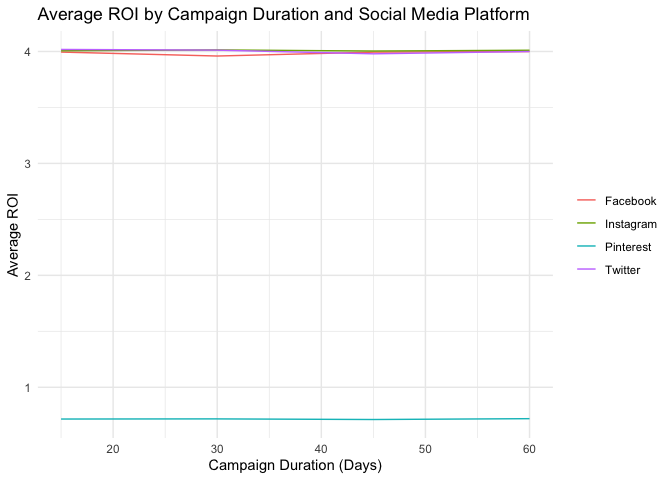

# Jannis Solution for Minseo’s Project

## Preperations

    # use the tidyverse package for data manipulation and visualization
    # use piping where possible to make the code more readable and efficient

    library(kableExtra)
    library(tidyverse)

    ## ── Attaching core tidyverse packages ──────────────────────── tidyverse 2.0.0 ──
    ## ✔ dplyr     1.2.1     ✔ readr     2.2.0
    ## ✔ forcats   1.0.1     ✔ stringr   1.6.0
    ## ✔ ggplot2   4.0.3     ✔ tibble    3.3.1
    ## ✔ lubridate 1.9.5     ✔ tidyr     1.3.2
    ## ✔ purrr     1.2.2     
    ## ── Conflicts ────────────────────────────────────────── tidyverse_conflicts() ──
    ## ✖ dplyr::filter()     masks stats::filter()
    ## ✖ dplyr::group_rows() masks kableExtra::group_rows()
    ## ✖ dplyr::lag()        masks stats::lag()
    ## ℹ Use the conflicted package (<http://conflicted.r-lib.org/>) to force all conflicts to become errors

    library(ggplot2)
    library(knitr)
    library(stringr)
    library(dplyr)
    library(tidyr)

    setwd("/Users/jannisdennochweiler/R2 Course/Projects/Minseo")

    data <- read_csv("Social Media Advertising.csv")

    ## Rows: 300000 Columns: 16
    ## ── Column specification ────────────────────────────────────────────────────────
    ## Delimiter: ","
    ## chr (10): Target_Audience, Campaign_Goal, Duration, Channel_Used, Acquisitio...
    ## dbl  (6): Campaign_ID, Conversion_Rate, ROI, Clicks, Impressions, Engagement...
    ## 
    ## ℹ Use `spec()` to retrieve the full column specification for this data.
    ## ℹ Specify the column types or set `show_col_types = FALSE` to quiet this message.

    head(data)

    ## # A tibble: 6 × 16
    ##   Campaign_ID Target_Audience Campaign_Goal    Duration Channel_Used
    ##         <dbl> <chr>           <chr>            <chr>    <chr>       
    ## 1      529013 Men 35-44       Product Launch   15 Days  Instagram   
    ## 2      275352 Women 45-60     Market Expansion 15 Days  Facebook    
    ## 3      692322 Men 45-60       Product Launch   15 Days  Instagram   
    ## 4      675757 Men 25-34       Increase Sales   15 Days  Pinterest   
    ## 5      535900 Men 45-60       Market Expansion 15 Days  Pinterest   
    ## 6      323031 Women 35-44     Product Launch   15 Days  Facebook    
    ## # ℹ 11 more variables: Conversion_Rate <dbl>, Acquisition_Cost <chr>,
    ## #   ROI <dbl>, Location <chr>, Language <chr>, Clicks <dbl>, Impressions <dbl>,
    ## #   Engagement_Score <dbl>, Customer_Segment <chr>, Date <chr>, Company <chr>

## Data cleanup

#### Cleanup-Tasks:

- convert Duration values into numeric day values
- clean currency-formatted variables such as Acquisition\_Cost
- convert Date into a proper date format
- split Target\_Audience into separate demographic variables, such as
  gender and age group
- create a cleaned dataset for later manipulation and visualization

<!-- -->

    cleandata <- data %>%
    mutate(Duration = as.numeric(str_remove(Duration, " Days"))) %>%
    mutate(Acquisition_Cost = as.numeric(str_sub(Acquisition_Cost, 2))) %>%
    mutate(Date = as.Date(Date, format ="%m/%d/%Y")) %>%
    separate(Target_Audience, into = c("gender", "age_group"), sep = " ")

    ## Warning: There was 1 warning in `mutate()`.
    ## ℹ In argument: `Acquisition_Cost = as.numeric(str_sub(Acquisition_Cost, 2))`.
    ## Caused by warning:
    ## ! NAs introduced by coercion

    # create rmd table with output of the cleaned data

    kable(head(cleandata), caption = "Cleaned Data", booktabs = TRUE) %>%
      kable_styling(latex_options = "striped", position = "center")

<table class="table" style="margin-left: auto; margin-right: auto;">
<caption>
Cleaned Data
</caption>
<thead>
<tr>
<th style="text-align:right;">
Campaign\_ID
</th>
<th style="text-align:left;">
gender
</th>
<th style="text-align:left;">
age\_group
</th>
<th style="text-align:left;">
Campaign\_Goal
</th>
<th style="text-align:right;">
Duration
</th>
<th style="text-align:left;">
Channel\_Used
</th>
<th style="text-align:right;">
Conversion\_Rate
</th>
<th style="text-align:right;">
Acquisition\_Cost
</th>
<th style="text-align:right;">
ROI
</th>
<th style="text-align:left;">
Location
</th>
<th style="text-align:left;">
Language
</th>
<th style="text-align:right;">
Clicks
</th>
<th style="text-align:right;">
Impressions
</th>
<th style="text-align:right;">
Engagement\_Score
</th>
<th style="text-align:left;">
Customer\_Segment
</th>
<th style="text-align:left;">
Date
</th>
<th style="text-align:left;">
Company
</th>
</tr>
</thead>
<tbody>
<tr>
<td style="text-align:right;">
529013
</td>
<td style="text-align:left;">
Men
</td>
<td style="text-align:left;">
35-44
</td>
<td style="text-align:left;">
Product Launch
</td>
<td style="text-align:right;">
15
</td>
<td style="text-align:left;">
Instagram
</td>
<td style="text-align:right;">
0.15
</td>
<td style="text-align:right;">
500
</td>
<td style="text-align:right;">
5.7900000
</td>
<td style="text-align:left;">
Las Vegas
</td>
<td style="text-align:left;">
Spanish
</td>
<td style="text-align:right;">
500
</td>
<td style="text-align:right;">
3000
</td>
<td style="text-align:right;">
7
</td>
<td style="text-align:left;">
Health
</td>
<td style="text-align:left;">
2022-02-25
</td>
<td style="text-align:left;">
Aura Align
</td>
</tr>
<tr>
<td style="text-align:right;">
275352
</td>
<td style="text-align:left;">
Women
</td>
<td style="text-align:left;">
45-60
</td>
<td style="text-align:left;">
Market Expansion
</td>
<td style="text-align:right;">
15
</td>
<td style="text-align:left;">
Facebook
</td>
<td style="text-align:right;">
0.01
</td>
<td style="text-align:right;">
500
</td>
<td style="text-align:right;">
7.2100000
</td>
<td style="text-align:left;">
Los Angeles
</td>
<td style="text-align:left;">
French
</td>
<td style="text-align:right;">
500
</td>
<td style="text-align:right;">
3000
</td>
<td style="text-align:right;">
5
</td>
<td style="text-align:left;">
Home
</td>
<td style="text-align:left;">
2022-05-12
</td>
<td style="text-align:left;">
Hearth Harmony
</td>
</tr>
<tr>
<td style="text-align:right;">
692322
</td>
<td style="text-align:left;">
Men
</td>
<td style="text-align:left;">
45-60
</td>
<td style="text-align:left;">
Product Launch
</td>
<td style="text-align:right;">
15
</td>
<td style="text-align:left;">
Instagram
</td>
<td style="text-align:right;">
0.08
</td>
<td style="text-align:right;">
500
</td>
<td style="text-align:right;">
0.4300000
</td>
<td style="text-align:left;">
Austin
</td>
<td style="text-align:left;">
Spanish
</td>
<td style="text-align:right;">
500
</td>
<td style="text-align:right;">
3000
</td>
<td style="text-align:right;">
9
</td>
<td style="text-align:left;">
Technology
</td>
<td style="text-align:left;">
2022-06-19
</td>
<td style="text-align:left;">
Cyber Circuit
</td>
</tr>
<tr>
<td style="text-align:right;">
675757
</td>
<td style="text-align:left;">
Men
</td>
<td style="text-align:left;">
25-34
</td>
<td style="text-align:left;">
Increase Sales
</td>
<td style="text-align:right;">
15
</td>
<td style="text-align:left;">
Pinterest
</td>
<td style="text-align:right;">
0.03
</td>
<td style="text-align:right;">
500
</td>
<td style="text-align:right;">
0.9098236
</td>
<td style="text-align:left;">
Miami
</td>
<td style="text-align:left;">
Spanish
</td>
<td style="text-align:right;">
293
</td>
<td style="text-align:right;">
1937
</td>
<td style="text-align:right;">
1
</td>
<td style="text-align:left;">
Health
</td>
<td style="text-align:left;">
2022-09-08
</td>
<td style="text-align:left;">
Well Wish
</td>
</tr>
<tr>
<td style="text-align:right;">
535900
</td>
<td style="text-align:left;">
Men
</td>
<td style="text-align:left;">
45-60
</td>
<td style="text-align:left;">
Market Expansion
</td>
<td style="text-align:right;">
15
</td>
<td style="text-align:left;">
Pinterest
</td>
<td style="text-align:right;">
0.13
</td>
<td style="text-align:right;">
500
</td>
<td style="text-align:right;">
1.4228282
</td>
<td style="text-align:left;">
Austin
</td>
<td style="text-align:left;">
French
</td>
<td style="text-align:right;">
293
</td>
<td style="text-align:right;">
1937
</td>
<td style="text-align:right;">
1
</td>
<td style="text-align:left;">
Home
</td>
<td style="text-align:left;">
2022-08-24
</td>
<td style="text-align:left;">
Hearth Harmony
</td>
</tr>
<tr>
<td style="text-align:right;">
323031
</td>
<td style="text-align:left;">
Women
</td>
<td style="text-align:left;">
35-44
</td>
<td style="text-align:left;">
Product Launch
</td>
<td style="text-align:right;">
15
</td>
<td style="text-align:left;">
Facebook
</td>
<td style="text-align:right;">
0.02
</td>
<td style="text-align:right;">
500
</td>
<td style="text-align:right;">
6.9000000
</td>
<td style="text-align:left;">
Austin
</td>
<td style="text-align:left;">
Spanish
</td>
<td style="text-align:right;">
500
</td>
<td style="text-align:right;">
3001
</td>
<td style="text-align:right;">
10
</td>
<td style="text-align:left;">
Technology
</td>
<td style="text-align:left;">
2022-01-15
</td>
<td style="text-align:left;">
Cyber Circuit
</td>
</tr>
</tbody>
</table>

## Manipulaiton

#### Question 1: Which campaign goals bring the highest engagement scores?

- grouping data by campaign goal
- create table showing average `Engagement_Score` and standard deviation

<!-- -->

    summary <- cleandata %>%
    group_by(Campaign_Goal) %>%
    summarise(
    avg_engagement = mean(Engagement_Score, na.rm = TRUE),
      sd_engagement = sd(Engagement_Score, na.rm = TRUE),
      number_campaigns = n()
              )
    summary

    ## # A tibble: 4 × 4
    ##   Campaign_Goal    avg_engagement sd_engagement number_campaigns
    ##   <chr>                     <dbl>         <dbl>            <int>
    ## 1 Brand Awareness            4.36          3.15            75248
    ## 2 Increase Sales             4.37          3.16            74963
    ## 3 Market Expansion           4.37          3.16            74759
    ## 4 Product Launch             4.37          3.16            75030

#### Answer 1:

All kinds of campaign goals seem to perform similarly in terms of
engagement scores, with the exception of “Brand Awareness” campaigns,
which have a slightly lower average engagement score. However, the
differences are not substantial enough to draw definitive conclusions.

#### Question 2: Which group has the highest click-through rate?

- Calculation of Click-Through rate (Clicks/Impressions)
- decomposition of age ranges into individual ranges

<!-- -->

    # this first part here is mainly AI since I had no idea how to tackle this

    data_expanded <- cleandata %>%
      mutate(

        age_group = if_else(age_group == "All Ages", "18-60",age_group)) %>%
      mutate(age_group = str_replace_all(age_group, "–", "-"),
             age_group = str_replace_all(age_group, " ", ""),)%>%
      separate(age_group, into = c("min_age", "max_age"), sep = "-") %>%
      drop_na(c(min_age, max_age)) %>%
      rowwise() %>%
      mutate(age = list(seq(min_age, max_age))) %>%
      unnest(age)

    ## Warning: Expected 2 pieces. Missing pieces filled with `NA` in 33447 rows [7, 13, 27,
    ## 29, 55, 58, 64, 75, 89, 90, 132, 138, 140, 151, 153, 168, 178, 183, 188, 189,
    ## ...].

    data_expanded2 <- data_expanded%>%
    mutate(click_through_rate = Clicks / Impressions)

    agedata <- data_expanded2 %>%
    group_by(age) %>%
    summarise(
    avg_click_through_rate = mean(click_through_rate)
    )

    slice_max(agedata, avg_click_through_rate, n = 1)

    ## # A tibble: 7 × 2
    ##     age avg_click_through_rate
    ##   <int>                  <dbl>
    ## 1    18                  0.314
    ## 2    19                  0.314
    ## 3    20                  0.314
    ## 4    21                  0.314
    ## 5    22                  0.314
    ## 6    23                  0.314
    ## 7    24                  0.314

    ?slice_max

#### Answer 2: There are 7 ages that share the highest click through rate of 0,314. This is because all the indivudual ages’ use the campaigns targetet at the age group 18-24 as well as those that are targetet towards all ages.

## Visualisation

#### Task: Create a line graph showing how average ROI changes with campaign duration across different social media platforms.

- grouping data by `Duration` and `Channel_Used`
- campaign duration on x-axis, average ROI on the y-axis

<!-- -->

    # Visualisation
    #Create a line graph showing how average ROI changes with campaign duration across different social media platforms.

    #The data should be grouped by Duration and Channel_Used.

    #The final graph should show:
    #campaign duration on the x-axis
    #average ROI on the y-axis
    #separate lines for different social media platforms

    cleandata %>%
    group_by(Duration, Channel_Used) %>%
    ggplot(aes(x = Duration, y = ROI, color = Channel_Used)) +
      geom_line(stat = "summary", fun = "mean") +
      labs(title = "Average ROI by Campaign Duration and Social Media Platform",
           x = "Campaign Duration (Days)",
           y = "Average ROI") +
      theme_minimal() +
      theme(legend.title = element_blank())

#### Interpretation:

All kinds of Channels have a nearly identical RIO except for Pinterest
which is much lower. All ROIs stay constant over the whole campaign
duration. Therefore, Pinterest should not be used in a campaign.

