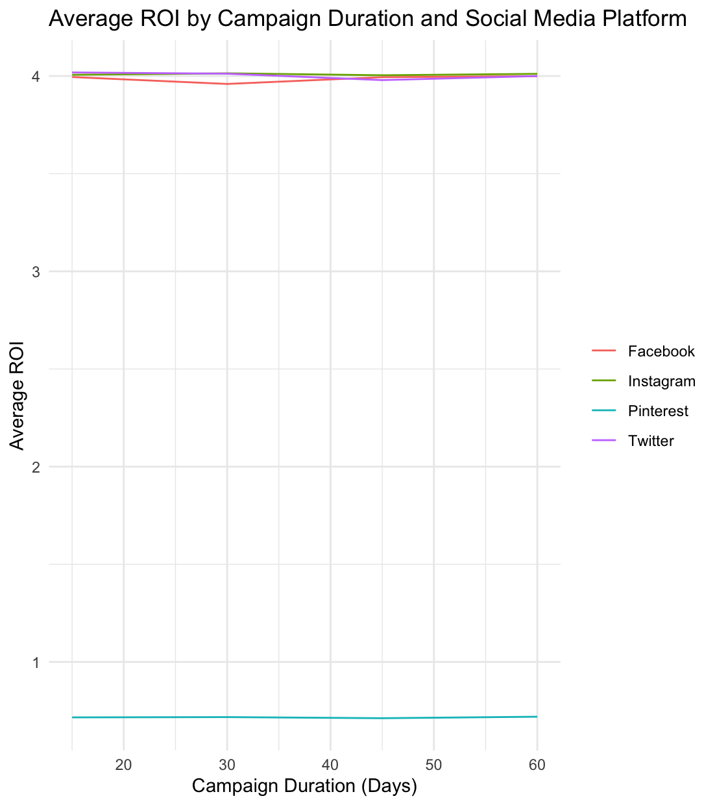

# Jannis Solution for Minseo’s Project

# use the tidyverse package for data manipulation and visualization

# use piping where possible to make the code more readable and efficient

library(tidyverse) library(ggplot2) library (stringr) library(dplyr)
library(tidyr)

setwd(“/Users/jannisdennochweiler/R2 Course/Projects/Minseo”) data &lt;-
read\_csv(“Social Media Advertising.csv”)

head(data)

\#Data cleanup

cleandata &lt;- data %&gt;% mutate(Duration =
as.numeric(str\_remove(Duration, ” Days”))) %&gt;%
mutate(Acquisition\_Cost = as.numeric(str\_sub(Acquisition\_Cost, 2)))
%&gt;% mutate(Date = as.Date(Date, format =“%m/%d/%Y”)) %&gt;%
separate(Target\_Audience, into = c(“gender”, “age\_group”), sep = ” “)

head(cleandata)

# everything clear, now manipulation

summary &lt;- cleandata %&gt;% group\_by(Campaign\_Goal) %&gt;%
summarise( avg\_engagement = mean(Engagement\_Score, na.rm = TRUE),
sd\_engagement = sd(Engagement\_Score, na.rm = TRUE), number\_campaigns
= n() ) summary

# data manipulation nr 2 (I had no Idea so this first big code chunk is mainly AI :/)

data\_expanded &lt;- cleandata %&gt;% mutate(age\_group =
str\_replace\_all(age\_group, “–”, “-”), age\_group =
str\_replace\_all(age\_group, ” “,”“)) %&gt;% separate(age\_group, into
= c(”min\_age”, “max\_age”), sep = “-”) %&gt;% mutate( min\_age =
as.numeric(min\_age), max\_age = as.numeric(max\_age) ) %&gt;%
filter(!is.na(min\_age), !is.na(max\_age)) %&gt;% rowwise() %&gt;%
mutate(age = list(seq(min\_age, max\_age))) %&gt;% unnest(age)

data\_expanded2 &lt;- data\_expanded%&gt;% mutate(click\_through\_rate =
Clicks / Impressions)

agedata &lt;- data\_expanded2 %&gt;% group\_by(age) %&gt;% summarise(
avg\_click\_through\_rate = mean(click\_through\_rate) )

head(agedata)

# Visualisation

\#Create a line graph showing how average ROI changes with campaign
duration across different social media platforms.

\#The data should be grouped by Duration and Channel\_Used.

\#The final graph should show: \#campaign duration on the x-axis
\#average ROI on the y-axis \#separate lines for different social media
platforms

cleandata %&gt;% group\_by(Duration, Channel\_Used) %&gt;% ggplot(aes(x
= Duration, y = ROI, color = Channel\_Used)) + geom\_line(stat =
“summary”, fun = “mean”) + labs(title = “Average ROI by Campaign
Duration and Social Media Platform”, x = “Campaign Duration (Days)”, y =
“Average ROI”) + theme\_minimal() + theme(legend.title =
element\_blank())

Result (i doubt this is correct): 
