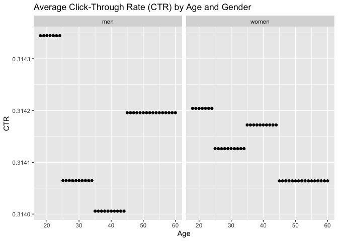
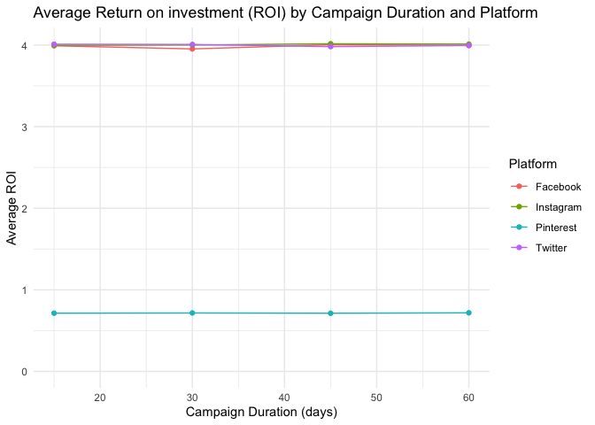

# Social Media Advertising

Social media advertising is an important part of modern marketing and
public relations. This project explores how social media advertising
campaigns differ across platforms, customer segments, and campaign
goals.

The focus of this project lies on cleaning, restructuring, and
visualizing advertising campaign data. I am especially interested in how
different advertising strategies lead to audience interaction and
financial performance.

    ##   Campaign_ID Target_Audience    Campaign_Goal Duration Channel_Used
    ## 1      529013       Men 35-44   Product Launch  15 Days    Instagram
    ## 2      275352     Women 45-60 Market Expansion  15 Days     Facebook
    ## 3      692322       Men 45-60   Product Launch  15 Days    Instagram
    ## 4      675757       Men 25-34   Increase Sales  15 Days    Pinterest
    ## 5      535900       Men 45-60 Market Expansion  15 Days    Pinterest
    ## 6      323031     Women 35-44   Product Launch  15 Days     Facebook
    ## 7      727501        All Ages   Increase Sales  15 Days    Pinterest
    ##   Conversion_Rate Acquisition_Cost       ROI    Location Language Clicks
    ## 1            0.15          $500.00 5.7900000   Las Vegas  Spanish    500
    ## 2            0.01          $500.00 7.2100000 Los Angeles   French    500
    ## 3            0.08          $500.00 0.4300000      Austin  Spanish    500
    ## 4            0.03          $500.00 0.9098236       Miami  Spanish    293
    ## 5            0.13          $500.00 1.4228282      Austin   French    293
    ## 6            0.02          $500.00 6.9000000      Austin  Spanish    500
    ## 7            0.10          $500.00 0.6792396 Los Angeles   French    293
    ##   Impressions Engagement_Score Customer_Segment       Date        Company
    ## 1        3000                7           Health 2022-02-25     Aura Align
    ## 2        3000                5             Home 2022-05-12 Hearth Harmony
    ## 3        3000                9       Technology 2022-06-19  Cyber Circuit
    ## 4        1937                1           Health 2022-09-08      Well Wish
    ## 5        1937                1             Home 2022-08-24 Hearth Harmony
    ## 6        3001               10       Technology 2022-01-15  Cyber Circuit
    ## 7        1938                1             Home 2022-10-30   Space Spruce

- Problem: The `Target_Audience` variable contained both gender and age
  group information. For some participants, “All Ages” was used to
  describe the target audience, which is not a valid gender category
  (see participant 7).

- In total **300000** participants took part in the social media
  advertising campaigns. The dataset contains 16 variables. After
  removing participants with “All gender” for analyses, where age and
  gender are required, **266553** participants remained in the dataset.

# Data manipulation

## 1. Which campaign goals bring the highest engagement scores?

<table>
<caption>Engagement Score Summary by Campaign Goal</caption>
<thead>
<tr>
<th style="text-align: left;">Campaign Goal</th>
<th style="text-align: right;">M</th>
<th style="text-align: right;">SD</th>
<th style="text-align: right;">n</th>
</tr>
</thead>
<tbody>
<tr>
<td style="text-align: left;">Increase Sales</td>
<td style="text-align: right;">4.37</td>
<td style="text-align: right;">3.16</td>
<td style="text-align: right;">74963</td>
</tr>
<tr>
<td style="text-align: left;">Product Launch</td>
<td style="text-align: right;">4.37</td>
<td style="text-align: right;">3.16</td>
<td style="text-align: right;">75030</td>
</tr>
<tr>
<td style="text-align: left;">Market Expansion</td>
<td style="text-align: right;">4.37</td>
<td style="text-align: right;">3.16</td>
<td style="text-align: right;">74759</td>
</tr>
<tr>
<td style="text-align: left;">Brand Awareness</td>
<td style="text-align: right;">4.36</td>
<td style="text-align: right;">3.15</td>
<td style="text-align: right;">75248</td>
</tr>
</tbody>
</table>

**Results**

There were marginally differences in engagement scores between campaign
goals. The lowest engagement scores were observed for campaigns with the
goal of “Brand Awareness” (M = 4.36, SD = 3.15, n = 75248).

## 2. Which age group has the highest click-through rate?

Visualization of click-through rate by gender

**Results CTR**

- The graph shows the average click-through rate (CTR) by age and
  gender.
- Results indicate that the CTR for men is highest for the age group
  18-24, followed by 45-60. The age groups 25-34 and 35-44 demonstrate
  the lowest CTR.
- For women, the highest CTR is for the same age group (18–24), but
  lower than the same age group for men. It is followed by 35–44, 25–34,
  and then 45–60 (which represents the lowest CTR for women).

# 3. Average ROI changes with campaign duration

**Results ROI**

- This line graph shows the average Return on investment for each
  campaign duration, separated by the platform used. - The average ROI
  does not change with campaign duration.
- However, differences exist regarding the platform used. Whereas
  facebook, instagram and twitter do not differ much in their average
  ROI, pinterest seems to be the least effective.
