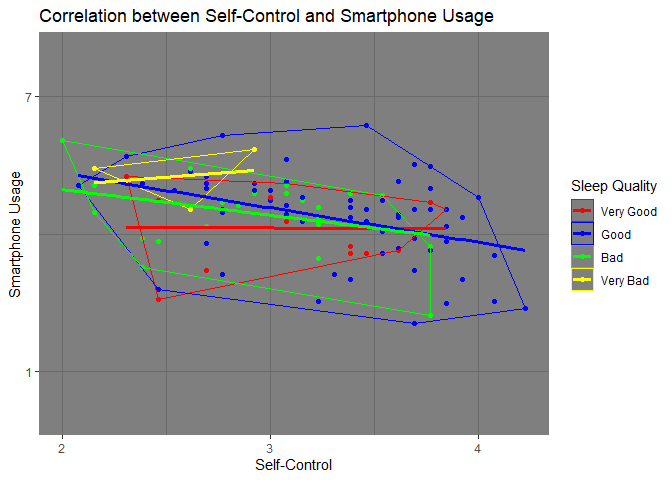

## Task 1 - Get in Touch with the Material

### 1) Take a look at the dataset in R

-   How many oberservations do we have?

<!-- -->

    library(readxl)
    data <- read_excel("data_smaschkon_2023-02-11_09-11.xlsx", na ="-9")
    dim(data)

    ## [1] 101  80

Answer: There are **101** observations in the data set

### 2) Examine the table

-   What is the question behind the items “SC01\_14”, “TS01\_01”?

SC01\_14: Ich kann Versuchungen gut wiederstehen.

TS01\_01: Wie häufig trägst Du dein Smartphone bei Dir?

### 3) Examine the table

-   What are the possible values for the item “PS03\_01”, “SC01\_14”,
    “TS01\_01”? PS03\_01: 1;2;3;4;-9 SC01\_14: 1;2;3;4;5;-9 TS01\_01:
    1;7;-9

-   What does “-9” mean? And how should “-9” be presented in R?

That the question was not answered. In R, -9 should be represented as NA

### 4) Back to R

-   Check with R for the observed values for “PS03\_01,” “SC01\_14,”
    “TS01\_17” (use, for example, the table() function).

<!-- -->

    variable_names <- c ("PS03_01", "SC01_14", "TS01_17")
      
    tables <- lapply(variable_names, function(variable) {
      table(data[[variable]], useNA = "ifany")
    })
    names(tables) <- variable_names
    print(tables)

    ## $PS03_01
    ## 
    ##  1  2  3  4 
    ## 13 61 24  3 
    ## 
    ## $SC01_14
    ## 
    ##  2  3  4  5 
    ## 16 51 30  4 
    ## 
    ## $TS01_17
    ## 
    ##    1    2    3    4    5    6    7 <NA> 
    ##   10   20   12   24   21    7    5    2

(In “TS01\_17” there are **two NAs** as the numbers does not add up to
101. However Number of NAs are not displayed directly)

**or** by using this new-learned alternative (hopefully pleasing the
R-Gods)

    library(tidyverse)

    ## ── Attaching core tidyverse packages ──────────────────────── tidyverse 2.0.0 ──
    ## ✔ dplyr     1.1.2     ✔ readr     2.1.4
    ## ✔ forcats   1.0.0     ✔ stringr   1.5.0
    ## ✔ ggplot2   3.4.2     ✔ tibble    3.2.1
    ## ✔ lubridate 1.9.2     ✔ tidyr     1.3.0
    ## ✔ purrr     1.0.1     
    ## ── Conflicts ────────────────────────────────────────── tidyverse_conflicts() ──
    ## ✖ dplyr::filter() masks stats::filter()
    ## ✖ dplyr::lag()    masks stats::lag()
    ## ℹ Use the conflicted package (<http://conflicted.r-lib.org/>) to force all conflicts to become errors

    data |>  select("PS03_01", "SC01_14", "TS01_17") |> 
      map(table, useNA = "ifany") |> print()

    ## $PS03_01
    ## 
    ##  1  2  3  4 
    ## 13 61 24  3 
    ## 
    ## $SC01_14
    ## 
    ##  2  3  4  5 
    ## 16 51 30  4 
    ## 
    ## $TS01_17
    ## 
    ##    1    2    3    4    5    6    7 <NA> 
    ##   10   20   12   24   21    7    5    2

## Task 2 - Building Scales

### 1) Some preparation is needed: Item “SC01\_09” must be recoded.

-   Examine the question behind item “SC01\_09” again. What is unique
    about this question, and why should this item be “recoded”?
-   Find a way to recode the item in the dataset.

This question should also be asked in “umgepolt”. All other questions
for SC are asked in a way that a higher number translates to more
self-control. However, when it comes to “SC01\_09” a higher number
refers to less Self Control. Therefore, I would suggest to recode this
item that 1 translates to 5, 2 to 4, 3 stays the same, 4 to 2 and 5 to
1.

    data$SC01_09 <- 6- data$SC01_09

### 2) **Find a way to build the scales.** Different methods can be used. As mentioned earlier, we want row-wise means over the items that belong to the specific scale. (You can use either `Base R` or

    `tidyverse`.)

Create the Scale for Sleep Quality

    data$Sleep_Quality <- data$PS03_01

Scale for Self-Control

    library(tidyverse)
    #SelfControlVariable <- c("SC01_14", "SC01_02", "SC01_03", "SC01_04", "SC01_05",
    #    "SC01_06", "SC01_07", "SC01_08", "SC01_09", "SC01_10", "SC01_11",
    #    "SC01_12", "SC01_13")
    #data$Self_Control <- rowMeans(data[SelfControlVariable])

    ##Alternative##
    SelfControlVariable <- data |> select(starts_with("SC01_"))
    data$Self_Control <- rowMeans(SelfControlVariable)

Scale for Smartphone Usage

    #SmartphoneUsageVariable <- c("TS01_01", "TS01_02" , "TS01_03", "TS01_04", "TS01_05", "TS01_06", #"TS01_07", "TS01_08", "TS01_09", "TS01_10", "TS01_11", "TS01_12", "TS01_13", "TS01_14", "TS01_15", #"TS01_16", "TS01_17", "TS01_18", "TS01_19")
    #data$Smartphone_Usage <- rowMeans(data[SmartphoneUsageVariable])

    ##Alternative##
    SmartphoneUsageVariable <- data |> select(starts_with("TS01_"))
    data$Smartphone_Usage <- rowMeans(SmartphoneUsageVariable)

## Task 3 - Plot Something Beautiful for Me

Creating the Plot

    ## Just copied this code, there is prob a way shorter alterrnative ##

    # Function to calculate convex hull
    calculate_hull <- function(group) {
      group_data <- subset(data, PS03_01 == group)
      
      # Check for finite coordinates
      finite_indices <- is.finite(group_data$Self_Control) & is.finite(group_data$Smartphone_Usage)
      
      # Calculate convex hull only for finite coordinates
      hull_indices <- chull(group_data$Self_Control[finite_indices], group_data$Smartphone_Usage[finite_indices])
      
      # Create a data frame with convex hull coordinates and group information
      hull_data <- data.frame(
        Self_Control = group_data$Self_Control[finite_indices][hull_indices],
        Smartphone_Usage = group_data$Smartphone_Usage[finite_indices][hull_indices],
        PS03_01 = group
      )
      
      return(hull_data)
    }

    # Calculate convex hulls for each group
    hulls_data <- do.call(rbind, lapply(levels(factor(data$PS03_01)), calculate_hull))

    color_names <- c("1" = "red", "2" = "blue", "3" = "green", "4" = "yellow")
    color_labels <- c("1" = "Very Good", "2" = "Good", "3" = "Bad", "4" = "Very Bad")
    library(ggplot2)

    ggplot(data, aes(x = Self_Control, y = Smartphone_Usage, color = factor(PS03_01))) +
      geom_point() +
    geom_polygon(data = hulls_data, aes(x = Self_Control, y = Smartphone_Usage, group = PS03_01, color = PS03_01),
                    fill = NA, alpha = 0.5, size = 0.2) +
      scale_color_manual(values = color_names, breaks = names(color_names), labels = color_labels) +
     geom_smooth(method = "lm", se = FALSE, aes(group = PS03_01), size = 1.1) +
      theme_dark()+
      labs(
        title = "Correlation between Self-Control and Smartphone Usage",
        x = "Self-Control",
        y = "Smartphone Usage",
        fill = "PS03_01"
      ) +
      guides(color = guide_legend(title = "Sleep Quality")) +
      
      scale_x_continuous( 
        breaks = seq(1, 5, by = 1),  
        labels = seq(1, 5, by = 1)
      ) +
      
      scale_y_continuous(
       breaks = c(1,7), 
       labels = c(1,7),
       limits = c(0,8)
      )

    ## Warning: Using `size` aesthetic for lines was deprecated in ggplot2 3.4.0.
    ## ℹ Please use `linewidth` instead.
    ## This warning is displayed once every 8 hours.
    ## Call `lifecycle::last_lifecycle_warnings()` to see where this warning was
    ## generated.

    ## `geom_smooth()` using formula = 'y ~ x'

    ## Warning: Removed 2 rows containing non-finite values (`stat_smooth()`).

    ## Warning: Removed 2 rows containing missing values (`geom_point()`).

**Self-Control** 1: high SelfControl 4: low SelfControl\*
