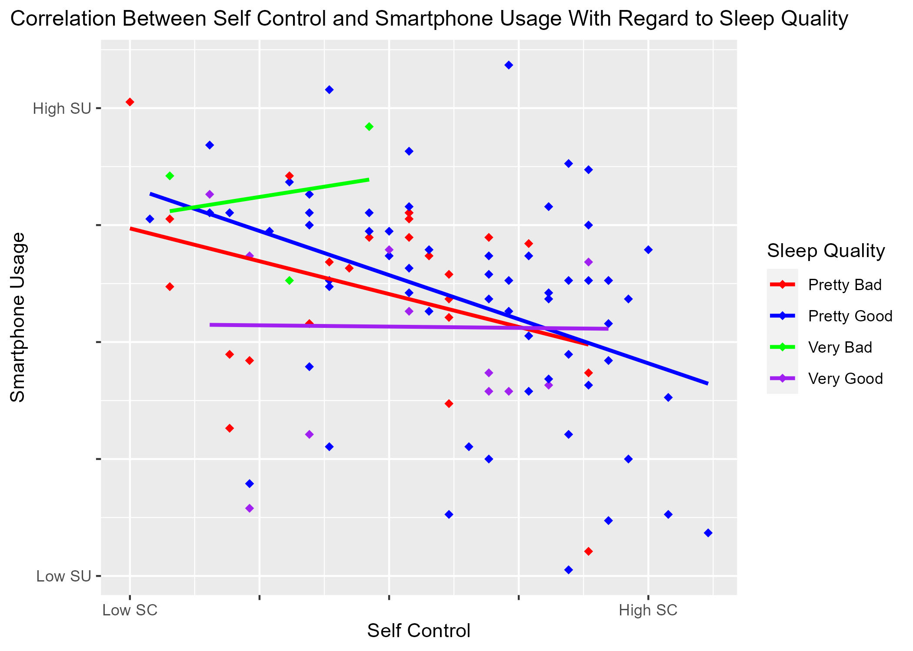

```{r, setup, include=FALSE}

knitr::opts_chunk$set(echo = TRUE, warning = FALSE, message = FALSE)

library(tidyverse)
library(readxl)
```

```{r read_n_pipe, echo=FALSE}
data <- read_excel("data_smaschkon_2023-02-11_09-11.xlsx")

data <- data %>%
  select("PS03_01",starts_with("SC01"), starts_with("TS01")) %>%
  mutate(
    across(1:ncol(.), na_if, -9)
    ) %>%
  na.omit() %>%
  mutate(
    SC01_09 = 6 - SC01_09
  ) %>%
  mutate(
    x = rowMeans(select(.,starts_with("SC01"))),
    y = rowMeans(select(.,starts_with("TS01")))
  )%>%
  mutate( PS03_01 =
    case_when(
      PS03_01 == 1 ~ "Very Good",
      PS03_01 == 2 ~ "Pretty Good",
      PS03_01 == 3 ~ "Pretty Bad",
      PS03_01 == 4 ~ "Very Bad"
      )
    ) %>%
  group_by(PS03_01)
```

```{r plotting, echo=FALSE}
p <- ggplot(data, aes(x=x, y=y, color = PS03_01)) +
  geom_point(size=2, shape = 18) +
  geom_smooth(method=lm, se=FALSE) +
  scale_color_manual(values = c("red", "blue", "green", "purple")) +
  scale_x_continuous(breaks=seq(2,4.5,.5),labels=c("Low SC","", "", "", "High SC", "")) +
  scale_y_continuous(breaks=seq(2,7,1),labels=c("Low SU","", "", "", "High SU", "")) +
  ggtitle("Correlation Between Self Control and Smartphone Usage With Regard to Sleep Quality")+
  xlab("Self Control") +
  ylab("Smartphone Usage") +
  labs(color = "Sleep Quality") +
  theme(
    plot.title = element_text(size=12),
    plot.title.position = "plot"
  )

ggsave(plot = p, "SleepyTime.jpg")
```




