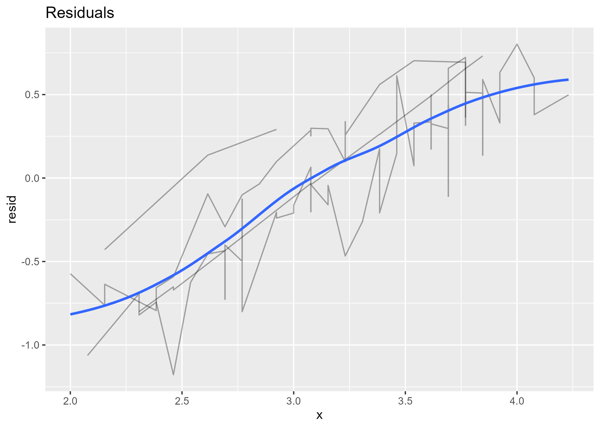
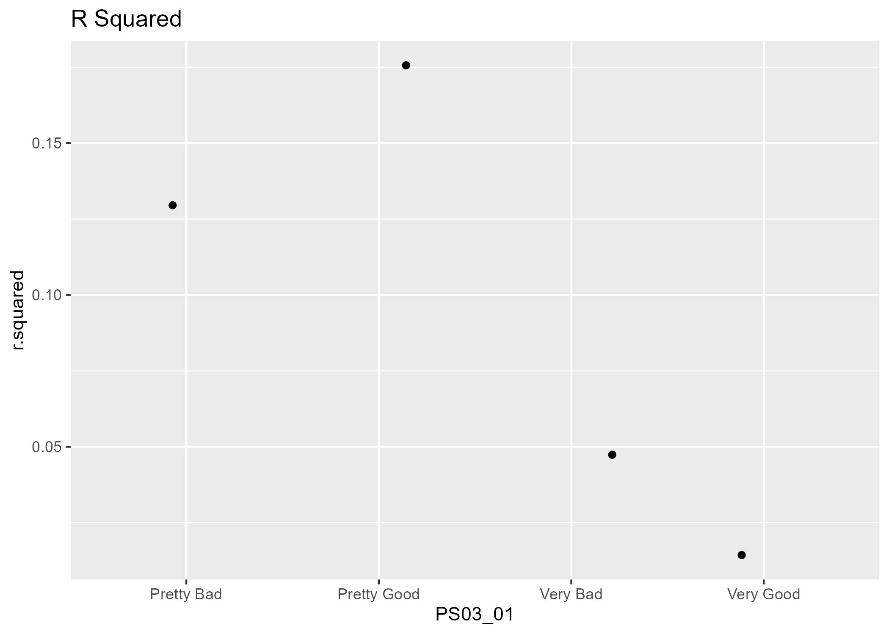

## Original Implementation

## Only Lines

## Only Hulls

## Holy Statistics Batman

    ## # A tibble: 4 × 16
    ## # Groups:   PS03_01 [4]
    ##   PS03_01     data     model  resids   r.squared adj.r.squared sigma statistic
    ##   <chr>       <list>   <list> <list>       <dbl>         <dbl> <dbl>     <dbl>
    ## 1 Very Good   <tibble> <lm>   <tibble>  0.000197       -0.0907 0.538   0.00216
    ## 2 Very Bad    <tibble> <lm>   <tibble>  0.0409         -0.918  0.536   0.0427 
    ## 3 Pretty Bad  <tibble> <lm>   <tibble>  0.122           0.0801 0.481   2.91   
    ## 4 Pretty Good <tibble> <lm>   <tibble>  0.167           0.152  0.483  11.6    
    ## # ℹ 8 more variables: p.value <dbl>, df <dbl>, logLik <dbl>, AIC <dbl>,
    ## #   BIC <dbl>, deviance <dbl>, df.residual <int>, nobs <int>

