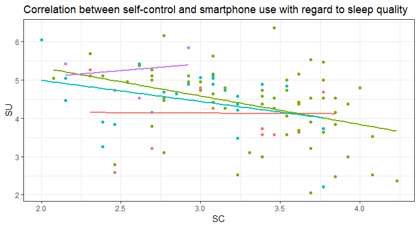

# Self-control, sleep quality and smartphone usage

## The data

-   Data: data\_smaschkon\_2023-02-11\_09-11.xlsx
-   Variables: variables\_smaschkon\_2023-02-11\_09-24.csv
-   Values: values\_smaschkon\_2023-02-11\_09-24.csv

The data was collected as part of a data collection seminar. The aim was
to investigate the relationship between self-control, sleep quality and
smartphone usage.

The following columns (so-called “items”) are relevant for my project:

-   Sleep quality: “PS03\_01”

-   Self-control: “SC01\_14”, “SC01\_02”, “SC01\_03”, “SC01\_04”,
    “SC01\_05”, “SC01\_06”, “SC01\_07”, “SC01\_08”, “SC01\_09”,
    “SC01\_10”, “SC01\_11”, “SC01\_12”, “SC01\_13”

    -   Attention! Item “SC01\_09” must be “recoded”!
    -   Find out what this means and adjust accordingly.

-   Smartphone Usage: “TS01\_01”, “TS01\_02”, “TS01\_03”, “TS01\_04”,
    “TS01\_05”, “TS01\_06”, “TS01\_07”, “TS01\_08”, “TS01\_09”,
    “TS01\_10”, “TS01\_11”, “TS01\_12”, “TS01\_13”, “TS01\_14”,
    “TS01\_15”, “TS01\_16”, “TS01\_17”, “TS01\_18”, “TS01\_19”

    -   Attention! Error with “TS01\_17”!
    -   What is wrong here? Pay attention to which values are possible
        and which values can actually be found in the column (e.g. with
        the “table()” function). Make appropriate adjustments.

## How do I create a scale/variable?

    # For example 3 Items
    data <- data.frame(item1 = c(4, 2, 3, 1), # You good in math?
                       item2 = c(4, 2, 3, 1), # You like math?
                       item3 = c(3, 3, 3, 2)) # You want to work on something that requires math skills

    # Simple (but not necessarily the most efficient) way:

    item123 <-c("item1", "item2", "item3") # building vector

    data$variable <-rowMeans(data[,item123]) # creating variable by building Means at each row

    head(data) # quick check

## Aim of the project

I would like to have a cool graphic in which you can see the correlation
between self-control and smartphone usage. The study participants should
be divided into groups for the graph: The groups should result from the
answers to item “PS03\_01”.

I have tried to create a graph but I just can’t get it any better than
this:

Please try to recreate the graphic and add colors that are easier to
distinguish, a legend, a clear axis label and choose a nice theme. Good
luck!
