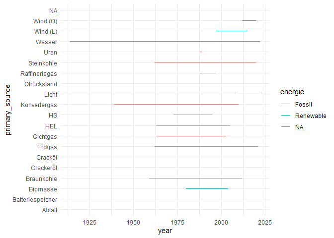
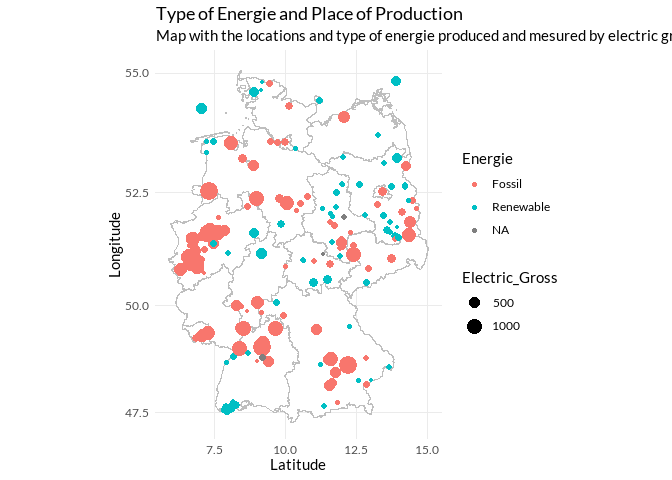
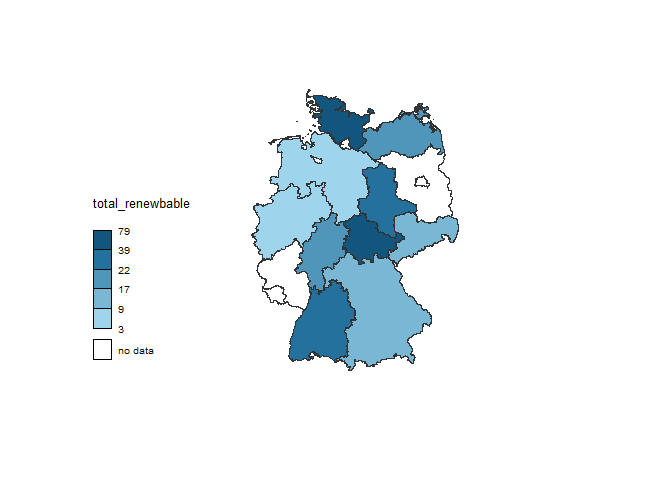

# Power Plants in Germany

    ## Warning: package 'raster' was built under R version 4.2.3

    ## Loading required package: sp

    ## Warning: package 'sp' was built under R version 4.2.3

    ## The legacy packages maptools, rgdal, and rgeos, underpinning this package
    ## will retire shortly. Please refer to R-spatial evolution reports on
    ## https://r-spatial.org/r/2023/05/15/evolution4.html for details.
    ## This package is now running under evolution status 0

    ## Warning: package 'cartography' was built under R version 4.2.3

    ## This project is in maintenance mode. 
    ## Core functionalities of `cartography` can be found in `mapsf`.
    ## https://riatelab.github.io/mapsf/

    ## 
    ## Attaching package: 'dplyr'

    ## The following objects are masked from 'package:raster':
    ## 
    ##     intersect, select, union

    ## The following objects are masked from 'package:stats':
    ## 
    ##     filter, lag

    ## The following objects are masked from 'package:base':
    ## 
    ##     intersect, setdiff, setequal, union

    ## 
    ## Attaching package: 'tidyr'

    ## The following object is masked from 'package:raster':
    ## 
    ##     extract

    ## Warning: package 'ggtext' was built under R version 4.2.3

    ## Warning: package 'showtext' was built under R version 4.2.3

    ## Loading required package: sysfonts

    ## Warning: package 'sysfonts' was built under R version 4.2.3

    ## Loading required package: showtextdb

    ## Warning: package 'showtextdb' was built under R version 4.2.3

The following is a proposed solution to the project [Large Scale Energy
Production](https://github.com/Dr-Eberle-Zentrum/Advanced-data-processing-with-R/blob/main/Projects/PaulKirschner/ProjectIdea_Energy.md)
created by Paul Kishner.

## Data Table - Power Plants in Germany over 100 MW in the year 2022

The data collected by National Environmental Agency:
[UBA](https://www.umweltbundesamt.de/dokument/datenbank-kraftwerke-in-deutschland)
are organized into 15 variables, including the locations of the power
generation companies, the raw materials used, the amount of energy
produced, among others.

<table style="width:100%;">
<caption>Power Plants in Germany over 100 MW in the year 2022</caption>
<colgroup>
<col style="width: 11%" />
<col style="width: 21%" />
<col style="width: 4%" />
<col style="width: 5%" />
<col style="width: 7%" />
<col style="width: 13%" />
<col style="width: 9%" />
<col style="width: 14%" />
<col style="width: 4%" />
<col style="width: 8%" />
</colgroup>
<thead>
<tr class="header">
<th style="text-align: left;">Kraftwerksname / Standort</th>
<th style="text-align: left;">Betreiber</th>
<th style="text-align: left;">Bundesland</th>
<th style="text-align: left;">Standort-PLZ</th>
<th style="text-align: left;">Kraftwerksstandort</th>
<th style="text-align: right;">Elektrische Bruttoleistung (MW)</th>
<th style="text-align: left;">Fernwärme-leistung (MW)</th>
<th style="text-align: left;">Inbetriebnahme (ggf. Ertüchtigung)</th>
<th style="text-align: left;">Anlagenart</th>
<th style="text-align: left;">Primärenergieträger</th>
</tr>
</thead>
<tbody>
<tr class="odd">
<td style="text-align: left;">Albatros</td>
<td style="text-align: left;">EnBW Albatros GmbH &amp; Co. KG / Enbridge
Inc.</td>
<td style="text-align: left;">Offshore</td>
<td style="text-align: left;">NA</td>
<td style="text-align: left;">Nordsee</td>
<td style="text-align: right;">112.0</td>
<td style="text-align: left;">NA</td>
<td style="text-align: left;">2019</td>
<td style="text-align: left;">WEA</td>
<td style="text-align: left;">Wind (O)</td>
</tr>
<tr class="even">
<td style="text-align: left;">Albbruck-Dogern / Rhein</td>
<td style="text-align: left;">Rheinkraftwerk Albbruck-Dogern AG / RWE
Vertrieb AG</td>
<td style="text-align: left;">BW</td>
<td style="text-align: left;">79774</td>
<td style="text-align: left;">Albbruck</td>
<td style="text-align: right;">108.9</td>
<td style="text-align: left;">NA</td>
<td style="text-align: left;">1933 / 2009 (2020)</td>
<td style="text-align: left;">LWK</td>
<td style="text-align: left;">Wasser</td>
</tr>
<tr class="odd">
<td style="text-align: left;">Altbach/Deizisau GT A-C, E</td>
<td style="text-align: left;">EnBW Kraftwerke AG</td>
<td style="text-align: left;">BW</td>
<td style="text-align: left;">73776</td>
<td style="text-align: left;">Altbach</td>
<td style="text-align: right;">305.0</td>
<td style="text-align: left;">NA</td>
<td style="text-align: left;">1971-1997</td>
<td style="text-align: left;">GT</td>
<td style="text-align: left;">Erdgas</td>
</tr>
<tr class="even">
<td style="text-align: left;">Altbach/Deizisau HKW 1</td>
<td style="text-align: left;">EnBW Kraftwerke AG</td>
<td style="text-align: left;">BW</td>
<td style="text-align: left;">73776</td>
<td style="text-align: left;">Altbach</td>
<td style="text-align: right;">476.0</td>
<td style="text-align: left;">280</td>
<td style="text-align: left;">1985 (2006)</td>
<td style="text-align: left;">HKW</td>
<td style="text-align: left;">Steinkohle</td>
</tr>
<tr class="odd">
<td style="text-align: left;">Altbach/Deizisau HKW 2</td>
<td style="text-align: left;">EnBW Kraftwerke AG</td>
<td style="text-align: left;">BW</td>
<td style="text-align: left;">73776</td>
<td style="text-align: left;">Altbach</td>
<td style="text-align: right;">379.0</td>
<td style="text-align: left;">280</td>
<td style="text-align: left;">1997 (2012)</td>
<td style="text-align: left;">HKW (DT)</td>
<td style="text-align: left;">Steinkohle</td>
</tr>
<tr class="even">
<td style="text-align: left;">Alttrebbin</td>
<td style="text-align: left;">EnBW Solarpark GmbH / ALH-Gruppe</td>
<td style="text-align: left;">BB</td>
<td style="text-align: left;">15320</td>
<td style="text-align: left;">Neutrebbin</td>
<td style="text-align: right;">150.0</td>
<td style="text-align: left;">NA</td>
<td style="text-align: left;">2022</td>
<td style="text-align: left;">PV</td>
<td style="text-align: left;">Licht</td>
</tr>
</tbody>
</table>

Power Plants in Germany over 100 MW in the year 2022

In order to meet the objectives proposed in the project, these data need
to be modified or expanded. First, we add to our data the longitude and
latitude for each of the locations or cities, where the producing
companies are located. For the identification of these variables we use
the [Batch geocoder for journalist
tool](https://geocode.localfocus.nl/). It allows us to find
automatically the longitude and the latitude of each place or locations
in our data set. For some of those locations the tool offer different
options to chose, therefore we can select the correct one, manually.

Secondly, we created a variable to normalize the date to a single year.

Thirdly, we separate the raw materials for the cases in which the power
plant manipulates or works with different sources.

Finally, we will classify them based on whether the materials are
renewable or fossil fuels.

#### Identify historic eras for energy sources (coal, water, renewable)

We can see that water is a resource that has been present all the time.
Renewable energies are a phenomenon that appeared in the last quarter of
the 20th century and the beginning of the 21st century. Fossil resources
such as gas and coal have dominated since the 1930s.

### Group the energy sources by renewable vs. fossil types Bundesland

    ## Warning in getData(country = "DEU", level = 1): getData will be removed in a future version of raster
    ## . Please use the geodata package instead

    ## Regions defined for each Polygons

With this map we see that renewable energy production is located in the
east of the country. While the fossil production is centralized in
Nordrhein-Westfalen and the Rhine river basin.

### Challenge (first try)

First we calculate the percentage of energy produced by Bundesland (both
fossil and renewable).

    ## `summarise()` has grouped output by 'Bundesland'. You can override using the
    ## `.groups` argument.

<table>
<caption>Percent of Energie Production by Bundesland and Type</caption>
<thead>
<tr class="header">
<th style="text-align: left;">Bundesland</th>
<th style="text-align: left;">Energie</th>
<th style="text-align: right;">Total_Renewable</th>
</tr>
</thead>
<tbody>
<tr class="odd">
<td style="text-align: left;">BB</td>
<td style="text-align: left;">Fossil</td>
<td style="text-align: right;">79.919102</td>
</tr>
<tr class="even">
<td style="text-align: left;">BB</td>
<td style="text-align: left;">Renewable</td>
<td style="text-align: right;">20.080898</td>
</tr>
<tr class="odd">
<td style="text-align: left;">BE</td>
<td style="text-align: left;">Fossil</td>
<td style="text-align: right;">100.000000</td>
</tr>
<tr class="even">
<td style="text-align: left;">BW</td>
<td style="text-align: left;">Fossil</td>
<td style="text-align: right;">78.522952</td>
</tr>
<tr class="odd">
<td style="text-align: left;">BW</td>
<td style="text-align: left;">Renewable</td>
<td style="text-align: right;">20.424361</td>
</tr>
<tr class="even">
<td style="text-align: left;">BW</td>
<td style="text-align: left;">NA</td>
<td style="text-align: right;">1.052687</td>
</tr>
</tbody>
</table>

Percent of Energie Production by Bundesland and Type

Then, we filtered by renewable energy and merged this data with the
spacial dataframe.

Finally, with the `choroLayer` function of the `cartography` library, we
color the Bundesland by percentage of renewable energy production.

As we can see, the production of renewable energies are centralize in
the east of the country. The no data cases are states where the
production is 100% derivative from fossil primary sources.
