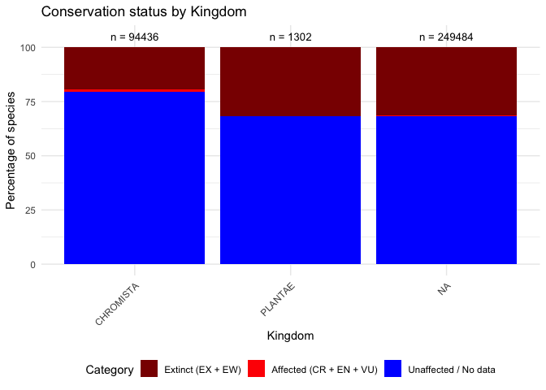
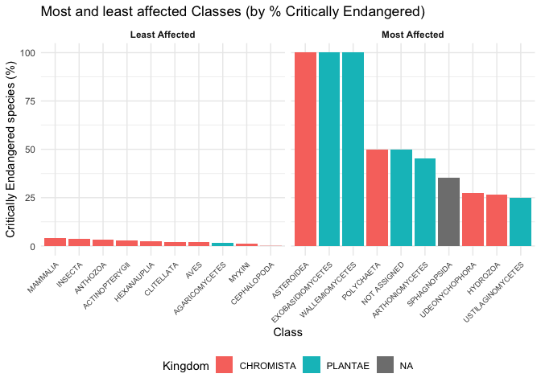

-   [Introduction](#introduction)
-   [1. Data Import and Wrangling](#data-import-and-wrangling)
    -   [1a) Import CSV into R](#a-import-csv-into-r)
    -   [1c) Add Kingdom Data](#c-add-kingdom-data)
-   [2. Data Manipulation](#data-manipulation)
    -   [2a) Remove Unwanted Columns](#a-remove-unwanted-columns)
    -   [2c) Simplify Columns](#c-simplify-columns)
    -   [2d) Make Column Names Readable](#d-make-column-names-readable)
-   [3. Data Visualisation](#data-visualisation)
    -   [3a) Create Relative Amount
        Table](#a-create-relative-amount-table)
    -   [3b) Visualise Difference Between
        Kingdoms](#b-visualise-difference-between-kingdoms)
    -   [3c) Visualise Most and Least Affected
        Classes](#c-visualise-most-and-least-affected-classes)

# Introduction

This analysis examines the **conservation status of species** across
different taxonomic classes and kingdoms, based on data from the **IUCN
Red List**. The IUCN Red List is the world’s most comprehensive
inventory of the global conservation status of biological species.

**What we will do:**

1.  **Import and enrich the data** – add Kingdom information based on
    taxonomic classification.
2.  **Clean and restructure** – remove non‑official categories, combine
    similar statuses, and rename columns for readability.
3.  **Create a percentage table** – express each category as a
    percentage of the total species count per class.
4.  **Visualise differences between Kingdoms** – compare the proportion
    of extinct, affected, and unaffected species across major kingdoms.
5.  **Identify most and least affected Classes** – highlight the classes
    with the highest and lowest percentages of Critically Endangered
    species.

------------------------------------------------------------------------

# 1. Data Import and Wrangling

## 1a) Import CSV into R

The dataset is loaded from the project’s `dependencies` folder (portable
path).

**First rows of the dataset:**

| Name           |  EX |  EW | Subtotal (EX+EW) | CR(PE) | CR(PEW) | Subtotal (EX+EW+ CR(PE)+CR(PEW)) |  CR |   EN |   VU | Subtotal (threatened spp.) | LR/cd | NT or LR/nt | LC or LR/lc |   DD | Total |
|:-----|--:|-:|------:|---:|---:|-----------:|--:|--:|--:|---------:|--:|----:|----:|--:|--:|
| ACTINOPTERYGII |  90 |  11 |              101 |    143 |       8 |                              252 | 777 | 1359 | 1502 |                       3638 |     0 |         890 |       17851 | 5236 | 27716 |
| AMPHIBIA       |  37 |   2 |               39 |    187 |       1 |                              227 | 825 | 1291 |  814 |                       2930 |     0 |         453 |        3733 |  896 |  8051 |
| ANTHOZOA       |   0 |   0 |                0 |      2 |       0 |                                2 |  32 |  246 |   58 |                        336 |     0 |          24 |         431 |  147 |   938 |
| ARACHNIDA      |   9 |   0 |                9 |     27 |       0 |                               36 | 121 |  165 |  104 |                        390 |     0 |          52 |         488 |  114 |  1053 |
| ASTEROIDEA     |   0 |   0 |                0 |      0 |       0 |                                0 |   2 |    0 |    0 |                          2 |     0 |           0 |           0 |    0 |     2 |
| AVES           | 164 |   5 |              169 |     18 |       2 |                              189 | 216 |  372 |  668 |                       1256 |     0 |         967 |        8757 |   36 | 11185 |

First 6 rows of the raw dataset

**Explanation:** The table shows for each class the number of species in
each IUCN category: `EX` (Extinct), `EW` (Extinct in the Wild), `CR`
(Critically Endangered), `EN` (Endangered), `VU` (Vulnerable), `NT`
(Near Threatened), `LC` (Least Concern), and `DD` (Data Deficient).

------------------------------------------------------------------------

## 1c) Add Kingdom Data

The original dataset does not contain a `Kingdom` column.

So we assign a Kingdom ID using `cumsum()`, then map IDs to Kingdom
names.

**First rows after adding Kingdom:**

| Name           |  EX |  EW | Subtotal (EX+EW) | CR(PE) | CR(PEW) | Subtotal (EX+EW+ CR(PE)+CR(PEW)) |  CR |   EN |   VU | Subtotal (threatened spp.) | LR/cd | NT or LR/nt | LC or LR/lc |   DD | Total | Kingdom   |
|:-----|--:|-:|------:|---:|---:|----------:|--:|--:|--:|---------:|--:|----:|----:|--:|--:|:----|
| ACTINOPTERYGII |  90 |  11 |              101 |    143 |       8 |                              252 | 777 | 1359 | 1502 |                       3638 |     0 |         890 |       17851 | 5236 | 27716 | CHROMISTA |
| AMPHIBIA       |  37 |   2 |               39 |    187 |       1 |                              227 | 825 | 1291 |  814 |                       2930 |     0 |         453 |        3733 |  896 |  8051 | CHROMISTA |
| ANTHOZOA       |   0 |   0 |                0 |      2 |       0 |                                2 |  32 |  246 |   58 |                        336 |     0 |          24 |         431 |  147 |   938 | CHROMISTA |
| ARACHNIDA      |   9 |   0 |                9 |     27 |       0 |                               36 | 121 |  165 |  104 |                        390 |     0 |          52 |         488 |  114 |  1053 | CHROMISTA |
| ASTEROIDEA     |   0 |   0 |                0 |      0 |       0 |                                0 |   2 |    0 |    0 |                          2 |     0 |           0 |           0 |    0 |     2 | CHROMISTA |
| AVES           | 164 |   5 |              169 |     18 |       2 |                              189 | 216 |  372 |  668 |                       1256 |     0 |         967 |        8757 |   36 | 11185 | CHROMISTA |

First 6 rows with Kingdom column added

**Explanation:** The `Kingdom` column now tells us which kingdom each
class belongs to.

------------------------------------------------------------------------

# 2. Data Manipulation

## 2a) Remove Unwanted Columns

The columns `CR(PE)` (Possibly Extinct) and `CR(PEW)` (Possibly Extinct
in the Wild) are *not* official IUCN categories and are removed. The
subtotal that includes them is also removed. The remaining subtotals are
renamed for clarity.

| Name           |  EX |  EW | Extinct_Subtotal |  CR |   EN |   VU | Threatened_Subtotal | LR/cd | NT or LR/nt | LC or LR/lc |   DD | Total | Kingdom   |
|:-------|--:|--:|--------:|--:|---:|---:|----------:|---:|------:|------:|---:|---:|:-----|
| ACTINOPTERYGII |  90 |  11 |              101 | 777 | 1359 | 1502 |                3638 |     0 |         890 |       17851 | 5236 | 27716 | CHROMISTA |
| AMPHIBIA       |  37 |   2 |               39 | 825 | 1291 |  814 |                2930 |     0 |         453 |        3733 |  896 |  8051 | CHROMISTA |
| ANTHOZOA       |   0 |   0 |                0 |  32 |  246 |   58 |                 336 |     0 |          24 |         431 |  147 |   938 | CHROMISTA |
| ARACHNIDA      |   9 |   0 |                9 | 121 |  165 |  104 |                 390 |     0 |          52 |         488 |  114 |  1053 | CHROMISTA |
| ASTEROIDEA     |   0 |   0 |                0 |   2 |    0 |    0 |                   2 |     0 |           0 |           0 |    0 |     2 | CHROMISTA |
| AVES           | 164 |   5 |              169 | 216 |  372 |  668 |                1256 |     0 |         967 |        8757 |   36 | 11185 | CHROMISTA |

After removing non‑official IUCN columns

------------------------------------------------------------------------

## 2c) Simplify Columns

`LR/cd` (Lower Risk – conservation dependent) and `NT or LR/nt` (Near
Threatened) are combined into a single column called **Near
Threatened**.

| Name           |  EX |  EW | Extinct_Subtotal |  CR |   EN |   VU | Threatened_Subtotal | LC or LR/lc |   DD | Total | Kingdom   | Near Threatened |
|:--------|--:|--:|---------:|--:|---:|---:|----------:|------:|---:|---:|:-----|--------:|
| ACTINOPTERYGII |  90 |  11 |              101 | 777 | 1359 | 1502 |                3638 |       17851 | 5236 | 27716 | CHROMISTA |             890 |
| AMPHIBIA       |  37 |   2 |               39 | 825 | 1291 |  814 |                2930 |        3733 |  896 |  8051 | CHROMISTA |             453 |
| ANTHOZOA       |   0 |   0 |                0 |  32 |  246 |   58 |                 336 |         431 |  147 |   938 | CHROMISTA |              24 |
| ARACHNIDA      |   9 |   0 |                9 | 121 |  165 |  104 |                 390 |         488 |  114 |  1053 | CHROMISTA |              52 |
| ASTEROIDEA     |   0 |   0 |                0 |   2 |    0 |    0 |                   2 |           0 |    0 |     2 | CHROMISTA |               0 |
| AVES           | 164 |   5 |              169 | 216 |  372 |  668 |                1256 |        8757 |   36 | 11185 | CHROMISTA |             967 |

After combining Near Threatened categories

------------------------------------------------------------------------

## 2d) Make Column Names Readable

All column names are replaced with their full, human‑readable names.

| Name           | Extinct | Extinct_Wild | Extinct_Subtotal | Critically_Endangered | Endangered | Vulnerable | Threatened_Subtotal | Least_Concern | Data_Deficient | Total | Kingdom   | Near Threatened |
|:-----|---:|-----:|------:|--------:|----:|----:|-------:|-----:|-----:|--:|:----|------:|
| ACTINOPTERYGII |      90 |           11 |              101 |                   777 |       1359 |       1502 |                3638 |         17851 |           5236 | 27716 | CHROMISTA |             890 |
| AMPHIBIA       |      37 |            2 |               39 |                   825 |       1291 |        814 |                2930 |          3733 |            896 |  8051 | CHROMISTA |             453 |
| ANTHOZOA       |       0 |            0 |                0 |                    32 |        246 |         58 |                 336 |           431 |            147 |   938 | CHROMISTA |              24 |
| ARACHNIDA      |       9 |            0 |                9 |                   121 |        165 |        104 |                 390 |           488 |            114 |  1053 | CHROMISTA |              52 |
| ASTEROIDEA     |       0 |            0 |                0 |                     2 |          0 |          0 |                   2 |             0 |              0 |     2 | CHROMISTA |               0 |
| AVES           |     164 |            5 |              169 |                   216 |        372 |        668 |                1256 |          8757 |             36 | 11185 | CHROMISTA |             967 |

After renaming columns to readable names

**Resulting columns:** `Name`, `Kingdom`, `Extinct`, `Extinct_Wild`,
`Critically_Endangered`, `Endangered`, `Vulnerable`, `Near Threatened`,
`Least_Concern`, `Data_Deficient`, `Extinct_Subtotal`,
`Threatened_Subtotal`, `Total`.

------------------------------------------------------------------------

# 3. Data Visualisation

## 3a) Create Relative Amount Table

We create a new table `redlist_pct` where every numeric column (except
`Total`) is expressed as a percentage of the row’s `Total`. The `Total`
column is set to 100.

| Name           | Extinct \[%\] | Extinct_Wild \[%\] | Extinct_Subtotal \[%\] | Critically_Endangered \[%\] | Endangered \[%\] | Vulnerable \[%\] | Threatened_Subtotal \[%\] | Least_Concern \[%\] | Data_Deficient \[%\] | Total | Kingdom   | Near Threatened \[%\] |
|:----|----:|-----:|------:|-------:|----:|----:|-------:|-----:|------:|--:|:---|------:|
| ACTINOPTERYGII |     0.3247222 |          0.0396883 |              0.3644104 |                    2.803435 |         4.903305 |         5.419252 |                  13.12599 |            64.40684 |           18.8916150 |   100 | CHROMISTA |              3.211142 |
| AMPHIBIA       |     0.4595702 |          0.0248416 |              0.4844119 |                   10.247174 |        16.035275 |        10.110545 |                  36.39299 |            46.36691 |           11.1290523 |   100 | CHROMISTA |              5.626630 |
| ANTHOZOA       |     0.0000000 |          0.0000000 |              0.0000000 |                    3.411514 |        26.226013 |         6.183369 |                  35.82090 |            45.94883 |           15.6716418 |   100 | CHROMISTA |              2.558635 |
| ARACHNIDA      |     0.8547009 |          0.0000000 |              0.8547009 |                   11.490978 |        15.669516 |         9.876543 |                  37.03704 |            46.34378 |           10.8262108 |   100 | CHROMISTA |              4.938272 |
| ASTEROIDEA     |     0.0000000 |          0.0000000 |              0.0000000 |                  100.000000 |         0.000000 |         0.000000 |                 100.00000 |             0.00000 |            0.0000000 |   100 | CHROMISTA |              0.000000 |
| AVES           |     1.4662494 |          0.0447027 |              1.5109522 |                    1.931158 |         3.325883 |         5.972284 |                  11.22932 |            78.29236 |            0.3218596 |   100 | CHROMISTA |              8.645507 |

Relative amounts (percentages of Total)

**Explanation:** In this table, each value shows the percentage of
species in that category relative to the total number of species for
that class.

------------------------------------------------------------------------

## 3b) Visualise Difference Between Kingdoms

To compare the conservation status across major Kingdoms, we create a
**stacked bar plot**. Only Kingdoms with at least 1,000 species are
included.

**Categories:** - **Extinct:** `Extinct + Extinct_Wild` (EX + EW) –
shown in **red** - **Affected:**
`Critically_Endangered + Endangered + Vulnerable` (CR + EN + VU) – shown
in **orange** - **Unaffected / No data:**
`Least_Concern + Near Threatened + Data_Deficient` – shown in **blue**

**Interpretation:** The plot shows the proportion of species in each
status category for each Kingdom.

------------------------------------------------------------------------

## 3c) Visualise Most and Least Affected Classes

We define **“affected”** as the percentage of **Critically Endangered**
species within a class. This plot shows the **10 most affected** and the
**10 least affected** classes, colour‑coded by Kingdom.

    ## R version 4.4.0 (2024-04-24)
    ## Platform: aarch64-apple-darwin20
    ## Running under: macOS 15.6.1
    ## 
    ## Matrix products: default
    ## BLAS:   /Library/Frameworks/R.framework/Versions/4.4-arm64/Resources/lib/libRblas.0.dylib 
    ## LAPACK: /Library/Frameworks/R.framework/Versions/4.4-arm64/Resources/lib/libRlapack.dylib;  LAPACK version 3.12.0
    ## 
    ## locale:
    ## [1] en_US.UTF-8/en_US.UTF-8/en_US.UTF-8/C/en_US.UTF-8/en_US.UTF-8
    ## 
    ## time zone: Europe/Berlin
    ## tzcode source: internal
    ## 
    ## attached base packages:
    ## [1] stats     graphics  grDevices utils     datasets  methods   base     
    ## 
    ## other attached packages:
    ## [1] readr_2.2.0   knitr_1.47    forcats_1.0.1 ggplot2_4.0.2 tidyr_1.3.2  
    ## [6] dplyr_1.2.0  
    ## 
    ## loaded via a namespace (and not attached):
    ##  [1] bit_4.0.5          gtable_0.3.6       highr_0.11         crayon_1.5.3      
    ##  [5] compiler_4.4.0     tidyselect_1.2.1   parallel_4.4.0     scales_1.4.0      
    ##  [9] yaml_2.3.8         fastmap_1.2.0      R6_2.5.1           labeling_0.4.3    
    ## [13] generics_0.1.4     tibble_3.3.1       pillar_1.9.0       RColorBrewer_1.1-3
    ## [17] tzdb_0.4.0         rlang_1.1.7        utf8_1.2.4         xfun_0.45         
    ## [21] S7_0.2.0           bit64_4.0.5        cli_3.6.3          withr_3.0.2       
    ## [25] magrittr_2.0.3     digest_0.6.36      grid_4.4.0         vroom_1.7.0       
    ## [29] rstudioapi_0.18.0  hms_1.1.3          lifecycle_1.0.5    vctrs_0.7.2       
    ## [33] evaluate_0.24.0    glue_1.8.0         farver_2.1.1       fansi_1.0.6       
    ## [37] rmarkdown_2.27     purrr_1.2.1        tools_4.4.0        pkgconfig_2.0.3   
    ## [41] htmltools_0.5.8.1
