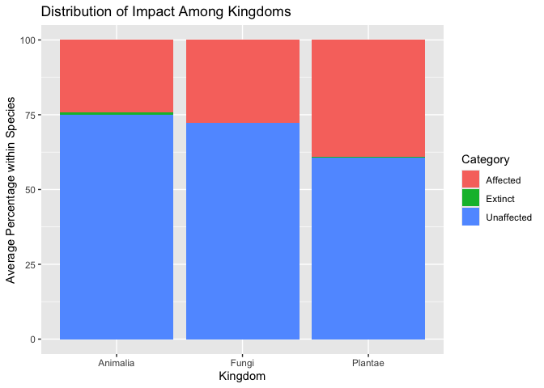

# Data Import

    raw_data  <- read_csv("dependencies/SpeciesByKingdomAndClass.csv")

## Add Kingdom Data

    kingdoms <- c("Animalia", "Chromista", "Fungi", "Plantae") # list kingdoms in the order they appear in

    kingdom_data  <- raw_data %>%
      mutate(
        ClassChange = Name < lag(Name),     # create column that says TRUE when a change appears (new kingdom)
        ClassChange = replace_na(ClassChange, TRUE),       # replaces NA in 1st observation with TRUE
        AllKingdom = ifelse(ClassChange == TRUE, kingdoms[cumsum(ClassChange)], NA)
      ) %>%
      fill(AllKingdom, .direction = "down") %>%      # fills the NAs with the value
      mutate(
        Kingdom = if_else(Name == "Total", NA, AllKingdom)
        ) %>%
      select(!c("ClassChange","AllKingdom"))     # removes the ClassChange & AllKingdom column 

# Data Manipulation

    manipulated_data <- kingdom_data %>%
      select(!("CR(PE)":"Subtotal (EX+EW+ CR(PE)+CR(PEW))")) %>%  # removes columns
      rowwise() %>%
      mutate( 
        NearThreatened = sum(c_across("LR/cd":"NT or LR/nt"))  # combines columns
            ) %>%
      select(!("LR/cd":"NT or LR/nt")   # removes columns
             ) %>%
      rename(
        "Extinct" = "EX",
        "ExtinctWild" = "EW",
        "CriticallyEndangered" = "CR",
        "Endangered" = "EN",
        "Vulnerable" = "VU",
        "LowRisk" = "LC or LR/lc",
        "DataDeficient" = "DD"
        ) %>%
      select(`Name`,`Kingdom`,`Extinct`:`Subtotal (threatened spp.)`, `NearThreatened`, `LowRisk`:`Total`)     # changes column order

# Data Visualization

First step: create a new seperate table

    data_table <- manipulated_data %>%
      filter ( Total > 1000 ) %>%
      transmute(
        `Name`,
        `Kingdom`,
        across(c(`Extinct`:`Total`), ~round ( .x / Total * 100, 2), .names = "{.col} [%]")
        )

Create barplot 1:

    data_table %>%
      rowwise() %>%
      mutate(
        `Unaffected [%]` = sum(c_across(`NearThreatened [%]`:`DataDeficient [%]`))
      ) %>%
      group_by(Kingdom) %>%
      summarise(
        Extinct = mean(`Subtotal (EX+EW) [%]`),
        Affected = mean(`Subtotal (threatened spp.) [%]`),
        Unaffected = mean(`Unaffected [%]`)
      ) %>%
      pivot_longer(
        cols = c(Extinct, Affected, Unaffected),
        names_to = "Category",
        values_to = "Percentage"
      ) %>%
      filter(!is.na(Kingdom)) %>%
      ggplot() +
       geom_bar(aes( x = Kingdom, y = Percentage, fill = Category), stat = "identity", position = "stack") +
      ggtitle("Distribution of Impact Among Kingdoms") +
      xlab("Kingdom") +
      ylab("Average Percentage within Species")

