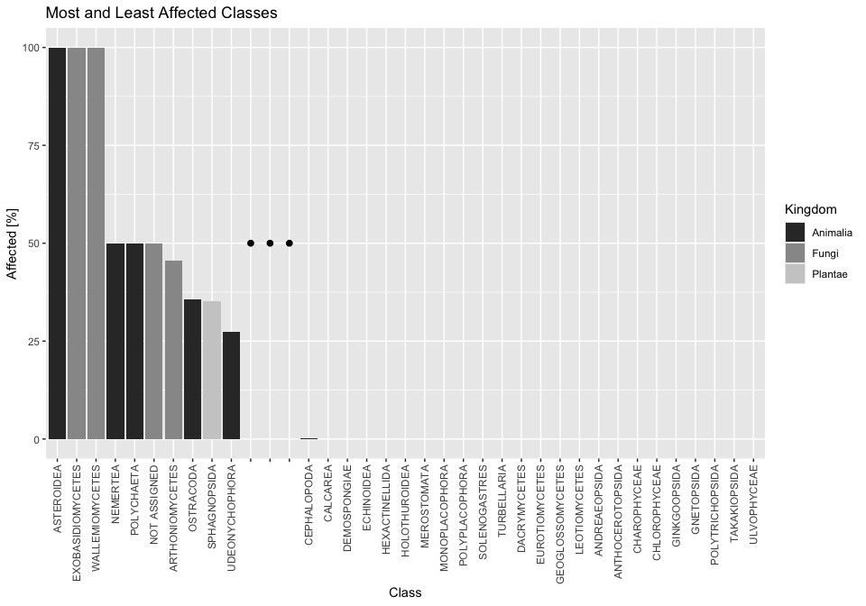

# Data Import

    raw_data  <- read_csv("dependencies/SpeciesByKingdomAndClass.csv")

## Add Kingdom Data

- lists kingdoms in the order they appear in the data set
- creates column that says TRUE when a change appears (new kingdom)
- replaces NA in 1st observation with TRUE
- fills the NAs with the value of the last non-NA observation
- removes the ClassChange & AllKingdom column

<!-- -->

    kingdoms <- c("Animalia", "Chromista", "Fungi", "Plantae") 

    kingdom_data  <- raw_data %>%
      mutate(ClassChange = Name < lag(Name),     
             ClassChange = replace_na(ClassChange, TRUE),
             AllKingdom = ifelse(ClassChange == TRUE, kingdoms[cumsum(ClassChange)], NA)) %>%
      fill(AllKingdom, .direction = "down") %>%
      mutate(Kingdom = if_else(Name == "Total", NA, AllKingdom)) %>%
      select(!c("ClassChange","AllKingdom"))      

# Data Manipulation

- removes non-IUCN data
- creates new column for NearThreatened species by combining the two
  columns that contain this information
- renames columns for clarity
- reorders columns

<!-- -->

    manipulated_data <- kingdom_data %>%
      select(!("CR(PE)":"Subtotal (EX+EW+ CR(PE)+CR(PEW))")) %>%
      rowwise() %>%
      mutate(NearThreatened = sum(c_across("LR/cd":"NT or LR/nt"))) %>%
      select(!("LR/cd":"NT or LR/nt")) %>%
      rename("Extinct" = "EX",
             "ExtinctWild" = "EW",
             "CriticallyEndangered" = "CR",
             "Endangered" = "EN",
             "Vulnerable" = "VU",
             "LowRisk" = "LC or LR/lc",
             "DataDeficient" = "DD") %>%
      select(`Name`,`Kingdom`,`Extinct`:`Subtotal (threatened spp.)`, `NearThreatened`, `LowRisk`:`Total`)

# Data Visualization

- creates new table
- filters only for classes with at least 1000 recorded species
- creates relative amount table

<!-- -->

    data_table_filtered <- manipulated_data %>%
      filter (Total > 1000) %>%
      transmute(`Name`,
                `Kingdom`,
                across(c(`Extinct`:`Total`), ~round ( .x / Total * 100, 2), .names = "{.col} [%]"))

## Barplot 1

- creates new column for unaffected species by combining the two columns
  that contain this information
- groups the data by kingdom and calculates the mean percentage for each
  category
- creates barplot

<!-- -->

    data_table_filtered %>%
      rowwise() %>%
      mutate(`Unaffected [%]` = sum(c_across(`NearThreatened [%]`:`DataDeficient [%]`))) %>%
      group_by(Kingdom) %>%
      summarise(Extinct = mean(`Subtotal (EX+EW) [%]`),
                Affected = mean(`Subtotal (threatened spp.) [%]`),
                Unaffected = mean(`Unaffected [%]`)) %>%
      pivot_longer(cols = c(Extinct, Affected, Unaffected),
                   names_to = "Category",
                   values_to = "Percentage") %>%
      filter(!is.na(Kingdom)) %>%
      ggplot() +
      geom_bar(aes( x = Kingdom, y = Percentage, fill = Category), stat = "identity", position = "stack") +
      ggtitle("Distribution of Impact Among Kingdoms") +
      xlab("Kingdom") +
      ylab("Average Percentage within Species") +
      scale_fill_manual(values = c("Extinct" = "red", "Affected" = "orange", "Unaffected" = "green"))

## Barplot 2

- creates the same table as above, but w/o the 1000 species filter (+
  adds a new column for the total affected species)
- creates a new table with the top 10 and bottom 24 classes based on the
  total affected species
- adds a gap in the middle of the table to separate the two groups

<!-- -->

    library(dplyr)

    data_table_unfiltered <- manipulated_data %>%
      transmute(`Name`,
                `Kingdom`,
                across(c(`Extinct`:`Total`), ~round ( .x / Total * 100, 2), .names = "{.col} [%]")) %>%
      rowwise() %>%
      mutate(`Affected [%]` = sum(c_across(`Extinct [%]`:`CriticallyEndangered [%]`))) 

    data_top_ten <- data_table_unfiltered %>%
      ungroup() %>%
      arrange(desc(`Affected [%]`)) %>% 
      slice_head(n = 10)

    data_bottom_twentyfour <- data_table_unfiltered %>%
      ungroup() %>%
      arrange(desc(`Affected [%]`)) %>% 
      slice_tail(n = 24)

    gap_plot <- tibble(
      Name = c("gap_one", "gap_two", "gap_three"),
      Kingdom = NA_character_,
      `Affected [%]` = NA_real_)
      
    ordered_data <- bind_rows(
      data_top_ten %>% 
        select(Name, Kingdom, `Affected [%]`), 
      gap_plot,
      data_bottom_twentyfour %>% 
        select(Name, Kingdom, `Affected [%]`))

------------------------------------------------------------------------

- “locks” the order of the classes in the barplot by converting the
  `Name` column to a factor with levels set to the unique values of Name
  in the order they appear in `ordered_data`
- creates a barplot with the top 10 and bottom 24 classes based on the
  total affected species
- adds the gap in the middle to separate the two groups (`geom_point()`)

<!-- -->

    ordered_data %>%
      mutate(Name = factor(Name, levels = unique(Name))) %>%
      ggplot() +
      geom_col(aes(x = Name, y = `Affected [%]`, fill = Kingdom)) +
      geom_point(data = gap_plot, aes(x = Name, y = 50), size = 2) +
      scale_x_discrete(labels = function(x) ifelse(grepl("gap_", x), "", x)) +  # Hide gap labels
      scale_fill_grey(na.translate = FALSE) +
      theme(axis.text.x = element_text(angle = 90, vjust = 0.5, hjust = 1)) +
      ggtitle("Most and Least Affected Classes") +
      xlab("Class")

