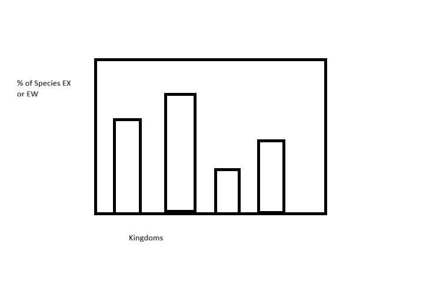
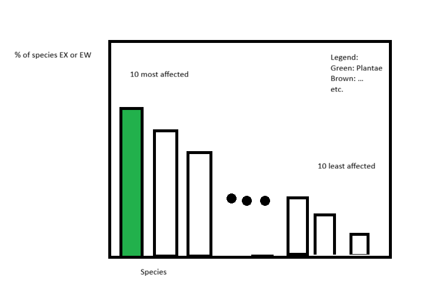

The data provides the number of species from every class and how they are classified according to the red list.

Link to the Data: https://www.iucnredlist.org/statistics
On the site you will also see, that they are ordered by the Kingdom as well, this is not yet represented by the data

# Tasks:

## 1. Data import and wrangling

### a) Download the csv-file from the provided link

The
[IUCN Red List](https://www.iucnredlist.org/statistics)
has an option to download the .csv

### b) Import csv into R

### c) Add Kingdom data

On the website you will see that they also have data on which Kingdom the various classes belong to, we want to add this data manually, find a way to do so, add a new Column that contains this information to the imported table.

## 2. Data Manipulation

### a) Remove unwanted Columns
The legend on the website also explains that `Possibly Extinct` and `Possibly Extinct in the Wild` are not from the IUCN, as such take them out of your table, but make sure that it doesn't change the total amount of species represented.

### c) Simplify Columns
Integrate `LR/cd - Lower Risk/conservation dependent` into `NT - Near Threatened (includes LR/nt - Lower Risk/near threatened)`

### d) Make Column names readable

The website also has an explanation of the Column names at the bottom, look them up and replace the Column names with the easier to read full names of the categories.

The Column that you added to in step c) you can just call `Near Threatened`

## 3. Data Visualisation

### a) Create relative amount table

Before you start visualizing, create a separate table, where the columns contain the percent of Species that are in that category instead of the absolute number.

### b) Visualize difference between Kingdoms

We want to compare the different Kingdoms, especially if they have been affected to different extends:

To this end, calculate how many percent of each Kingdoms' Species are EX or EW and plot these in a simple barplot.

Exclude any Kingdoms that have a total of less than 1000 Species from the plot.

### c) Visualize most and least affected Classes

Next we are interested in the most and least affected classes, as well as which Kingdom they belong to:

Show in a barplot, the 10 most and 10 least affected Classes, color them according to their Kingdom and place a legend that explains the colors.

Affected here is defined as `Percent of at least Critically Endangered Species in a given Class`

