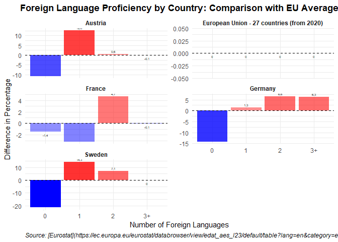

# Introduction

<<<<<<< HEAD
The report analyzes foreign language proficiency across selected
European countries (Germany, France, Sweden, and Austria) and compares
their performance to the EU average. The primary goal is to evaluate
differences in proficiency levels by the number of foreign languages
known among adults aged 18 to 69.

# Analysis

The dataset is filtered to include data from 2022 for the relevant
countries and age group. Key steps include below

1.  Renaming and reorganizing columns for clarity.

2.  Calculating the difference between each country’s proficiency
    percentage and the EU average for the same category (number of
    foreign languages known).

3.  Grouping data by country and number of languages for summary
    statistics, particularly focusing on the mean differences from the
    EU average.

The results are visualized using a bar chart, where red and blue
indicate whether a country’s proficiency level is above or below the EU
average.

# My Challenge

One of the main challenges was incorporating country flags and the EU
flag into the facet labels for enhanced visual clarity.

This was achieved using the ggtext library, which supports HTML
rendering in ggplot facet labels. Flags were added as  tags in the
facet labels, with specific sizes and alignments. The
element\_markdown() function in theme() allowed rendering these HTML
elements correctly.

# Result

The final plot effectively illustrates the proficiency levels of each
country compared to the EU average, with flags for each country and the
EU flag enhancing the visualization. You can see my code and Result
image below
=======
This report analyzes foreign language proficiency by country, comparing
it with the EU average.

    ## 
    ## Attache Paket: 'dplyr'

    ## Die folgenden Objekte sind maskiert von 'package:stats':
    ## 
    ##     filter, lag

    ## Die folgenden Objekte sind maskiert von 'package:base':
    ## 
    ##     intersect, setdiff, setequal, union

    ## 
    ## Attache Paket: 'scales'

    ## Das folgende Objekt ist maskiert 'package:readr':
    ## 
    ##     col_factor

    ## Rows: 5474 Columns: 11
    ## ── Column specification ────────────────────────────────────────────────────────
    ## Delimiter: ","
    ## chr (9): DATAFLOW, LAST UPDATE, freq, age, n_lang, unit, isced11, geo, OBS_FLAG
    ## dbl (2): TIME_PERIOD, OBS_VALUE
    ## 
    ## ℹ Use `spec()` to retrieve the full column specification for this data.
    ## ℹ Specify the column types or set `show_col_types = FALSE` to quiet this message.

    ## # A tibble: 6 × 11
    ##   DATAFLOW      `LAST UPDATE` freq  age   n_lang unit  isced11 geo   TIME_PERIOD
    ##   <chr>         <chr>         <chr> <chr> <chr>  <chr> <chr>   <chr>       <dbl>
    ## 1 ESTAT:EDAT_A… 20/08/24 23:… Annu… From… No la… Perc… Less t… Aust…        2022
    ## 2 ESTAT:EDAT_A… 20/08/24 23:… Annu… From… No la… Perc… Less t… Belg…        2022
    ## 3 ESTAT:EDAT_A… 20/08/24 23:… Annu… From… No la… Perc… Less t… Bulg…        2022
    ## 4 ESTAT:EDAT_A… 20/08/24 23:… Annu… From… No la… Perc… Less t… Cypr…        2022
    ## 5 ESTAT:EDAT_A… 20/08/24 23:… Annu… From… No la… Perc… Less t… Czec…        2022
    ## 6 ESTAT:EDAT_A… 20/08/24 23:… Annu… From… No la… Perc… Less t… Germ…        2022
    ## # ℹ 2 more variables: OBS_VALUE <dbl>, OBS_FLAG <chr>

    ## [1] "From 18 to 24 years" "From 18 to 64 years" "From 18 to 69 years"
    ## [4] "From 25 to 64 years" "From 25 to 69 years"

    ##  [1] "Austria"                                  
    ##  [2] "Belgium"                                  
    ##  [3] "Bulgaria"                                 
    ##  [4] "Cyprus"                                   
    ##  [5] "Czechia"                                  
    ##  [6] "Germany"                                  
    ##  [7] "Denmark"                                  
    ##  [8] "Euro area – 20 countries (from 2023)"     
    ##  [9] "Estonia"                                  
    ## [10] "Greece"                                   
    ## [11] "Spain"                                    
    ## [12] "European Union - 27 countries (from 2020)"
    ## [13] "Finland"                                  
    ## [14] "France"                                   
    ## [15] "Croatia"                                  
    ## [16] "Hungary"                                  
    ## [17] "Ireland"                                  
    ## [18] "Iceland"                                  
    ## [19] "Italy"                                    
    ## [20] "Lithuania"                                
    ## [21] "Luxembourg"                               
    ## [22] "Latvia"                                   
    ## [23] "Malta"                                    
    ## [24] "Netherlands"                              
    ## [25] "Norway"                                   
    ## [26] "Poland"                                   
    ## [27] "Portugal"                                 
    ## [28] "Romania"                                  
    ## [29] "Serbia"                                   
    ## [30] "Sweden"                                   
    ## [31] "Slovenia"                                 
    ## [32] "Slovakia"                                 
    ## [33] "Türkiye"                                  
    ## [34] "Albania"                                  
    ## [35] "Bosnia and Herzegovina"                   
    ## [36] "Switzerland"                              
    ## [37] "North Macedonia"                          
    ## [38] "United Kingdom"

    ## [1] 2022 2016 2007 2011

    ## [1] "No languages"        "1 language"          "2 languages"        
    ## [4] "3 languages or more"

    ## Warning in left_join(., eu_data, by = "Number_of_Languages"): Detected an unexpected many-to-many relationship between `x` and `y`.
    ## ℹ Row 1 of `x` matches multiple rows in `y`.
    ## ℹ Row 1 of `y` matches multiple rows in `x`.
    ## ℹ If a many-to-many relationship is expected, set `relationship =
    ##   "many-to-many"` to silence this warning.

    ## # A tibble: 6 × 3
    ##   Country                                   Number_of_Languages Mean_Difference
    ##   <chr>                                     <chr>                         <dbl>
    ## 1 Austria                                   0                           -10.8  
    ## 2 Austria                                   1                            12.6  
    ## 3 Austria                                   2                             0.600
    ## 4 Austria                                   3+                           -0.05 
    ## 5 European Union - 27 countries (from 2020) 0                             0    
    ## 6 European Union - 27 countries (from 2020) 1                             0

    ##    Country          Number_of_Languages Mean_Difference   
    ##  Length:20          Length:20           Min.   :-21.4000  
    ##  Class :character   Class :character    1st Qu.: -0.4125  
    ##  Mode  :character   Mode  :character    Median :  0.0000  
    ##                                         Mean   :  0.1220  
    ##                                         3rd Qu.:  5.1125  
    ##                                         Max.   : 14.3500

>>>>>>> 352cf73ad3913765dbd21795886669156a9269a2
