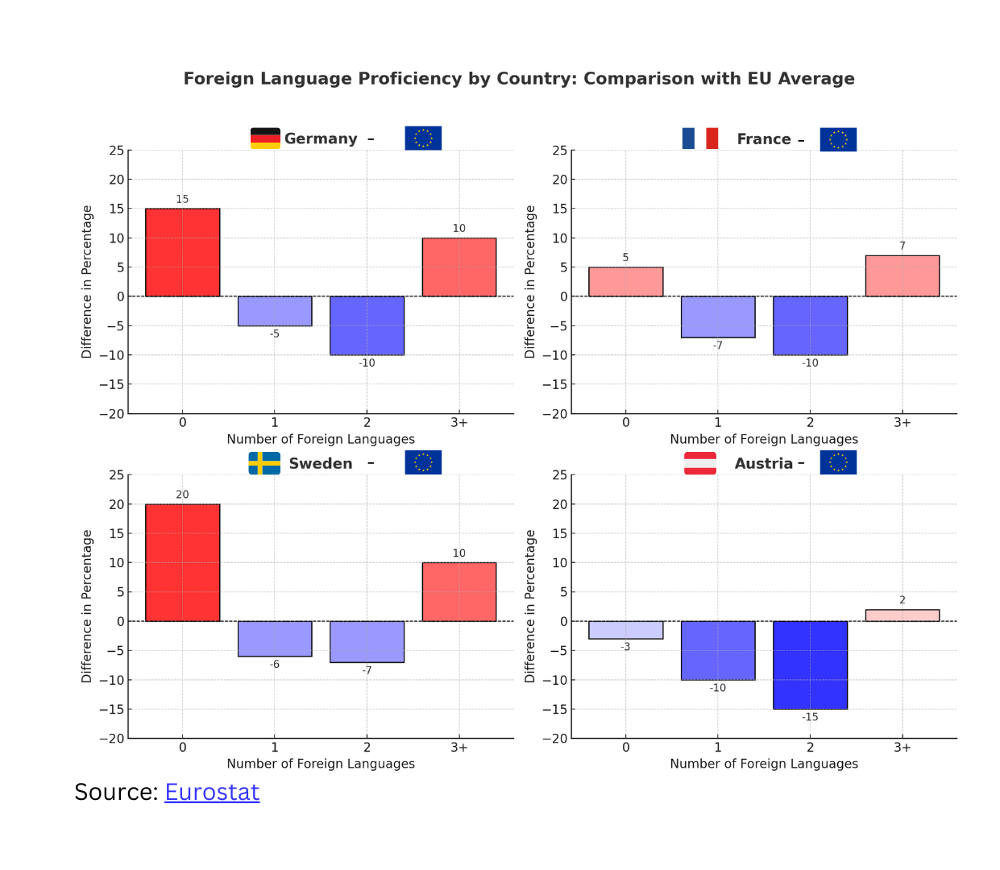

# [Data-projects-with-R-and-GitHub](https://dr-eberle-zentrum.github.io/Data-projects-with-R-and-GitHub/)

## General Topic

The goal of this project is to visualize the foreign language proficiency of individuals in Germany and other European countries compared to the EU average. The focus is on the number of foreign languages known by individuals aged 18–69 in Germany and three other selected countries in 2022.

## The Data Set

The data set is from [Eurostat](https://ec.europa.eu/eurostat/en/). You can view and download the full dataset [here](https://ec.europa.eu/eurostat/databrowser/view/edat_aes_l23/default/table?lang=en&category=educ.educ_lang.educ_lang_00.edat_aes_l2) or download the `.csv` file [here](lang_known.csv). For this project, we will focus specifically on data from 2022 for individuals aged 18–69. For more information about the dataset, please refer to this [website](https://ec.europa.eu/eurostat/cache/metadata/en/trng_aes_12m_esms.htm) for metadata details.

## Data Manipulation Goals

1. Import the `.csv.gz` data file.
2. Filter the data to include:
   - Only Germany, the EU countries, and the three other countries of your choice.
   - Data for the year 2022.
   - Individuals aged 18–69 years.
3. Compute the difference between the percentages of individuals who know 0, 1, 2, or 3+ foreign languages in each country and the EU average percentages.

## Visualization Goal

The final visualization should resemble the following example:  
(The chart is only an example and does not represent the actual data.)

1. **Facet Plot**: Create a facet plot with four bar charts (one for each country).
2. **Titles**:
   - Add a bold and centered main title: "Foreign Language Proficiency by Country: Comparison with EU Average".
   - Each chart should have a small title with the country name and its flag, along with the EU flag.
3. **Axes**:
   - X-axis should represent the number of foreign languages known (labeled as "0", "1", "2", and "3+").
   - Y-axis should represent the percentage difference.
4. **Zero Reference Line**: Add a dashed horizontal line at 0%.
5. **Bar Colors**:
   - Bars above 0% (i.e., above EU value) should be red, with darker shades for larger values.
   - Bars below 0% (i.e., below EU value) should be blue, with darker shades for larger negative values.
6. **Data Labels**: Display the exact value above or below each bar.
7. **Source Information**: Include the source "Source: Eurostat" in the bottom-left corner, with "Eurostat" hyperlinked to this URL: https://ec.europa.eu/eurostat/databrowser/view/edat_aes_l23/default/table?lang=en&category=educ.educ_lang.educ_lang_00.edat_aes_l2.

Enjoy working on this project!
