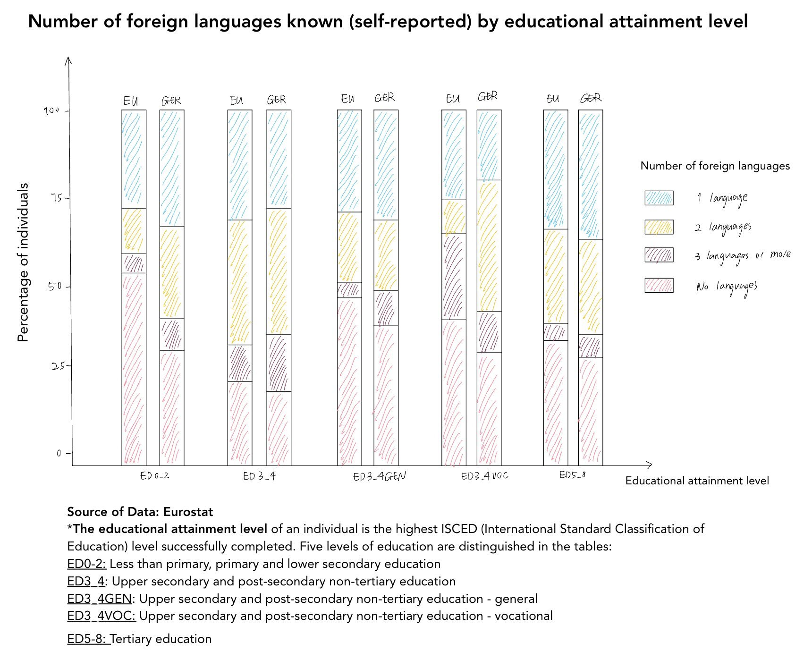

# [Data-projects-with-R-and-GitHub](https://dr-eberle-zentrum.github.io/Data-projects-with-R-and-GitHub/)

## General Topic

This project aims to analyze and visualize the number of foreign
languages known (self-reported) in Germany compared to the EU, broken
down by educational attainment level.

## The Data Set

The data set is from [Eurostat](https://ec.europa.eu/eurostat/en/). You
can view and download the full dataset
[here](https://ec.europa.eu/eurostat/databrowser/view/edat_aes_l23/default/table?lang=en&category=educ.educ_lang.educ_lang_00.edat_aes_l2)
or download the `.csv.gz` file directly from my directory. For this
project, we will focus solely on the data from Germany and the EU
countries for 2022, specifically for individuals aged 18–69 years. For
more information about the dataset, please refer to this
[website](https://ec.europa.eu/eurostat/cache/metadata/en/trng_aes_12m_esms.htm)
for metadata details.

## Data Manipulation Goals

Filter the data to include only Germany and the EU countries for the
year 2022, within the age group of 18–69 years. In terms of educational
attainment, exclude entries labeled as “All ISCED 2011 levels.”

## Visualization Goal

Recreate the following stacked bar chart:  Note:

-   The chart is only an example and does not represent the actual data.

-   Feel free to customize the colors, font style, and other aesthetic
    elements as you like.
