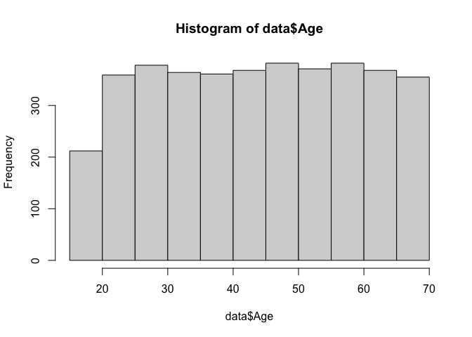

# Data Loading

    getwd()

    ## [1] "/Users/nicolasdelgadolozano/Desktop/R and Github/R & Github/Projects/SunKyoung Moon"

    data <- read.csv("../SunKyoung Moon/shopping_trends_updated.csv")

# Data Exploration

    View(data)
    hist(data$Age)

# Graph 1: Female consumers’ purchase amount by age group

    data <- data$age_by_group 
    data$age_by_group <- c()

### Graph 2: Male consumers’ purchase amount by age group

# Graph 3: Female consumers’ frequency of purchases by age group

# Graph 4: Male consumers’ frequency of purchases by age group
