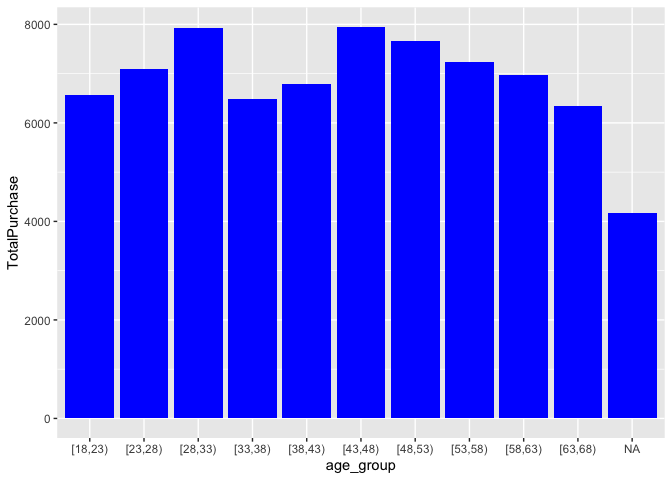
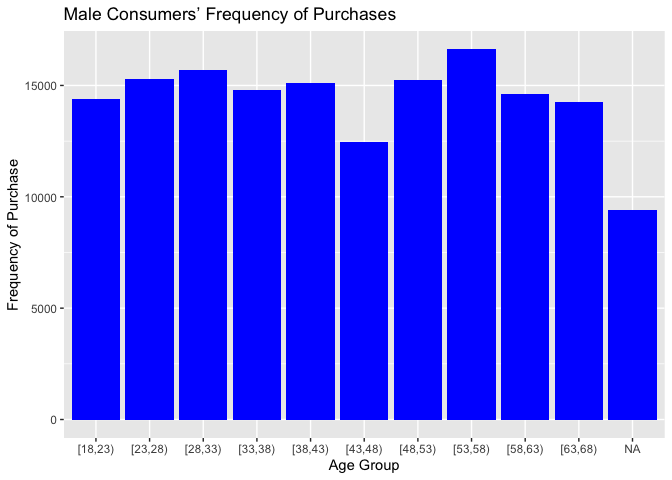

# Data Loading

    setwd(dirname(rstudioapi::getActiveDocumentContext()$path))
    data <- read.csv("shopping_trends_updated.csv")

# Data Exploration

    View(data)
    hist(data$Age)

# Graphs 1 and 2: Female and male consumers’ purchase amount by age group

    processed_data <- data %>% 
      mutate(age_group = cut(Age, seq(18, 70, by = 5), right = FALSE)#,
             #labels = c("18-22", "23-27", "28-32", "33-37", "38-42", "43-47", 
             #           "48-52", "53-57", "58-62", "63-67", "68-70")
            ) %>%
      group_by(Gender,age_group) %>%
      summarize(TotalPurchase = sum(Purchase.Amount..USD.))

    ## `summarise()` has grouped output by 'Gender'. You can override using the
    ## `.groups` argument.

    ggplot(filter(processed_data, Gender == "Female"), aes(x = age_group, y = TotalPurchase)) +
      geom_bar(stat = "identity", position = "dodge", fill = "blue")

    ggplot(filter(processed_data, Gender == "Male"), aes(x = age_group, y = TotalPurchase)) +
      geom_bar(stat = "identity", position = "dodge", fill = "blue")

# Graphs 3 and 4: Female consumers’ frequency of purchases by age group

    frequency_mapping <- c(
      "Weekly" = 4,            # 4 weeks in a month
      "Fortnightly" = 2,       # Twice a month
      "Bi-Weekly" = 2,         # Same as fortnightly
      "Monthly" = 1,           # Once a month
      "Quarterly" = 1/3,       # Once every 3 months
      "Every 3 Months" = 1/3,  # Same as quarterly
      "Annually" = 1/12        # Once a year
    )

    data$Numeric.Frequency <- frequency_mapping[data$Frequency.of.Purchases]

    processed_data2 <- data %>% 
      mutate(age_group = cut(Age, seq(18, 70, by = 5), right = FALSE)
            ) %>%
      group_by(Gender,age_group) %>%
      summarize(TotalFrequency = sum(Numeric.Frequency))

    ## `summarise()` has grouped output by 'Gender'. You can override using the
    ## `.groups` argument.

    ggplot(filter(processed_data, Gender == "Female"), aes(x = age_group, y = TotalPurchase)) +
      geom_bar(stat = "identity", position = "dodge", fill = "blue")

    ggplot(filter(processed_data, Gender == "Male"), aes(x = age_group, y = TotalPurchase)) +
      geom_bar(stat = "identity", position = "dodge", fill = "blue") +
    labs(y = "Frequency of Purchase", x = "Age Group", title = "Male Consumers’ Frequency of Purchases")

