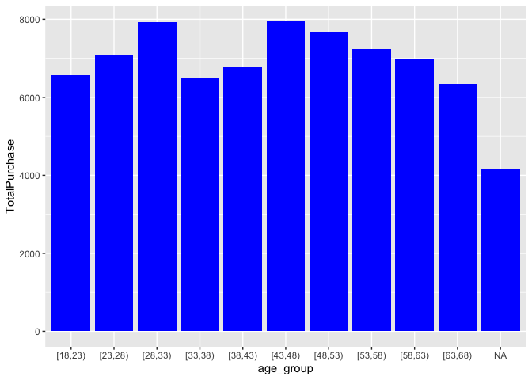
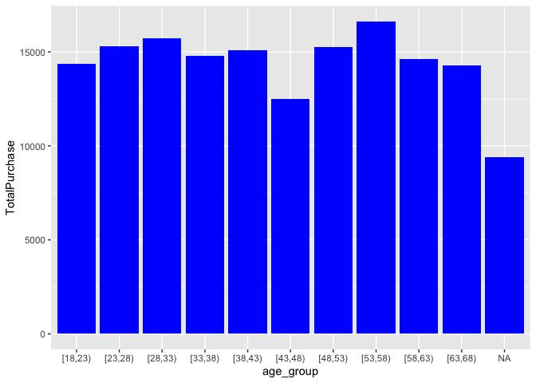

# Data Loading

    getwd()

    ## [1] "/Users/nicolasdelgadolozano/Desktop/R and Github/R & Github/Projects/SunKyoung Moon"

    data <- read.csv("../SunKyoung Moon/shopping_trends_updated.csv")

# Data Exploration

    View(data)
    hist(data$Age)

# Graph 1: Female consumers’ purchase amount by age group

    processed_data <- data %>% 
      mutate(age_group = cut(Age, seq(18, 70, by = 5), right = FALSE)#,
             #labels = c("18-22", "23-27", "28-32", "33-37", "38-42", "43-47", 
             #           "48-52", "53-57", "58-62", "63-67", "68-70")
            ) %>%
      group_by(Gender,age_group) %>%
      summarize(TotalPurchase = sum(Purchase.Amount..USD.))

    ## `summarise()` has grouped output by 'Gender'. You can override using the
    ## `.groups` argument.

    ggplot(filter(processed_data, Gender == "Female"), aes(x = age_group, y = TotalPurchase)) +
      geom_bar(stat = "identity", position = "dodge", fill = "blue")

    ggplot(filter(processed_data, Gender == "Male"), aes(x = age_group, y = TotalPurchase)) +
      geom_bar(stat = "identity", position = "dodge", fill = "blue")

### Graph 2: Male consumers’ purchase amount by age group

# Graph 3: Female consumers’ frequency of purchases by age group

# Graph 4: Male consumers’ frequency of purchases by age group
