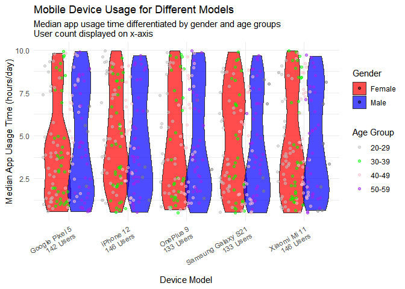

    # Load necessary libraries
    library(ggplot2)
    library(dplyr)

    ## 
    ## 다음의 패키지를 부착합니다: 'dplyr'

    ## The following objects are masked from 'package:stats':
    ## 
    ##     filter, lag

    ## The following objects are masked from 'package:base':
    ## 
    ##     intersect, setdiff, setequal, union

    library(tidyr)

    # Load data
    path <- "C:/R2_data/kaggle_dataset.csv"
    data <- read.csv(path)
    head(data)

    ##   User.ID   Device.Model Operating.System App.Usage.Time..min.day.
    ## 1       1 Google Pixel 5          Android                      393
    ## 2       2      OnePlus 9          Android                      268
    ## 3       3   Xiaomi Mi 11          Android                      154
    ## 4       4 Google Pixel 5          Android                      239
    ## 5       5      iPhone 12              iOS                      187
    ## 6       6 Google Pixel 5          Android                       99
    ##   Screen.On.Time..hours.day. Battery.Drain..mAh.day. Number.of.Apps.Installed
    ## 1                        6.4                    1872                       67
    ## 2                        4.7                    1331                       42
    ## 3                        4.0                     761                       32
    ## 4                        4.8                    1676                       56
    ## 5                        4.3                    1367                       58
    ## 6                        2.0                     940                       35
    ##   Data.Usage..MB.day. Age Gender User.Behavior.Class
    ## 1                1122  40   Male                   4
    ## 2                 944  47 Female                   3
    ## 3                 322  42   Male                   2
    ## 4                 871  20   Male                   3
    ## 5                 988  31 Female                   3
    ## 6                 564  31   Male                   2

    # Convert app usage time from minutes/day to hours/day
    mutate_data <- data %>%
      mutate(AppUsageHours = `App.Usage.Time..min.day.` / 60)

    # Calculate user count per device model and sort in descending order
    device_user_counts <- mutate_data %>%
      group_by(Device.Model) %>%
      summarize(UserCount = n()) %>%
      arrange(desc(UserCount)) # Sort by user count

    # Convert Device.Model to a factor with levels ordered by UserCount
    mutate_data$Device.Model <- factor(
      mutate_data$Device.Model,
      levels = device_user_counts$Device.Model
    )

    # Add user count to device labels for display on the x-axis
    mutate_data <- mutate_data %>%
      left_join(device_user_counts, by = "Device.Model") %>%
      mutate(DeviceLabel = paste0(Device.Model, "\n", UserCount, " Users"))

    # Add age group column for grouping points in the scatter plot
    age_data <- mutate_data %>%
      mutate(AgeGroup = case_when(
        Age >= 20 & Age <= 29 ~ "20-29",
        Age >= 30 & Age <= 39 ~ "30-39",
        Age >= 40 & Age <= 49 ~ "40-49",
        Age >= 50 & Age <= 59 ~ "50-59",
        TRUE ~ "Others" # Default for ages outside defined ranges
      ))

    # Visualization: Violin plot with scatter plot overlay
    ggplot(age_data, aes(x = DeviceLabel, y = AppUsageHours, fill = Gender)) +
      geom_violin(alpha = 0.7, scale = "width", position = position_dodge(width = 0.8)) +
      geom_point(
        aes(color = AgeGroup),
        position = position_jitterdodge(jitter.width = 0.2, dodge.width = 0.8),
        alpha = 0.5
      ) +
      scale_fill_manual(values = c("Male" = "blue", "Female" = "red")) +
      scale_color_manual(values = c(
        "20-29" = "gray",
        "30-39" = "green",
        "40-49" = "pink",
        "50-59" = "purple"
      )) +
      labs(
        title = "Mobile Device Usage for Different Models",
        subtitle = "Median app usage time differentiated by gender and age groups\nUser count displayed on x-axis",
        x = "Device Model",
        y = "Median App Usage Time (hours/day)",
        fill = "Gender",
        color = "Age Group"
      ) +
      theme_minimal() +
      theme(axis.text.x = element_text(angle = 30, hjust = 1))

