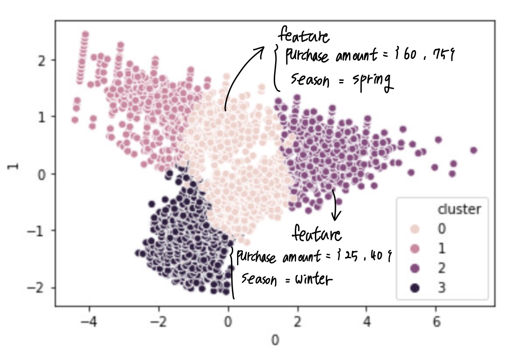

## General Topic

Companies often discover unique patterns when organizing and visualizing consumer data. This project aims to visualize shopping trends of American consumers by age group and gender, focusing on their Purchase Amount and Frequency of Purchases. You need to create four separate graphs:

1. Female consumers' purchase amount by age group,
2. Male consumers' purchase amount by age group,
3. Female consumers' frequency of purchases by age group,
4. Male consumers' frequency of purchases by age group.

## The Data Set
You can download the .csv file from my GitHub repository at the following link: [data_link](https://github.com/Dr-Eberle-Zentrum/Data-projects-with-R-and-GitHub/blob/main/Projects/SunKyoung%20Moon/shopping_trends_updated.csv). The dataset is available in [Kaggle](https://www.kaggle.com/datasets/iamsouravbanerjee/customer-shopping-trends-dataset)

Among the many columns in this dataset, we will focus on the following:

1. Age
2. Gender
3. Purchase Amount (USD)
4. Frequency of Purchases

I will explain how to use these features further in the section below.

## Manipulation Goals
Let’s first talk about creating graphs for 1) Female consumers' purchase amount by age group and 2) Male consumers' purchase amount by age group.

The consumer ages in this dataset range from 18 years (min) to 70 years (max), and they are uniformly distributed. (To better understand the dataset, it might be helpful to create a histogram showing the age distribution before starting the project!) Group the ages into intervals of 5 years, and sum up the purchase amount for each age group. Then create a graph showing the purchase amounts for each age group. Make sure to create separate graphs for female and male consumers.

Next, let’s move to 3) Female consumers' frequency of purchases by age group and 4) Male consumers' frequency of purchases by age group.

Again, group ages into 5-year intervals, and sum up the frequency of purchases for each age group. Create graphs that visualize the total purchase frequencies for each age group. As before, create separate graphs for female and male consumers.

## Visualization Goals
To aid understanding, example graphs are attached below. Use different colors to distinguish between graphs for male and female consumers. Ensure that the age groups you defined are displayed numerically at the bottom of each bar. Add a bold title at the top of each graph to explain what it represents. Feel free to include any additional design elements you like! :)

