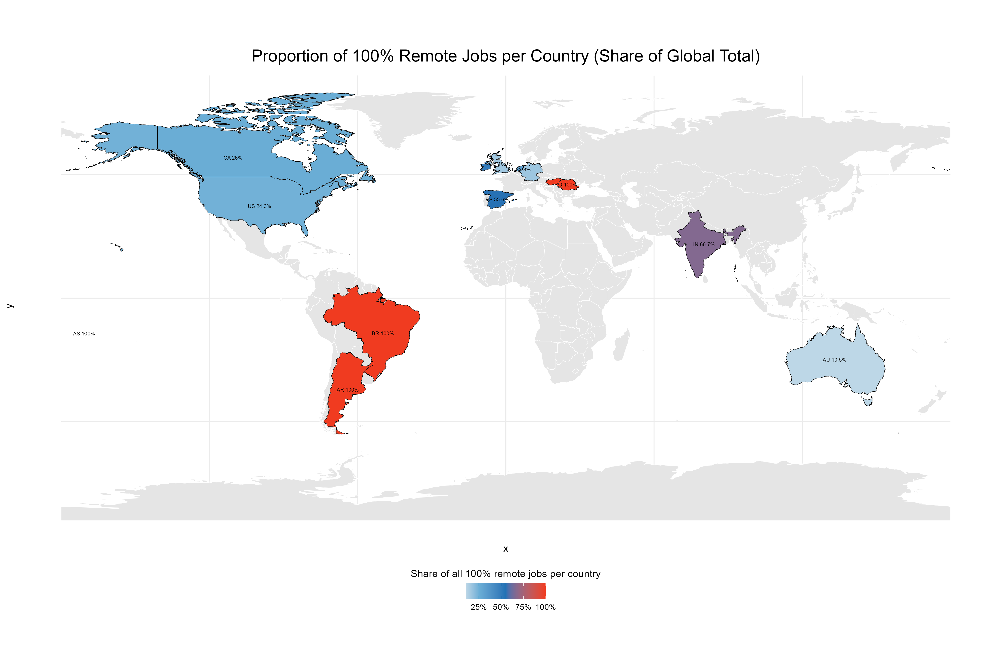
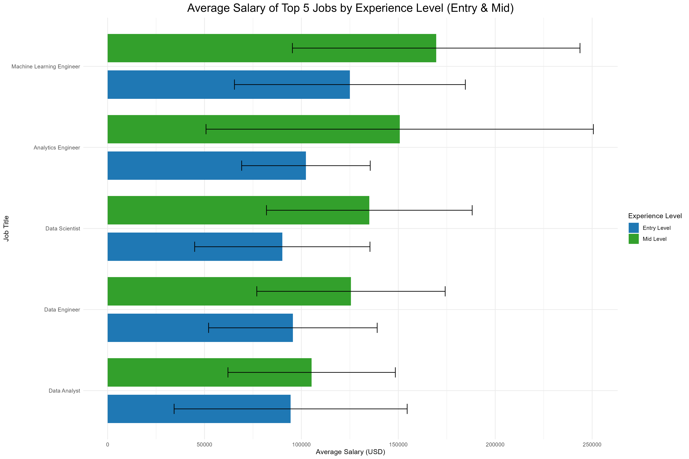

# Project 2: Comparison of salaries of global remote data scientists!

## Solution by paula0013

Remote working became a norm during covid-19. And with remote work came
more concern about salary. Let’s see using the data from kaggle whether
there is any difference in salary of remote data scientists in different
countries.

# Read and transform of the data

<table style="width:100%;">
<colgroup>
<col style="width: 5%" />
<col style="width: 10%" />
<col style="width: 9%" />
<col style="width: 15%" />
<col style="width: 4%" />
<col style="width: 9%" />
<col style="width: 8%" />
<col style="width: 11%" />
<col style="width: 7%" />
<col style="width: 10%" />
<col style="width: 7%" />
</colgroup>
<thead>
<tr>
<th style="text-align: right;">work_year</th>
<th style="text-align: left;">experience_level</th>
<th style="text-align: left;">employment_type</th>
<th style="text-align: left;">job_title</th>
<th style="text-align: right;">salary</th>
<th style="text-align: left;">salary_currency</th>
<th style="text-align: right;">salary_in_usd</th>
<th style="text-align: left;">employee_residence</th>
<th style="text-align: right;">remote_ratio</th>
<th style="text-align: left;">company_location</th>
<th style="text-align: left;">company_size</th>
</tr>
</thead>
<tbody>
<tr>
<td style="text-align: right;">2024</td>
<td style="text-align: left;">SE</td>
<td style="text-align: left;">FT</td>
<td style="text-align: left;">AI Engineer</td>
<td style="text-align: right;">90000</td>
<td style="text-align: left;">USD</td>
<td style="text-align: right;">90000</td>
<td style="text-align: left;">AE</td>
<td style="text-align: right;">0</td>
<td style="text-align: left;">AE</td>
<td style="text-align: left;">L</td>
</tr>
<tr>
<td style="text-align: right;">2024</td>
<td style="text-align: left;">SE</td>
<td style="text-align: left;">FT</td>
<td style="text-align: left;">Machine Learning Engineer</td>
<td style="text-align: right;">180500</td>
<td style="text-align: left;">USD</td>
<td style="text-align: right;">180500</td>
<td style="text-align: left;">US</td>
<td style="text-align: right;">0</td>
<td style="text-align: left;">US</td>
<td style="text-align: left;">M</td>
</tr>
<tr>
<td style="text-align: right;">2024</td>
<td style="text-align: left;">SE</td>
<td style="text-align: left;">FT</td>
<td style="text-align: left;">Machine Learning Engineer</td>
<td style="text-align: right;">96200</td>
<td style="text-align: left;">USD</td>
<td style="text-align: right;">96200</td>
<td style="text-align: left;">US</td>
<td style="text-align: right;">0</td>
<td style="text-align: left;">US</td>
<td style="text-align: left;">M</td>
</tr>
<tr>
<td style="text-align: right;">2024</td>
<td style="text-align: left;">SE</td>
<td style="text-align: left;">FT</td>
<td style="text-align: left;">Machine Learning Engineer</td>
<td style="text-align: right;">235000</td>
<td style="text-align: left;">USD</td>
<td style="text-align: right;">235000</td>
<td style="text-align: left;">AU</td>
<td style="text-align: right;">0</td>
<td style="text-align: left;">AU</td>
<td style="text-align: left;">M</td>
</tr>
<tr>
<td style="text-align: right;">2024</td>
<td style="text-align: left;">SE</td>
<td style="text-align: left;">FT</td>
<td style="text-align: left;">Machine Learning Engineer</td>
<td style="text-align: right;">175000</td>
<td style="text-align: left;">USD</td>
<td style="text-align: right;">175000</td>
<td style="text-align: left;">AU</td>
<td style="text-align: right;">0</td>
<td style="text-align: left;">AU</td>
<td style="text-align: left;">M</td>
</tr>
</tbody>
</table>

# Visualisation of the percentage of the remote work ratio in comparsion to other countries

This map shows the share of fully remote jobs (100% remote) compared to
the total number of jobs per country for the year 2024. Countries
without relevant data are shown in gray.

# Visualisation of average salary of the top 5 entry and mid-level jobs

This chart shows the average salaries of the five most common job titles
at entry and mid-level. The error bars show the standard deviation
within the respective group.

