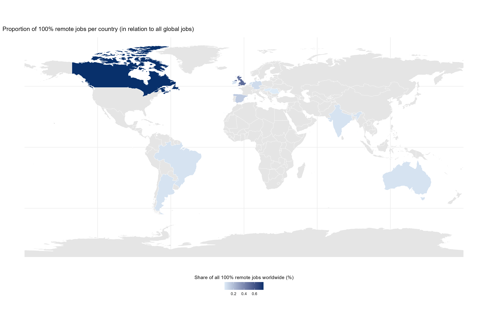
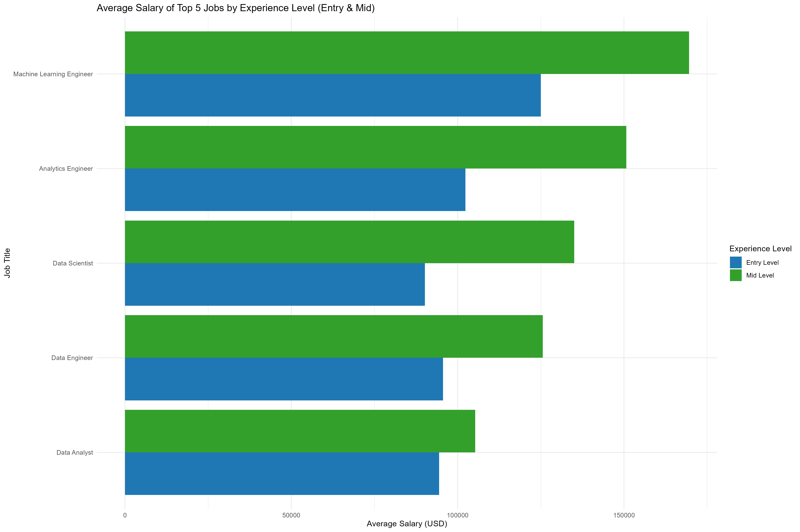

\#Project 2: Comparison of salaries of global remote data scientists!
\## Solution by paula0013

Remote working became a norm during covid-19. And with remote work came
more concern about salary. Let’s see using the data from kaggle whether
there is any difference in salary of remote data scientists in different
countries.

# Read and transform of the data

\#Visualisation of the percentage of the remote work ratio in worldwide
comparsion

 \# Visualisation of average
salary of the top 5 entry and mid-level jobs

