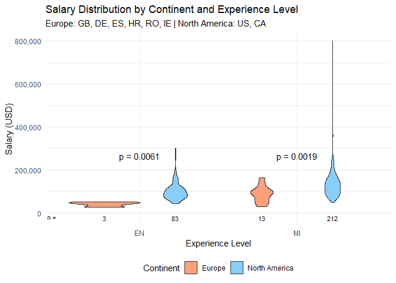

# Remote Work Ratio by Country

We want to investigate the number of fully remote employees globally in
2024:

We can see that the USA has the highest number of fully remote jobs,
followed by Canada and Great Britain, with a big gap between the USA and
the rest of the countries. This indicates that the USA is the leading
country with 764 fully remote data science jobs in 2024.

# Salary Distribution in North America and Europe

Next, we visualize the salary distribution in North America and Europe
for positions with a 100% remote work ratio. The data is grouped by
experience level, with a particular focus on entry-level (EN) and
mid-level (MI) roles.

We observe that the salary distribution for entry-level (EN) and
mid-level (MI) positions in North America is generally higher than in
Europe. This indicates that data scientists in North America,
particularly in the USA and Canada, tend to earn more than their
European counterparts in comparable roles. However, it is important to
note that the European dataset is smaller, which may affect the
reliability of these results.
