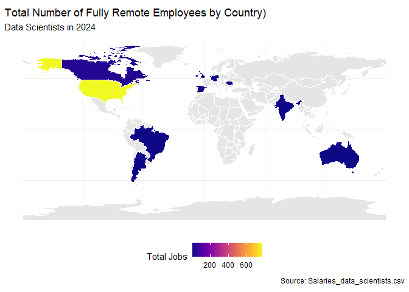

    world <- ne_countries(scale = "medium", returnclass = "sf")
    # view(world)

    joinedData <- world %>%
      left_join(employeeLocations, by = "iso_a2")

    ggplot(data = joinedData) +
      geom_sf(aes(fill = total_jobs), color = "white") +
      scale_fill_viridis(option = "C", na.value = "grey90", name = "Total Jobs") +
      labs(title = "Total Number of Fully Remote Employees by Country)",
           subtitle = "Data Scientists in 2024",
           caption = "Source: Salaries_data_scientists.csv") +
      theme_minimal() +
      theme(legend.position = "bottom")

