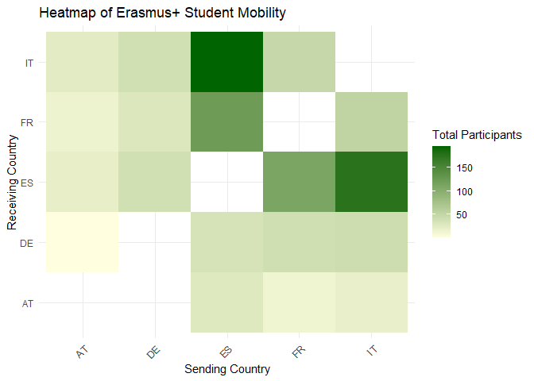
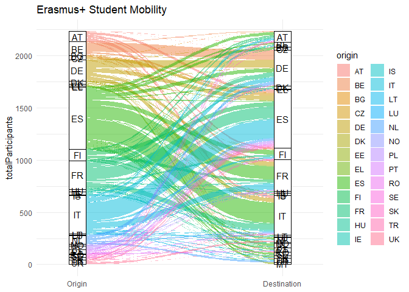

# Erasmus Mobility Study

We want to investigate the student mobility within the Erasmus+
programme, focusing on long-term study mobility of pupils. The dataset
contains information about the sending and receiving countries along
with the number of participants. In this dataset, the rows in which the
sending and receiving countries are the same have been removed, as they
do not represent mobility. The data has been aggregated to show the
total number of participants for each pair of sending and receiving
countries:

<table>
<caption>Erasmus+ Student Mobility Data</caption>
<thead>
<tr class="header">
<th style="text-align: center;">origin</th>
<th style="text-align: center;">destination</th>
<th style="text-align: center;">totalParticipants</th>
</tr>
</thead>
<tbody>
<tr class="odd">
<td style="text-align: center;">AT</td>
<td style="text-align: center;">BE</td>
<td style="text-align: center;">3</td>
</tr>
<tr class="even">
<td style="text-align: center;">AT</td>
<td style="text-align: center;">DE</td>
<td style="text-align: center;">1</td>
</tr>
<tr class="odd">
<td style="text-align: center;">AT</td>
<td style="text-align: center;">EL</td>
<td style="text-align: center;">2</td>
</tr>
<tr class="even">
<td style="text-align: center;">AT</td>
<td style="text-align: center;">ES</td>
<td style="text-align: center;">21</td>
</tr>
<tr class="odd">
<td style="text-align: center;">AT</td>
<td style="text-align: center;">FI</td>
<td style="text-align: center;">15</td>
</tr>
<tr class="even">
<td style="text-align: center;">AT</td>
<td style="text-align: center;">FR</td>
<td style="text-align: center;">15</td>
</tr>
<tr class="odd">
<td style="text-align: center;">AT</td>
<td style="text-align: center;">IE</td>
<td style="text-align: center;">5</td>
</tr>
<tr class="even">
<td style="text-align: center;">AT</td>
<td style="text-align: center;">IT</td>
<td style="text-align: center;">25</td>
</tr>
<tr class="odd">
<td style="text-align: center;">AT</td>
<td style="text-align: center;">PT</td>
<td style="text-align: center;">4</td>
</tr>
<tr class="even">
<td style="text-align: center;">AT</td>
<td style="text-align: center;">SE</td>
<td style="text-align: center;">2</td>
</tr>
<tr class="odd">
<td style="text-align: center;">AT</td>
<td style="text-align: center;">UK</td>
<td style="text-align: center;">7</td>
</tr>
<tr class="even">
<td style="text-align: center;">BE</td>
<td style="text-align: center;">AT</td>
<td style="text-align: center;">6</td>
</tr>
<tr class="odd">
<td style="text-align: center;">BE</td>
<td style="text-align: center;">DE</td>
<td style="text-align: center;">91</td>
</tr>
<tr class="even">
<td style="text-align: center;">BE</td>
<td style="text-align: center;">ES</td>
<td style="text-align: center;">15</td>
</tr>
<tr class="odd">
<td style="text-align: center;">BE</td>
<td style="text-align: center;">FR</td>
<td style="text-align: center;">5</td>
</tr>
</tbody>
</table>

Erasmus+ Student Mobility Data

# Visualization

## Heatmap

We want to visualize the intensity of student mobility between the top
sending and receiving countries using a heatmap:

The heatmap visualizes the intensity of student mobility between the top
5 sending and receiving countries in the Erasmus+ programme. The color
intensity indicates the number of participants, with darker shades of
representing higher mobility. The 5 countries with the highest intensity
of student exchange are:

<table>
<caption>Top 5 Sending and Receiving Country Pairs</caption>
<thead>
<tr class="header">
<th style="text-align: center;">pair</th>
<th style="text-align: center;">combinedParticipants</th>
</tr>
</thead>
<tbody>
<tr class="odd">
<td style="text-align: center;">ES - IT</td>
<td style="text-align: center;">373</td>
</tr>
<tr class="even">
<td style="text-align: center;">ES - FR</td>
<td style="text-align: center;">235</td>
</tr>
<tr class="odd">
<td style="text-align: center;">FR - IT</td>
<td style="text-align: center;">102</td>
</tr>
<tr class="even">
<td style="text-align: center;">BE - DE</td>
<td style="text-align: center;">92</td>
</tr>
<tr class="odd">
<td style="text-align: center;">ES - FI</td>
<td style="text-align: center;">86</td>
</tr>
</tbody>
</table>

Top 5 Sending and Receiving Country Pairs

## Sankey Flow Diagram

To visualize the flow of students between sending and receiving
countries, we can use a Sankey diagram. This will show the connections
between the top 5 sending and receiving countries, highlighting the flow
of participants. Participants from countries not in the top 5 will be
grouped into an “Other” category for both origins and destinations.

The Sankey diagram offers an alternative visualization of the heatmap
results, highlighting the largest student flows, primarily between Spain
and Italy, followed by Spain and France, and then France and Italy.

## Barplot

To further analyze the data, we can create a bar plot that shows the top
10 origins and destinations of participants. This will help us
understand which countries are the most popular for sending and
receiving students in the Erasmus+ programme.

 The bar plot
shows highest number of participants in the Erasmus+ programme, with
Spain being the top sending and recieving country followed by Italy and
France.
