    ## ── Attaching core tidyverse packages ──────────────────────── tidyverse 2.0.0 ──
    ## ✔ dplyr     1.1.4     ✔ readr     2.1.5
    ## ✔ forcats   1.0.1     ✔ stringr   1.5.2
    ## ✔ ggplot2   4.0.0     ✔ tibble    3.2.1
    ## ✔ lubridate 1.9.4     ✔ tidyr     1.3.1
    ## ✔ purrr     1.0.4     
    ## ── Conflicts ────────────────────────────────────────── tidyverse_conflicts() ──
    ## ✖ dplyr::filter() masks stats::filter()
    ## ✖ dplyr::lag()    masks stats::lag()
    ## ℹ Use the conflicted package (<http://conflicted.r-lib.org/>) to force all conflicts to become errors

# Reading the data

    setwd(this.path::this.dir())
    daten <- read_csv2("klimadaten_tuebingen.csv")

    ## ℹ Using "','" as decimal and "'.'" as grouping mark. Use `read_delim()` for more control.

    ## Rows: 1088 Columns: 14
    ## ── Column specification ────────────────────────────────────────────────────────
    ## Delimiter: ";"
    ## chr  (3): name, typ, saison
    ## dbl (11): id, jahr, temperatur_heisse_tage, temperatur_frosttage, temperatur...
    ## 
    ## ℹ Use `spec()` to retrieve the full column specification for this data.
    ## ℹ Specify the column types or set `show_col_types = FALSE` to quiet this message.

# Wie veränderte sich die Temperatur im zeitlichen Verlauf?

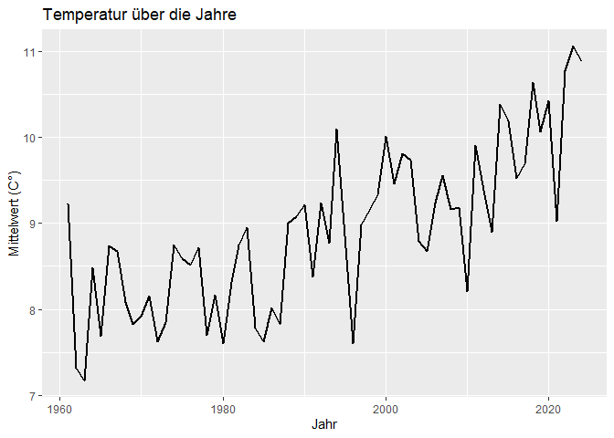

# Wie verändert sich die Temperatur im Jahreszeitlichen Verlauf, über den gesamten Messzeitraum?

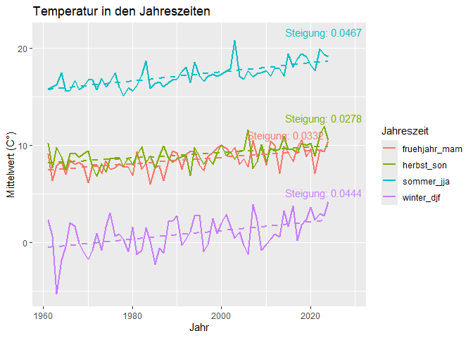

# Wie verhalten sich die Niederschlagsmengen in Kombination mit den Heißen Tagen?

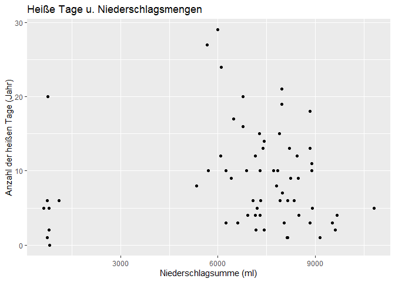

# Wie entwickeln sich die Heißtage und Frosttage im laufe der Zeit und Saisonal?

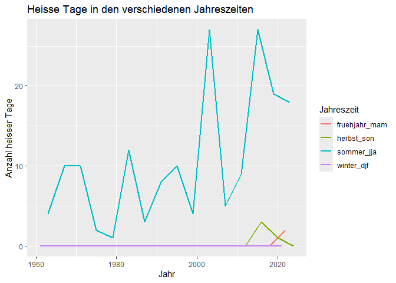

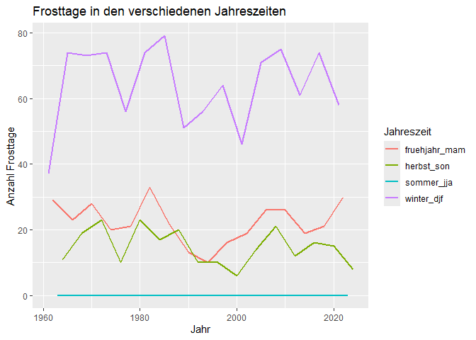

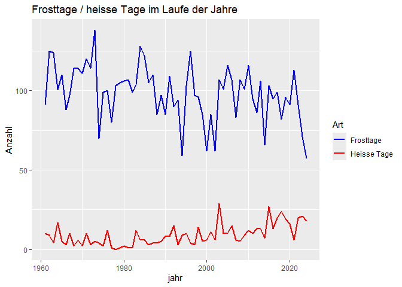

# Saisonale Trenddiagramme, alle Saisons in einem Diagramm (2023)

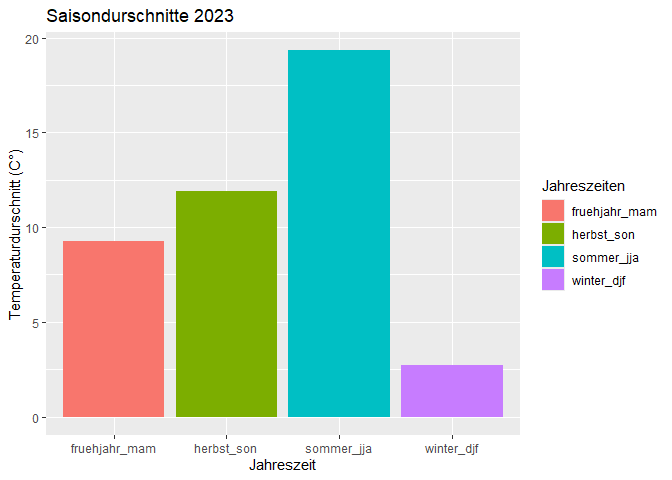

# Wie häufig treten Trockenperioden auf und wie lange dauern diese an?

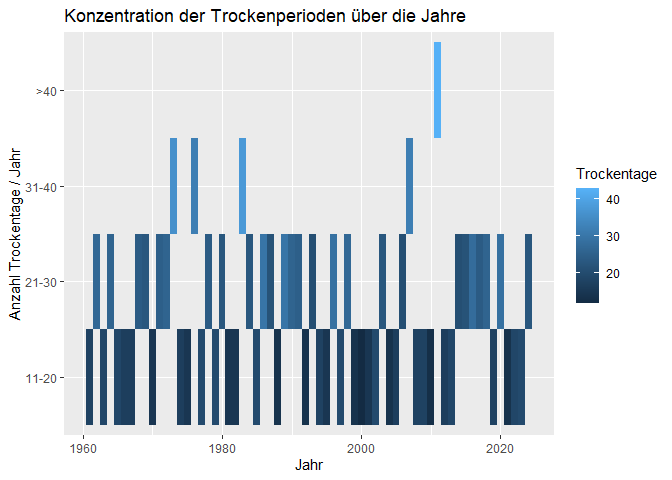

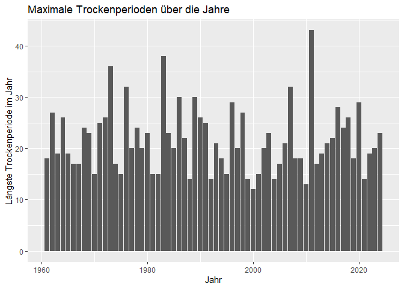

# Gibt es einen Zusammenhang zwischen Tropennächten und Trockentagen?

Es gibt keine Tropennächte ?

# Wie häufig gab es jährlich mehr als 5 Frosttage/Heißtage im Jahr?

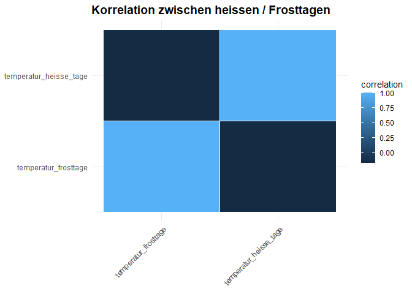

# Hat die Anzahl an Starknierderschlägen über die Jahre zugenommen?

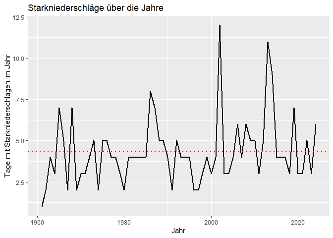
