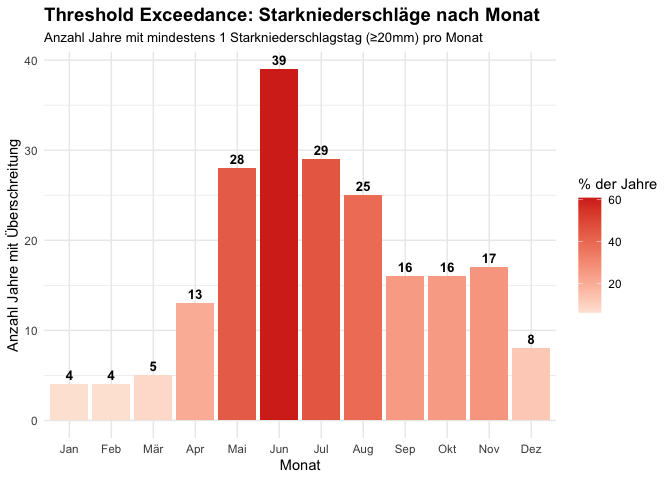
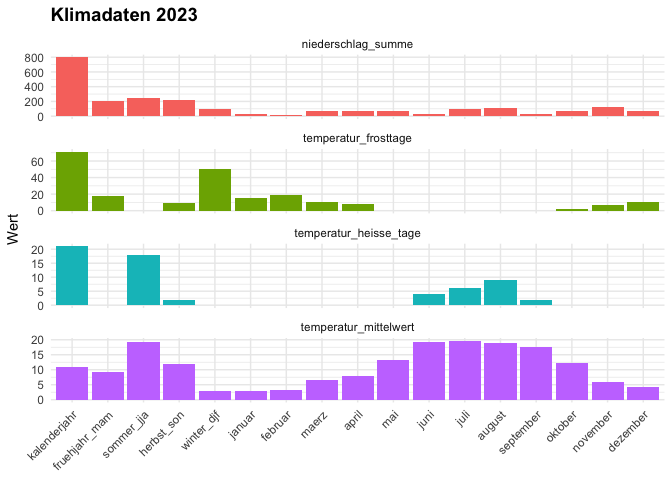
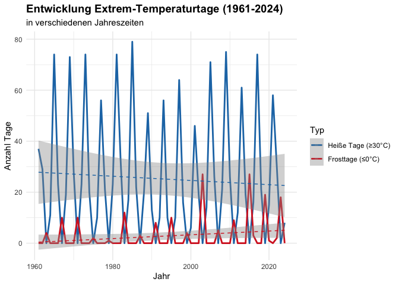
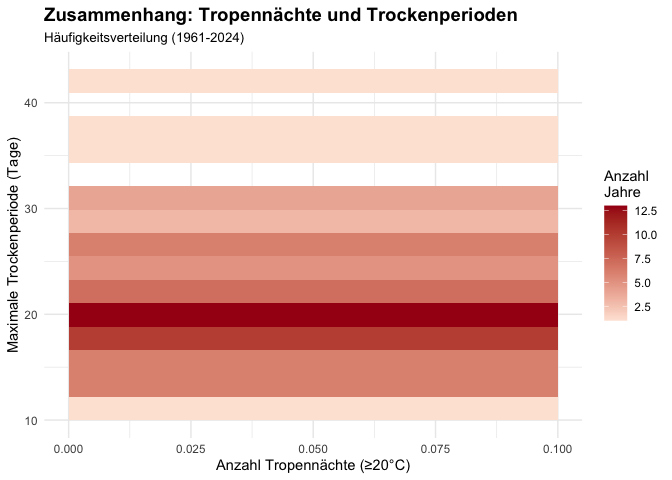
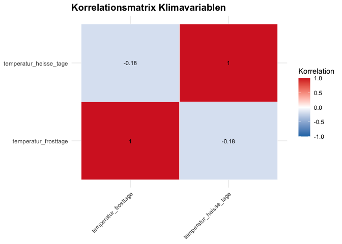
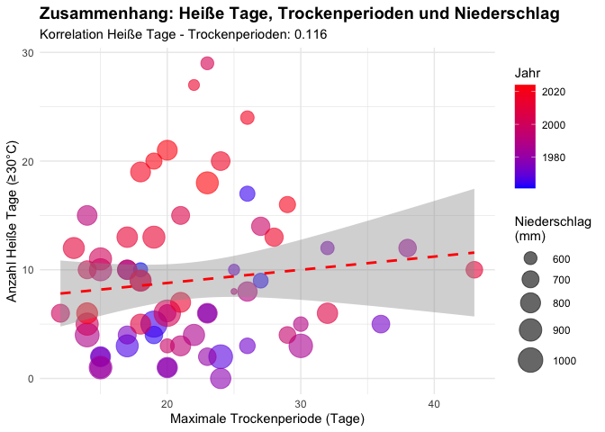

**Spaltenerklärung der LUBW:**

-   id: Schlüssel für Bundesland, Naturraum, Kreis oder Gemeinde name
-   Bezeichnung typ: Bundesland, Naturraum, Kreis oder Gemeinde
-   Kalenderjahr, Jahreszeiten oder Monate jahr: Jahr
-   temperatur\_heisse\_tage: Anzahl Heißer Tage (Tmax ≥ 30 °C)
-   temperatur\_frosttage: Anzahl Frosttage (Tmin ≤ 0 °C)
-   temperatur\_tropennaechte: Anzahl Tropennächte (Tmin ≥ 20 °C)
-   temperatur\_mittelwert: Temperatur (°C)
-   temperatur\_heizgradtage: Heizgradtage (Kelvin x Tage)
-   temperatur\_kuehlgradtage: Kühlgradtage (Kelvin x Tage)
-   niederschlag\_summe: Niederschlagssumme (Millimeter)
-   starkniederschlag\_20mm\_tage: Anzahl Tage mit N ≥ 20 mm
-   trockenperiode\_tage\_maximum: Dauer der längsten Trockenperiode mit
    Tagen &lt; 1 mm

# Solutions

-   Wie veränderte sich die Temperatur im zeitlichen Verlauf?

-   Wie verändert sich die Temperatur im Jahreszeitlichen Verlauf, über
    den gesamten Messzeitraum?

-   Wie verhalten sich die Niederschlagsmengen in Kombination mit den
    Heißen Tagen?

    ## 
    ## Korrelation Niederschlag - Heiße Tage: 0.506

-   Wie entwickeln sich die Heißtage und Frost im laufe der Zeit und
    Sasional?

Saisonale Trenddiagramme, alle Saisons in einem Diagramm

-   Wie sieht der Mittelwert im Jahr 2023 aus?

<!--# Mittelwert von was?  -->

Darstellung mithilfe einer Heatmap

-   Wie häufig treten Trockenperioden auf und wie lange dauern diese an?

Heatmap, Barplot

-   Gibt es einen Zusammenhang zwischen Tropennächten und Trockentagen?

<!--# Da es keine Tropennächte gibts, checke ich überhaupt nicht was da gemacht sein sollte -->

Korrelationsmatrix und Scatterplot, gerne auch andere Dimensionen

-   Wie häufig gab es jährlich mehr als 5 Frosttage/Heißtage im Jahr?

Threshold Exceedance Plots

-   Hat die Anzahl an Starknierderschlägen über die Jahre zugenommen?
    Wenn ja, wie viele Starkniederschläge gab es und wie verteilen sich
    diese über das Jahr?

