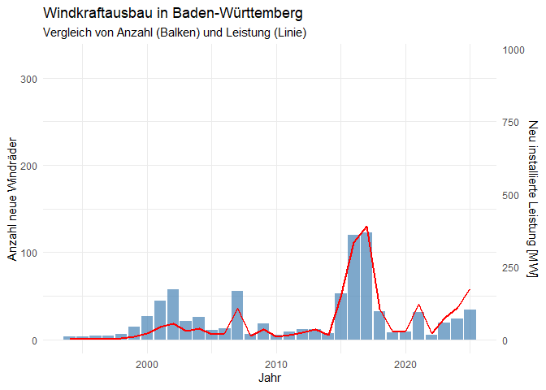
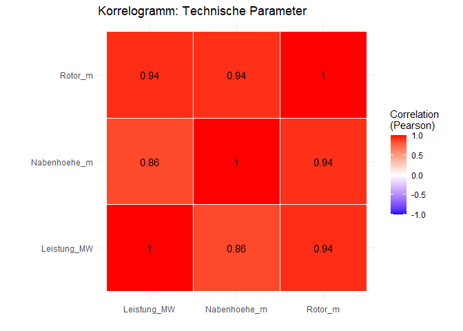
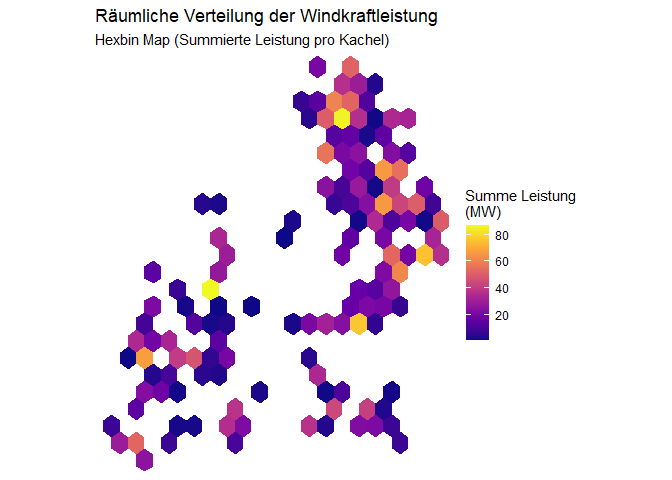
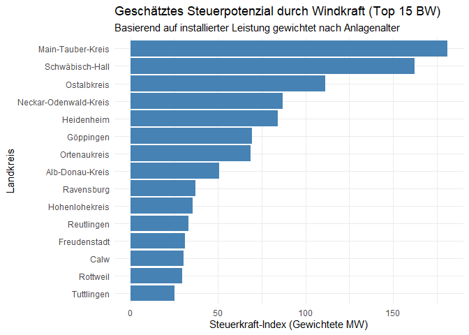
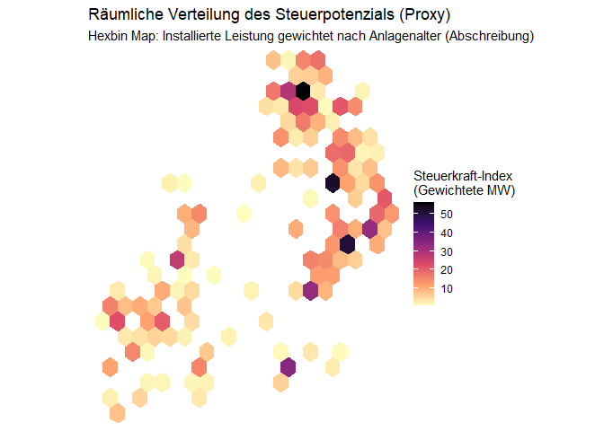
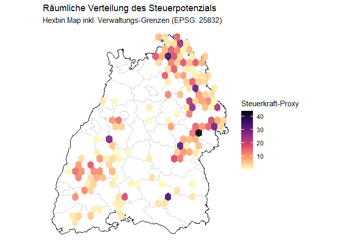

    # Import using readr. 
    # The locale encoding argument helps ensure special characters are read correctly.
    wind_data <- read_delim("WindenergieBW.csv", 
                            delim = ",", 
                            locale = locale(encoding = "UTF-8"))

    # Inspect column names to ensure no BOM artifacts (like "ï..Zuständige")
    colnames(wind_data)

    ##  [1] "Zuständige Dienststelle"        "Standortgemeinde"              
    ##  [3] "Hersteller"                     "Typbezeichnung des Herstellers"
    ##  [5] "Generatorleistung [MW]"         "Nabenhöhe [m]"                 
    ##  [7] "Rotordurchmesser [m]"           "Status"                        
    ##  [9] "Inbetriebnahmedatum"            "Stilllegedatum"                
    ## [11] "Ost"                            "Nord"                          
    ## [13] "Herkunft der Daten"             "Stand der Daten"

    # Data Cleaning Pipeline
    clean_wind <- wind_data %>%
      # Rename columns for easier access (CamelCase or English is often easier)
      rename(
        Landkreis = `Zuständige Dienststelle`,
        Gemeinde = Standortgemeinde,
        Leistung_MW = `Generatorleistung [MW]`,
        Nabenhoehe_m = `Nabenhöhe [m]`,
        Rotor_m = `Rotordurchmesser [m]`,
        Inbetriebnahme = Inbetriebnahmedatum
      ) %>%
      # Convert Date from character (German format dd.mm.yyyy) to Date object
      mutate(Inbetriebnahme = dmy(Inbetriebnahme)) %>%
      mutate(Jahr = year(Inbetriebnahme)) %>%
      # Filter out rows that might have missing coordinates if necessary for the map
      filter(!is.na(Ost), !is.na(Nord))

    # Preview
    head(clean_wind)

    ## # A tibble: 6 × 15
    ##   Landkreis  Gemeinde Hersteller Typbezeichnung des H…¹ Leistung_MW Nabenhoehe_m
    ##   <chr>      <chr>    <chr>      <chr>                        <dbl>        <dbl>
    ## 1 Landratsa… Hardtha… Enercon    E-115                          3           149 
    ## 2 Landratsa… Widdern  Enercon    E-115                          3           149.
    ## 3 Landratsa… Obersulm Nordex     N-149                          4.5         164 
    ## 4 Landratsa… Forchte… Enercon    E-115                          3           149 
    ## 5 Landratsa… Weißbach Vestas De… V126-3.3 MW                    3.3         137 
    ## 6 Landratsa… Weißbach Vestas De… V126-3.3 MW                    3.3         137 
    ## # ℹ abbreviated name: ¹​`Typbezeichnung des Herstellers`
    ## # ℹ 9 more variables: Rotor_m <dbl>, Status <chr>, Inbetriebnahme <date>,
    ## #   Stilllegedatum <lgl>, Ost <dbl>, Nord <dbl>, `Herkunft der Daten` <chr>,
    ## #   `Stand der Daten` <dbl>, Jahr <dbl>

    # 1. Define a scaling factor
    # This means: 1 unit of height on the chart = 1 Turbine OR 3 MW of Power
    # You can change this number to 2 or 4 if you want the line higher or lower
    scale_factor <- 3 

    # 2. Aggregating
    yearly_stats <- clean_wind %>%
      group_by(Jahr) %>%
      summarise(
        New_Turbines = n(),
        Total_Power = sum(Leistung_MW, na.rm = TRUE)
      )

    # 3. Plotting
    ggplot(yearly_stats, aes(x = Jahr)) +
      # Primary Data (Bars): The number of turbines
      geom_bar(aes(y = New_Turbines), stat = "identity", fill = "steelblue", alpha = 0.7) +
      
      # Secondary Data (Line): Power divided by scale factor to fit on the chart
      geom_line(aes(y = Total_Power / scale_factor), color = "red", linewidth = 1) + 
      
      # Axis Configuration
      scale_y_continuous(
        name = "Anzahl neue Windräder",
        # We multiply the labels back by the scale_factor so the numbers are correct
        sec.axis = sec_axis(~ . * scale_factor, name = "Neu installierte Leistung [MW]")
      ) +
      
      theme_minimal() +
      labs(
        title = "Windkraftausbau in Baden-Württemberg",
        subtitle = "Vergleich von Anzahl (Balken) und Leistung (Linie)"
      )

    # 1. Prepare data: Select only numeric variables of interest
    corr_data <- clean_wind %>%
      select(Leistung_MW, Nabenhoehe_m, Rotor_m) %>%
      drop_na()

    # 2. Calculate Correlation Matrix
    cor_matrix <- cor(corr_data)

    # 3. Transform to long format for ggplot
    cor_melted <- cor_matrix %>%
      as.data.frame() %>%
      rownames_to_column(var = "Var1") %>%
      pivot_longer(cols = -Var1, names_to = "Var2", values_to = "rho")

    # 4. Create the Plot (Manual ggplot approach as requested)
    ggplot(cor_melted, aes(x = Var1, y = Var2, fill = rho)) +
      geom_tile(color = "white") +
      geom_text(aes(label = round(rho, 2)), color = "black") +
      scale_fill_gradient2(low = "blue", high = "red", mid = "white", 
                           midpoint = 0, limit = c(-1,1), name = "Correlation\n(Pearson)") +
      theme_minimal() +
      coord_fixed() +
      labs(title = "Korrelogramm: Technische Parameter",
           x = "", y = "")

    # Preparation: Aggregating per Landkreis (as per project description)
    # We aggregate to find the 'center' of wind power for each district
    landkreis_agg <- clean_wind %>%
      group_by(Landkreis) %>%
      summarise(
        Turbine_Count = n(),
        Mean_Ost = mean(Ost, na.rm = TRUE),
        Mean_Nord = mean(Nord, na.rm = TRUE),
        # Using Power sum
        Sum_Leistung = sum(Leistung_MW, na.rm = TRUE) 
      )

    head(landkreis_agg)

    ## # A tibble: 6 × 5
    ##   Landkreis                        Turbine_Count Mean_Ost Mean_Nord Sum_Leistung
    ##   <chr>                                    <int>    <dbl>     <dbl>        <dbl>
    ## 1 Landratsamt Alb-Donau-Kreis                 51  558716.  5371338.        121. 
    ## 2 Landratsamt Biberach                         1  564089   5323386           0.9
    ## 3 Landratsamt Breisgau-Hochschwar…            14  421544.  5310841.         58.8
    ## 4 Landratsamt Calw                            17  463235.  5389227.         67.7
    ## 5 Landratsamt Emmendingen                     19  424462.  5334927.         56.0
    ## 6 Landratsamt Enzkreis                        14  466143.  5407238.         46.5

    # Plotting the Map
    # We use the raw coordinate data (clean_wind) but color the hexagons 
    # based on the sum of Power (z) in that area.

    ggplot(clean_wind, aes(x = Ost, y = Nord, z = Leistung_MW)) +
      # stat_summary_hex bins the data and applies a function (sum) to the z variable
      stat_summary_hex(fun = sum, bins = 20) +
      scale_fill_viridis_c(option = "C", name = "Summe Leistung\n(MW)") +
      theme_void() + # Clean map theme
      coord_fixed() +
      labs(title = "Räumliche Verteilung der Windkraftleistung",
           subtitle = "Hexbin Map (Summierte Leistung pro Kachel)")

Das Konzept für den Proxy Wir gewichten die MW-Leistung anhand des
Alters der Anlage, um die finanziellen Phasen eines Windparks
abzubilden:

Phase 1: “Neuanlagen” (0–4 Jahre):

Situation: Hohe Abschreibungen (drücken Gewinn & Gewerbesteuer), aber
oft Einnahmen aus der §6 EEG-Kommunalabgabe (0,2 Cent/kWh), die sofort
fließt.

Gewicht: 0.8 (Gute Einnahmen, aber noch keine volle Gewerbesteuer).

Phase 2: “Abschreibungsphase” (5–12 Jahre):

Situation: Die “Durststrecke”. Hohe steuerliche Abschreibungen,
Zinszahlungen an Banken. Oft zahlt der Betreiber hier kaum Gewerbesteuer
an die Kommune.

Gewicht: 0.3 (Niedrigste Einnahmen für den Landkreis).

Phase 3: “Cash Cow” (&gt; 12 Jahre):

Situation: Anlage ist oft abgeschrieben, Kredite bedient. Der Stromerlös
ist fast reiner Gewinn = maximale Gewerbesteuer.

Gewicht: 1.0 (Volles Steuerpotenzial).

    # Bibliotheken laden (falls noch nicht geschehen)
    library(tidyverse)
    library(lubridate)

    # 1. BERECHNUNG DES STEUER-PROXY
    # Wir gehen davon aus, dass 'clean_wind' bereits existiert (aus Ihrem Snippet)
    tax_analysis <- clean_wind %>%
      # Nur Anlagen, die wirklich Geld verdienen (keine genehmigten/stillgelegten)
      filter(Status == "in Betrieb") %>%
      
      # Alter berechnen (Bezugsjahr 2025)
      mutate(Alter = 2025 - Jahr) %>%
      
      # Die Gewichtungs-Logik anwenden
      mutate(Gewichtungsfaktor = case_when(
        Alter < 5 ~ 0.8,   # Neue Anlagen: EEG-Abgabe fließt, Gewerbesteuer niedrig
        Alter >= 5 & Alter <= 12 ~ 0.3, # Abschreibungsphase: Kaum Einnahmen
        Alter > 12 ~ 1.0,  # Cash-Cows: Anlage abgeschrieben, volle Gewerbesteuer
        TRUE ~ 0 # Fallback
      )) %>%
      
      # Den Proxy-Wert berechnen: Leistung * Faktor
      mutate(Steuerkraft_Index = Leistung_MW * Gewichtungsfaktor)

    # 2. AGGREGATION NACH LANDKREIS
    landkreis_ranking <- tax_analysis %>%
      group_by(Landkreis) %>%
      summarise(
        Anzahl_Windraeder = n(),
        Installierte_Leistung_MW = sum(Leistung_MW, na.rm = TRUE),
        # Der gewichtete Index ist unser Proxy für das Steueraufkommen
        Steuerkraft_Proxy = sum(Steuerkraft_Index, na.rm = TRUE)
      ) %>%
      mutate(Landkreis = str_remove(Landkreis, "Landratsamt ")) %>%
      arrange(desc(Steuerkraft_Proxy)) # Sortieren nach unserem Index

    # 3. ERGEBNIS ANZEIGEN (Top 10)
    print(head(landkreis_ranking, 10))

    ## # A tibble: 10 × 4
    ##    Landkreis          Anzahl_Windraeder Installierte_Leistun…¹ Steuerkraft_Proxy
    ##    <chr>                          <int>                  <dbl>             <dbl>
    ##  1 Main-Tauber-Kreis                154                  309.              181. 
    ##  2 Schwäbisch-Hall                  114                  358.              162. 
    ##  3 Ostalbkreis                       95                  242.              111. 
    ##  4 Neckar-Odenwald-K…                48                  130.               87.0
    ##  5 Heidenheim                        41                  123.               84.3
    ##  6 Göppingen                         56                  122.               69.3
    ##  7 Ortenaukreis                      45                  132.               68.7
    ##  8 Alb-Donau-Kreis                   43                   63.9              50.7
    ##  9 Ravensburg                         8                   45.8              37.2
    ## 10 Hohenlohekreis                    18                   53.6              35.6
    ## # ℹ abbreviated name: ¹​Installierte_Leistung_MW

    # 4. VISUALISIERUNG
    # Ein schöner Plot für die Hausarbeit/Präsentation
    ggplot(head(landkreis_ranking, 15), aes(x = reorder(Landkreis, Steuerkraft_Proxy), y = Steuerkraft_Proxy)) +
      geom_col(fill = "steelblue") +
      coord_flip() + # Balken horizontal für bessere Lesbarkeit der Namen
      labs(
        title = "Geschätztes Steuerpotenzial durch Windkraft (Top 15 BW)",
        subtitle = "Basierend auf installierter Leistung gewichtet nach Anlagenalter",
        x = "Landkreis",
        y = "Steuerkraft-Index (Gewichtete MW)"
      ) +
      theme_minimal()

    # Wir nutzen den Dataframe 'tax_analysis' aus dem vorherigen Schritt,
    # da dieser die berechnete Spalte 'Steuerkraft_Index' enthält.

    ggplot(tax_analysis, aes(x = Ost, y = Nord, z = Steuerkraft_Index)) +
      # Wir summieren den Steuer-Index pro Hexagon
      stat_summary_hex(fun = sum, bins = 20) +
      # Anderes Farbschema (z.B. "D" oder "A") hilft oft, 
      # um es visuell von der reinen Leistungskarte zu unterscheiden
      scale_fill_viridis_c(option = "A", direction = -1, name = "Steuerkraft-Index\n(Gewichtete MW)") +
      theme_void() + 
      coord_fixed() +
      labs(
        title = "Räumliche Verteilung des Steuerpotenzials (Proxy)",
        subtitle = "Hexbin Map: Installierte Leistung gewichtet nach Anlagenalter (Abschreibung)"
      )

    # 1. Notwendige Pakete installieren und laden
    if(!require("sf")) install.packages("sf")
    if(!require("giscoR")) install.packages("giscoR") # Amtliche EU-Grenzen

    library(sf)
    library(giscoR)

    # 2. Geodaten für BW laden (NUTS-Code für BW ist "DE1")
    # NUTS 1 = Bundesland, NUTS 3 = Landkreise
    bw_border <- gisco_get_nuts(nuts_id = "DE1", resolution = "01") # Hohe Auflösung
    bw_kreise <- gisco_get_nuts(country = "Germany", nuts_level = 3, resolution = "03") %>%
      filter(startsWith(NUTS_ID, "DE1")) # Nur Kreise in BW filtern

    # 3. KOORDINATENTRANSFORMATION (Der Geographen-Schritt)
    # Ihre Daten (Ost/Nord ~ 500.000 / 5.400.000) sind ETRS89 / UTM Zone 32N (Code 25832).
    # Wir müssen die Grenzen in dieses System umrechnen ("projizieren").
    bw_border_utm <- st_transform(bw_border, crs = 25832)
    bw_kreise_utm <- st_transform(bw_kreise, crs = 25832)

    # 4. Der Plot mit Grenzen
    ggplot(tax_analysis, aes(x = Ost, y = Nord, z = Steuerkraft_Index)) +
      
      # A) Ebene Landkreise (Optional: dünne graue Linien zur Orientierung)
      geom_sf(data = bw_kreise_utm, 
              fill = NA, 
              color = "grey80", 
              size = 0.3, 
              inherit.aes = FALSE) + # WICHTIG: inherit.aes = FALSE, sonst sucht er x/y im shapefile
      
      # B) Ebene Landesgrenze (Dickerer schwarzer Umriss)
      geom_sf(data = bw_border_utm, 
              fill = NA, 
              color = "black", 
              size = 0.8, 
              inherit.aes = FALSE) +
      
      # C) Ihre Hexbins (wie gehabt)
      stat_summary_hex(fun = sum, bins = 25, alpha = 0.9) + # alpha macht sie leicht transparent
      
      # Styling
      scale_fill_viridis_c(option = "A", direction = -1, name = "Steuerkraft-Proxy") +
      theme_void() + 
      coord_sf(datum = NA) + # Entfernt das Koordinatengitter, behält aber die Projektion bei
      labs(
        title = "Räumliche Verteilung des Steuerpotenzials",
        subtitle = "Hexbin Map inkl. Verwaltungs-Grenzen (EPSG: 25832)"
      )

