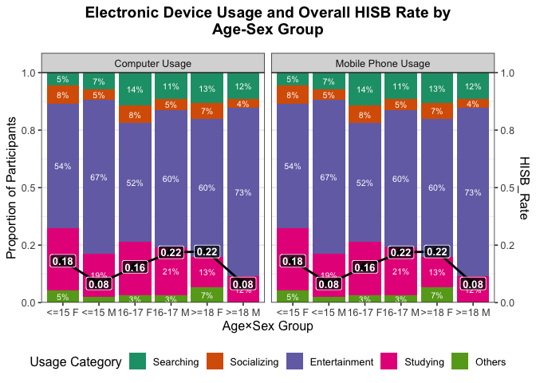

Wenjing’s Project Solution
================
Jingyi LI
2026-06-09

### Data Cleaning

``` r
# Removing columns with text answers. Such as "Which social media platform/site (Facebook, Instagram, Twitter, Tiktok, Snapchat) is your favourite to use for your health? And what do you like about it?"

df <- df %>%
  select(
    -which_social_media_platform_site_facebook_instagram_twitter_tiktok_snapchat_is_your_favourite_to_use_for_your_health_and_what_do_you_like_about_it,
    -for_searching_health_information_which_app_social_media_or_website_do_you_use,
    -for_discussing_health_topics_with_other_people_online_which_app_social_media_or_website_do_you_use
  )
```

``` r
# Simplifying participants’ answers by changing all characters/words records checked/unchecked or Yes/No into numeric 1/0 R encoding. Simplifying participants’s age records to <= 15 F or M, 16-17 F or M, >=18 F or M.(Attention that records in table for the same category may be different. For example:%22Greater than or equal to 18” vs Greater than or equal 18”)

df <- df %>%
  mutate(
    age_group = case_when(
      str_detect(age_range, "Lower") ~ "<=15",
      str_detect(age_range, "16") ~ "16-17",
      str_detect(age_range, "18") ~ ">=18",
      TRUE ~ NA_character_
    )
  )

df <- df %>%
  mutate(
    age_sex_group = paste(age_group, sex)
  )
```

``` r
# Convert binary variables to numeric (1 for "Checked"/"Yes", 0 for "Unchecked"/"No")

df <- df %>%
  mutate(across(
    where(~ all(.x %in% c("Checked", "Unchecked", "Yes", "No", NA))),
    ~ case_when(
      . == "Checked" ~ 1,
      . == "Yes" ~ 1,
      . == "Unchecked" ~ 0,
      . == "No" ~ 0,
      TRUE ~ NA_real_
    )
  ))
```

``` r
# Merging “Do you have a mobile phone?” into “Is this mobile phone yours or do you share it ?” and the new column called “mobile_phone ownership”; Making responses numeric: 0 stands for do not have mobile phone, 1 stands for have shared mobile phone, 2 stands for have own mobile phone. Do not forget solving missing values with NA;

df <- df %>%
  mutate(
    mobile_phone_ownership = case_when(
      do_you_have_a_mobile_phone == 0 ~ 0,
      do_you_have_a_mobile_phone == 1 &
        is_this_mobile_phone_yours_or_do_you_share_it == "Shared" ~ 1,
      do_you_have_a_mobile_phone == 1 &
        is_this_mobile_phone_yours_or_do_you_share_it == "Not shared" ~ 2,
      TRUE ~ NA_real_
    )
  )
```

``` r
# Merging columns that for a same question in Social media and health to one column, such as "Platform for health", "Platform for HISB", "Platform for health topic";

# Platform for health
df <- df %>%
  mutate(
    platform_for_health = case_when(
      favourite_platform_site_for_health_social_media == 1 ~ "social media",
      favourite_platform_site_for_health_search_engine == 1 ~ "search engine",
      favourite_platform_site_for_health_unclear == 1 ~ "unclear",
      favourite_platform_site_for_health_none == 1 ~ "none",
      TRUE ~ NA_character_
    )
  )

# Platform for HISB
df <- df %>%
  mutate(
    platform_for_hisb = case_when(
      for_searching_health_information_social_media == 1 ~ "social media",
      for_searching_health_information_search_engine == 1 ~ "search engine",
      for_searching_health_information_web_site == 1 ~ "web site",
      for_searching_health_information_unclear == 1 ~ "unclear",
      for_searching_health_information_none == 1 ~ "none",
      TRUE ~ NA_character_
    )
  )

# Platform for discussing health topics
df <- df %>%
  mutate(
    platform_for_health_topic = case_when(
      for_discussing_social_media == 1 ~ "social media",
      for_discussing_search_engine == 1 ~ "search engine",
      for_discussing_app == 1 ~ "app",
      for_discussing_web_site == 1 ~ "web site",
      for_discussing_unclear == 1 ~ "unclear",
      for_discussing_none == 1 ~ "none",
      TRUE ~ NA_character_
    )
  )

# Merging "Do you use apps, social media or websites for your health" in the following columns. When the answer to that question is no, solving missing values with none, otherwise solvng missing value with NA. The values should be social media, search engine, app, web site, unclear, none.

df <- df %>%
  mutate(
    platform_for_health = ifelse(
      do_you_use_apps_social_media_or_websites_for_your_health == 0,
      "none",
      platform_for_health
    ),
    platform_for_hisb = ifelse(
      do_you_use_apps_social_media_or_websites_for_your_health == 0,
      "none",
      platform_for_hisb
    ),
    platform_for_health_topic = ifelse(
      do_you_use_apps_social_media_or_websites_for_your_health == 0,
      "none",
      platform_for_health_topic
    )
  )
```

``` r
# Combining above numeric responses that in Use of devices. The new values should be completed by the sum of the subbranches. Renaming each column with short but representative name. For example: we combine numeric responses in "Discussion by email or on the digital social networks with friends or family" and "Watching your social network feed" to Computer Socialzing; "Listening to the music", "Playing games","viewing videos" to Computer Entertainment. So finally the column should be Computer Searching,Computer Socializing,Computer Entertainment,Computer Studying,Others. You should rename them with usage of Mobile Phone in this same format. Attention that Telephone conversation counts to Socializing.

df <- df %>%
  mutate(
    computer_searching =
      when_you_are_on_the_computer_and_or_tablet_what_type_of_actions_do_you_most_often_perform_choice_searching_for_general_information,

    computer_socializing = rowSums(across(c(
      when_you_are_on_the_computer_and_or_tablet_what_type_of_actions_do_you_most_often_perform_choice_discussion_by_email_or_on_the_digital_social_networks_with_friends_or_family,
      when_you_are_on_the_computer_and_or_tablet_what_type_of_actions_do_you_most_often_perform_choice_watching_your_social_network_feed
    )), na.rm = TRUE),

    computer_entertainment = rowSums(across(c(
      when_you_are_on_the_computer_and_or_tablet_what_type_of_actions_do_you_most_often_perform_choice_listening_to_the_music,
      when_you_are_on_the_computer_and_or_tablet_what_type_of_actions_do_you_most_often_perform_choice_playing_games,
      when_you_are_on_the_computer_and_or_tablet_what_type_of_actions_do_you_most_often_perform_choice_viewing_videos
    )), na.rm = TRUE),

    computer_studying =
      when_you_are_on_the_computer_and_or_tablet_what_type_of_actions_do_you_most_often_perform_choice_study_or_homeworks,

    computer_others =
      when_you_are_on_the_computer_and_or_tablet_what_type_of_actions_do_you_most_often_perform_choice_other
  )


df <- df %>%
  mutate(
    mobile_searching =
      when_you_are_on_your_mobile_phone_what_type_of_actions_do_you_perform_most_often_choice_searching_for_general_information,

    mobile_socializing = rowSums(across(c(
      when_you_are_on_your_mobile_phone_what_type_of_actions_do_you_perform_most_often_choice_discussion_by_email_or_on_the_digital_social_networks_with_friends_or_family,
      when_you_are_on_your_mobile_phone_what_type_of_actions_do_you_perform_most_often_choice_watching_your_social_network_feed,
      when_you_are_on_your_mobile_phone_what_type_of_actions_do_you_perform_most_often_choice_telephone_conversation
    )), na.rm = TRUE),

    mobile_entertainment = rowSums(across(c(
      when_you_are_on_your_mobile_phone_what_type_of_actions_do_you_perform_most_often_choice_listening_to_the_music,
      when_you_are_on_your_mobile_phone_what_type_of_actions_do_you_perform_most_often_choice_playing_games,
      when_you_are_on_your_mobile_phone_what_type_of_actions_do_you_perform_most_often_choice_viewing_videos
    )), na.rm = TRUE),

    mobile_studying =
      when_you_are_on_your_mobile_phone_what_type_of_actions_do_you_perform_most_often_choice_study_or_homeworks,

    mobile_others =
      when_you_are_on_your_mobile_phone_what_type_of_actions_do_you_perform_most_often_choice_other
  )

df <- df %>%
  mutate(
    platform_for_health = case_when(
      favourite_platform_site_for_health_social_media == 1 ~ "social media",
      favourite_platform_site_for_health_search_engine == 1 ~ "search engine",
      favourite_platform_site_for_health_unclear == 1 ~ "unclear",
      favourite_platform_site_for_health_none == 1 ~ "none",
      TRUE ~ NA_character_
    )
  )
```

``` r
# Combine HISB platform usage
df <- df %>%
  mutate(
    hisb_rate = rowSums(across(c(
      for_searching_health_information_social_media,
      for_searching_health_information_search_engine,
      for_searching_health_information_web_site
    )), na.rm = TRUE)
  )
```

``` r
# Remove the original platform variables
df <- df %>%
  select(
    -favourite_platform_site_for_health_social_media,
    -favourite_platform_site_for_health_search_engine,
    -favourite_platform_site_for_health_unclear,
    -favourite_platform_site_for_health_none,
    -for_searching_health_information_social_media,
    -for_searching_health_information_search_engine,
    -for_searching_health_information_web_site,
    -for_searching_health_information_unclear,
    -for_searching_health_information_none,
    -for_discussing_social_media,
    -for_discussing_search_engine,
    -for_discussing_app,
    -for_discussing_web_site,
    -for_discussing_unclear,
    -for_discussing_none,
    -do_you_use_apps_social_media_or_websites_for_your_health
  )

df <- df %>%
  select(
    -starts_with("when_you_are_on_the_computer_and_or_tablet_what_type_of_actions_do_you_most_often_perform_choice_"),
    -starts_with("when_you_are_on_your_mobile_phone_what_type_of_actions_do_you_perform_most_often_choice_")
  )
```

``` r
df_cleaned <- df

# Save the cleaned data
write_csv(df_cleaned, "../Wenjing_Huang/dataset/cleaned_data.csv", na = "")
```

### Visualization

1.Dividing participants into 6 groups that serves as X-axis Age✖️Sex
Group. 2.Participants without age information were excluded in the data
analysis. NAin other columns counts as numeric 0 while analyzing. 3.Bars
that presenting same age groups should stay closer together. 4.Remember
to use facet relevant functions to finish two plots, which means that
they must use same 5 usage categories, the colour mapping,singile shared
legend. 5.Pay attention that this is required as dual Y-axis plot. Each
range is different. Detailed seen in the following sample plot. 6.label
names should be following: X-axis Age✖️Sex Group Left-Y-axisProportion
of participants Right-Y-axisHISB Rate plot-name Electronic Device Usage
and HISB Rate by Age-Sex Group. 7.color:different color for different
groups; black line with filled black circle point marker. 8.The legend
should be placed on the right of the plot.

``` r
df <- read.csv("../Wenjing_Huang/dataset/cleaned_data.csv", stringsAsFactors = FALSE)

colnames(df)
```

    ##  [1] "participant"                                  
    ##  [2] "sex"                                          
    ##  [3] "age_range"                                    
    ##  [4] "do_you_have_a_mobile_phone"                   
    ##  [5] "is_this_mobile_phone_yours_or_do_you_share_it"
    ##  [6] "age_group"                                    
    ##  [7] "age_sex_group"                                
    ##  [8] "mobile_phone_ownership"                       
    ##  [9] "platform_for_health"                          
    ## [10] "platform_for_hisb"                            
    ## [11] "platform_for_health_topic"                    
    ## [12] "computer_searching"                           
    ## [13] "computer_socializing"                         
    ## [14] "computer_entertainment"                       
    ## [15] "computer_studying"                            
    ## [16] "computer_others"                              
    ## [17] "mobile_searching"                             
    ## [18] "mobile_socializing"                           
    ## [19] "mobile_entertainment"                         
    ## [20] "mobile_studying"                              
    ## [21] "mobile_others"                                
    ## [22] "hisb_rate"

``` r
dim(df)
```

    ## [1] 197  22

``` r
group_order <- c("<=15 F", "<=15 M", "16-17 F", "16-17 M", ">=18 F", ">=18 M")

df <- df %>%
  filter(age_sex_group %in% group_order) %>%
  mutate(age_sex_group = factor(age_sex_group, levels = group_order)) %>%
  mutate(across(c(
    computer_searching,
    computer_socializing,
    computer_entertainment,
    computer_studying,
    computer_others,
    mobile_searching,
    mobile_socializing,
    mobile_entertainment,
    mobile_studying,
    mobile_others,
    hisb_rate),
  ~ replace_na(.x, 0)))

hisb_by_group <- df %>%
  mutate(hisb_indicator = as.integer(hisb_rate > 0,1,0)) %>%
  group_by(age_sex_group) %>%
  summarise(HISB_Rate = mean(hisb_indicator, na.rm = TRUE), .groups = "drop")

summarise_usage <- function(dat, s, soc, ent, stu, oth) {
  dat %>%
    group_by(age_sex_group) %>%
    summarise(
      Searching     = mean({{ s   }}),
      Socializing   = mean({{ soc }}),
      Entertainment = mean({{ ent }}),
      Studying      = mean({{ stu }}),
      Others        = mean({{ oth }}),
      .groups = "drop"
    ) %>%

    rowwise() %>%
    mutate(
      total = Searching + Socializing + Entertainment + Studying + Others,
      Searching = Searching / total,
      Socializing = Socializing / total,
      Entertainment = Entertainment / total,
      Studying = Studying / total,
      Others = Others / total
    ) %>%
    ungroup() %>%
    select(-total)
}

computer_sum <- summarise_usage(df,
  computer_searching, computer_socializing, computer_entertainment, computer_studying, computer_others)

mobile_sum <- summarise_usage(df, computer_searching, computer_socializing, computer_entertainment, computer_studying, computer_others)

usage_levels <- c("Searching", "Socializing", "Entertainment", "Studying", "Others")
```

``` r
plot_df <- bind_rows(

  computer_sum %>%
    pivot_longer(Searching:Others, names_to = "Usage", values_to = "Proportion") %>%
    mutate(Device = "Computer Usage"),

  mobile_sum %>%
    pivot_longer(Searching:Others, names_to = "Usage", values_to = "Proportion") %>%
    mutate(Device = "Mobile Phone Usage")
) %>% 
  mutate(Usage = factor(Usage, levels = usage_levels),
         Device = factor(Device, levels = c("Computer Usage", "Mobile Phone Usage")))


hisb_df <- bind_rows(

  hisb_by_group %>% mutate(Device = "Computer Usage"),
  hisb_by_group %>% mutate(Device = "Mobile Phone Usage")
) %>%
  mutate(Device = factor(Device, levels = c("Computer Usage", "Mobile Phone Usage")))
```

``` r
usage_colors <- c(
  Searching = "#1B9E77",
  Socializing = "#D95F02",
  Entertainment = "#7570B3",
  Studying = "#E7298A",
  Others = "#66A61E"
)


p <- ggplot(plot_df, 
            aes(x = age_sex_group, y = Proportion, fill = Usage)) +
  
  
  geom_col() +


  geom_text(
    aes(label = ifelse(Proportion > 0.03, percent(Proportion, accuracy = 1), "")),
    position = position_stack(vjust = 0.5), 
    color = "white",                        
    size = 2.8   
  ) +

  # HISB Rate lines
  geom_line(
    data = hisb_df,
    aes(x = age_sex_group, y = HISB_Rate, group = 1),
    inherit.aes = FALSE,
    colour = "black",
    linewidth = 1
  ) +

  # HISB Rate points
  geom_point(
    data = hisb_df,
    aes(x = age_sex_group, y = HISB_Rate),
    inherit.aes = FALSE,
    colour = "black",
    size = 3
  ) +

  # HISB Rate labels
  geom_label(
    data = hisb_df,
    aes(x = age_sex_group, y = HISB_Rate, label = round(HISB_Rate, 2)),
    inherit.aes = FALSE,
    size = 3.5,
    color = "white",
    fill = alpha("black", 0.7),
    fontface = "bold",
    label.padding = unit(0.2, "lines")
) +

  facet_wrap(~Device, nrow = 1) +

  scale_fill_manual(
    values = usage_colors
  ) +

  scale_y_continuous(
    name = "Proportion of Participants",
    labels = function(x) sprintf("%.1f", x),
    expand = c(0, 0),
    sec.axis = sec_axis(
      transform = ~.,
      name = "HISB_Rate", 
      labels = function(x) sprintf("%.1f", x)
    )
  ) +

  labs(
    title = str_wrap("Electronic Device Usage and Overall HISB Rate by Age-Sex Group", width = 50),
    x = "Age×Sex Group",
    y = "Proportion of Participants",
    fill = "Usage Category"
  ) +

  theme_bw(base_size = 12) +

  theme(
    legend.position = "bottom", 
    plot.title = element_text(
      hjust = 0.5,
      face = "bold",
      margin = margin(b = 15)
    )
  )

p
```

<!-- -->

``` r
ggsave("figures/usage_hisb_plot.png", p, width=14, height=12, dpi=300)
```
