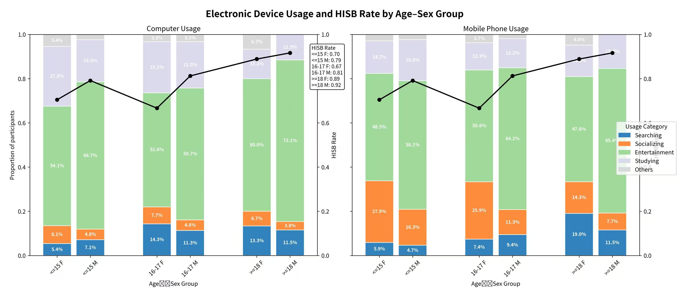

# Introduction:

Digital heath conceptually consists of two sectors, namely
digitalisation & digization in health &well-ness industry and mental
health affected by digital platforms. When it comes to the first
concept, most studies confirmed that origin of country, place of
residence,gender..many factors have an impact on “Health Information
Seeking Behaviour”(**abbreviated HIBS**).

Shifting focus to less developed countries, questions arise: How do the
youth engage with digital platforms, and what is the real gap from
age-groups? Do they use which type of social media to search health
information? To address these, we analyze a dataset from Vanuatu, a
South Pacific island nation.

## Data\_import and quick overview

You need to import [CSV
file](https://zenodo.org/records/17154763/files/2024-12-09_FALAH_Vanuatu_socialMediaUse_Zenodo_anonymized.csv?download=1)
with correct **separator** encoding.

Descriptions in colounms:

-   individual information:

    -   **Participant**: Participant ID of the study
    -   **Sex**: Sex of the participant (“F” for female or “M” for male)
    -   **Age range**: Age range of the adolescent participant (“Lower
        than or equal to 15”, “Between 16 and 17 inclusive” or “Greater
        than or equal to 18”)

-   Questionaire:

    -   **Mobile phone**
        -   Do you have a mobile phone?: response to the question (“Yes”
            or “No”)
        -   Is this mobile phone yours or do you share it?: response to
            the question (“Shared” or “Not shared”)
    -   **Use of devices**

    In this part of questionaire the choice **can only be single
    considered**.

    -   1.When you are on the **computer and/or tablet**, what type of
        actions do you most often perform? single choice: ticked or not
        (“Checked” or “Unchecked”)

        -   column(choice) followed by this order:“Searching for general
            information”, “Discussion by email or on the digital social
            networks with friends or family”, “Watching your social
            network feed”, “Listening to the music”, “Playing games”,
            “Study or homeworks”, “Viewing videos”, “Other”

    -   2.When you are on your **mobile phone**, what type of actions do
        you perform most often? single choice: ticked or not (“Checked”
        or “Unchecked”)

        -   columns followed by order mentioned above and an extra
            choice “Telephone conversation”

    -   **Social media and health** In this part of the questionnaire
        the **choice can be single or multiple**!

        -   1.Which social media platform/site is your favourite to use
            for health? And what do you like about it?
            -   **Favourite platform/site for health(followed by this
                order)**: social media,search engine,unclear,none.
        -   2.For searching health information, which app, social media
            or website do you use?
            -   **For searching health information**: social
                media,search engine,web site,unclear,none
        -   3.For discussing health topics, which app, social media or
            website do you use?
            -   **For discussing(followed by this order)**: social
                media, search engine, app, web site, unclear, none

## Data cleaning

1.Removing columns with text answers. Such as
`"Which social media platform/site (Facebook, Instagram, Twitter, Tiktok, Snapchat) is your favourite to use for your health? And what do you like about it?"`

2.Merging “Do you have a mobile phone?” into “Is this mobile phone yours
or do you share it ?” and the new column called “mobile\_phone
ownership”; Making responses numeric: `0` stands for
`do not have mobile phone`, `1` stands for `have shared mobile phone`,
`2` stands for `have own mobile phone`. Do not forget solving missing
values with `NA`;

Merging columns that for a same question in **Social media and health**
to one column, such as
`"Platform for health", "Platform for HISB", "Platform for health topic"`;

Merging `"Do you use apps, social media or websites for your health"` in
the following columns. When the answer to that question is `no`, solving
missing values with `none`, otherwise solvng missing value with `NA`.
The values should be
`social media, search engine, app, web site, unclear, none`.

3.Simplifying participants’ answers by changing all characters/words
records `checked/unchecked` or `Yes/No` into numeric `1/0` R encoding.
Simplifying participants’s age records to
`<= 15 F or M, 16-17 F or M, >=18 F or M`.(Attention that records in
table for the same category may be different. For <example:%22Greater>
than or equal to 18” vs Greater than or equal 18”)

4.Combining above numeric responses that in **Use of devices**. The new
values should be completed by the sum of the subbranches. Renaming each
column with short but representative name. For example: we combine
numeric responses in
`"Discussion by email or on the digital social networks with friends or family" and "Watching your social network feed"`
to `Computer Socialzing`;
`"Listening to the music", "Playing games","viewing videos"` to
`Computer Entertainment`. So finally the column should be
`Computer Searching`,`Computer Socializing`,`Computer Entertainment`,`Computer Studying`,`Others`.
You should rename them with usage of Mobile Phone in this same format.
Attention that `Telephone conversation` counts to `Socializing`.

5.**Dealing with all the missing values by completing `NA` in table.**

## Visualization

We want two stacked bar chart plots to search the percentage of each
general electronics performance respectively by computer and
mobile\_phone in each Age-Sex group.

We want you also overlay a line plot on each top of the stacked bars
plot to figure out the proportion of performing HISB within each age-sex
group. Additionally, display the numeric HISB Rate values(rounded to 2
decimals in a annotation box)

Requirements:

1.Dividing participants into 6 groups that serves as X-axis
`Age✖️Sex Group`.

2.Participants without age information were excluded in the data
analysis. `NA`in other columns counts as numeric `0` while analyzing.

3.Bars that presenting same age groups should stay closer together.

4.Remember to use `facet` relevant functions to finish two plots, which
means that they must use same 5 usage categories, the colour
mapping,singile shared legend.

5.Pay attention that this is required as dual Y-axis plot. Each range is
different. Detailed seen in the following sample plot.

6.label names should be following: X-axis `Age✖️Sex Group`
Left-Y-axis`Proportion of participants` Right-Y-axis`HISB Rate`
plot-name `Electronic Device Usage and HISB Rate by Age-Sex Group`.

7.color:different color for different groups; black line with filled
black circle point marker.

8.The legend should be placed on the right of the plot.

The sample plot looks like this:

## Visualization Optional Task

You may also find that the sample plot still has some defects. Try to
revise them and make it clearer!

# Dataset Citation

Wattelez, G., Amon, K., Nedjar-Guerre, A., Forsyth, R., Peralta, L.,
Urvoy, M.-J., Caillaud, C., & Galy, O. (2025). Exploring the Digital
Health Landscape: How adolescents living in urban and rural Vanuatu use
online platforms to access health information (anonymized version of the
dataset and supplementary tables) (2.0.0) \[Data set\]. Zenodo.
<https://doi.org/10.5281/zenodo.17154763>
