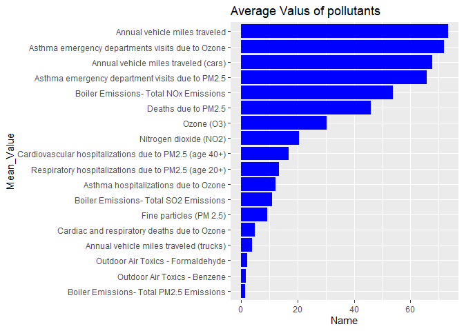
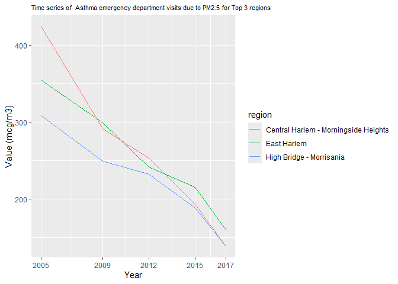

# This is my solution for Yue’s project.

## Chart one data

    library(tidyverse)
    data <- read.csv("https://data.cityofnewyork.us/api/views/c3uy-2p5r/rows.csv?accessType=DOWNLOAD")
    # Data manipulation for first graph.
    data_task1 <- data |>
      select(Name, Data.Value) |>
      group_by(Name) |>
      summarise(Mean_value = mean(Data.Value, na.rm = TRUE)) |>
      arrange(Mean_value)

## Chart one

    # visualization for first graph
    ggplot(data_task1, aes(x = Mean_value, y = reorder(Name, Mean_value)))+
      geom_bar(stat = "identity", show.legend = TRUE, fill = "blue")+
      labs(
        title = "Average Valus of pollutants",
        x = "Name",
        y = "Mean_Value"
      )+
      theme()

## Chart two data

    #data manipulation for second task

    data_pollutant <- data |>
      mutate(Year = year(dmy(Start_Date))) |>
      group_by(Name) |>
      summarise(Max_value = max(Data.Value, na.rm = TRUE), .groups = "drop") |>
      arrange(desc(Max_value)) |>
      slice_head(n = 1) |>
      pull(Name)
    #This data_region is also to store a data set, which contains only three Geo.Place.Name
    data_region <- data |>
      filter(Name == data_pollutant) |>
      mutate(Year = year(dmy(Start_Date))) |>
      arrange(desc(Data.Value)) |>
      slice_head(n = 3) |>
      pull(Geo.Place.Name)
    #This part is to select the observations we need.
    data_task2 <- data |>
      filter(Name == data_pollutant) |>
      filter(Geo.Place.Name %in% data_region) |>
      mutate(Year = year(dmy(Start_Date))) |>
      group_by(Geo.Place.Name,Year) |>
      slice_max(Data.Value, n = 1)|>
      ungroup()

## chart two

    #visualization.
    ggplot(data_task2, aes(x = Year, y = Data.Value, color = factor(Geo.Place.Name)))+
      geom_line()+
      scale_x_continuous(breaks = unique(data_task2$Year))+
      labs(
        x = "Year",
        y = "Value (mcg/m3)",
        color = "region",
        title = paste("Time series of ", data_pollutant, "for Top 3 regions")
      )+
      theme(
        plot.title = element_text(size = 8)
      )

